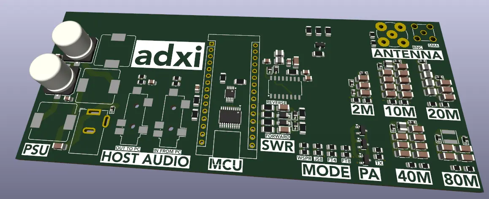

# adxi - ADX Improved

ADX is abbreviation for Arduino Digital Xceiver.

This fork is called __adxi__ (or "ADX Improved") and is focused on:
 * restoring access to the design for modern KiCad
 * integrating known bug fixes
 * revised layout
 * additional protection
 * reducing the BOM cost and enhancing functionality through integrated components where feasible
 * improved documentation to facilitate teaching and learning
 * using platformio to manage the firmware build and dependencies in a modern way

## Current draft PCB (2024-08-07)



 * Draft is nearing completion, about 90%.
 * Still need a band-switch, output multiplexer if LEDs are kept, reduce audio connector footprints.

## Current documentation
 * [Bandpass filter model](doc/filter-models/bandpass-filter/) showing audio frequency bandpass filter
 * [CD2003 5V supply filter model](doc/filter-models/cd2003-supply-low-pass-filter/) showing power supply filtering for the radio receiver chipset
 * [Multi-band low pass filters](doc/multi-band-lpfs) showing various third party designs for multi-band LPFs and including notes considering practical aspects of the design problem.

## ADX Original Project

### Features

 * ADX is a mono band (actually quad band) digital modes optimized HF transceiver that can cover four pre-programmed bands one band at a time by swapping Band LPF Modules.
   * It can work on 80m, 40m, 30m, 20m, 17m, 15m and 10m bands
   * It can operate on four of the most popular digital modes, FT8, FT4, JS8call and WSPR.
 * ADX supports computer control (CAT) by emulating KENWOOD TS2000 HF Transceiver over a 9600 8N1 serial link to control Band and Mode changes.

### Goals

The project was originally designed by [Barb (WB2CBA)](https://github.com/WB2CBA/ADX) ([original project website](https://antrak.org.tr/blog/adx-arduino-digital-transceiver/))  with the goal to design a simple HF Transceiver optimized for operating on Digital modes:
 - Simple to procure – meaning not effected by chip shortage
 - Simple to build – 2 modules, 2 IC’s and 4 Mosfets!
 - Simple to setup and tune – One simple calibration procedure is all needed.
 - Simple to operate – Plug in ADX MIC to soundcard MIC input and ADX SPK to PC soundcard speaker input and we are good to go with any digital modes Software.
 - Dirt Cheap – Costs less than 25$ to get all parts and PCB if we exclude ridiculous shipping costs!
 - Plug in a USB cable between ADX Arduino and your PC, Select Kenwood TS2000 with 9600bps,8,1 setup as your CAT rig and you will have CAT control on ADX!

It has since been built all over the world.

### Design

The original design was based on the following major physical modules:
 * Main ADX PCB
   * CD2003 radio chip
   * 74ACT244 buffer/line driver
 * Arduino Nano (ATmega328P MCU module)
 * Si535x clock generator module
 * uSDX LPF band module
 * External PC microphone interface (for sending received signals to the computer)
 * External PC speaker interface (for receiving encoded signals from the computer)

## Revised design

The revised design is not religiously focused on minimizing the number of components through using external circuit boards.

Instead, it:
 * brings the clock generator and band-specific filters on-board
 * seeks to remove the physical interface and replace it fully with host computer control (known as a "computer aided transceiver" or "CAT") via [wsjtx](https://wsjt.sourceforge.io/) (G4WJS/K9AN/IV3NWV) which is itself based on [hamlib](https://hamlib.github.io/) (VK3FCS/F8CFE/etc.)
 * provides a more flexible and well filtered power supply so that available AC-DC ~12-36V inputs can be used

## Building the firmware

Firmware is managed through [platformio](https://github.com/platformio/platformio-core).

Rationale:
 - While excellent in its simplicity, Arduino IDE is generally inappropriate for long lived projects.
   - Why?
     - It has brittle dependency management
     - It relies on non-scriptable GUI actions.
     - It lacks modern features like unit testing, CI/CD, etc.

Result:
 - You will need to install either [platformio-core](https://github.com/platformio/platformio-core) (command line) or [platformio IDE](https://platformio.org/platformio-ide).

Benefits:
 - Notes about specific versions of specific libraries and compatibility are now a thing of the past.
 - The addition of future libraries, compilers, or tools is easy
 - Users become familiar with more modern, cross platform and professional grade approach to firmware development and management while working on personal projects

### Under platform-io core (command line)

Simply change to the source code directory and type `pio run`.

```
$ cd firmware
$ pio run
```

### Under platformio IDE

Open the project in the IDE then use the buttons provided.


## Current status of this fork

 - Firmware now builds correctly under platformio
 - KiCad 8 redrawing of the schematic and a draft layout are well underway and nearing completion

### Next steps
 - Complete schematic and layout
 - Order boards
 - Verify functionality

## History

### 2024-08-07
 - First 'mostly there' release of Kicad v8 schematic and board design

### 2024-08-03

 - Forked, general cleanup and migrated to [platformio](https://github.com/platformio/platformio-core).
   - Previously Arduino IDE builds were the norm
   - Apparently the files had apparently not been opened since KiCad v4 ... KiCad is now at v8.0.4
 - Outstanding issues
   - KiCad has altered its library management so much that the old files will not import directly to v8.0.4
   - KiCad has improved its internal libraries so that external libraries for many parts are no longer required
   - KiCad has integrated the historic DigiKey library
   - The schematic is missing known PCB fixes not integrated but documented by the original author
   - The schematic uses a non-standard symbol for the MCU which is unhelpful
   - The schematic has a number of further errors making it suboptimal for introducing new students
   - The layout used a type of fill which is no longer supported by modern KiCad
   - The layout can probably be improved
 - Conclusion
   - Given the simple nature of the schematic it is better at this point to redraw the schematic and redo the layout, removing all previous KiCad 4 era files

### 2023-07-14

- Release band display bug fixes by Peter Petrov (LA7WRA) and Mark Culross (KD5RXT).

### 2023-06-10

- Cowtown Amateur Radio Club ADX Buildathon Construction Manual v1.5 by Richard Hinsley (W5ARH/VK2ARH)

### 2023-04-08

- SI5351 module pull up resistor fix added to build manual v1.4 by Richard Hinsley (W5ARH/VK2ARH)

### 2022-12-20

- Calibration procedure changed to protect EEPROM from R/W wear.
- Add zener diode PA mosfet protection from excessive SWR conditions.

## Contributors

### adxi project

 * VK2DIY

### ADX Project

 * [Barb (WB2CBA)](https://github.com/WB2CBA/ADX): Project conception and original design.
 * [Richard Hinsley (W5ARH/VK2ARH)](): Buildathons, outreach and build documentation.
 * Joerg Frede (DK3JF): CAT and other software contributions.
 * Peter Petrov (LA7WRA) and Mark Culross (KD5RXT): Band display bug corrections.
 * Burkhard Kainka (DK7JD): Initial FSK TX signal generation code - http://elektronik-labor.de/HF/SDRtxFSK2.html
 * Jason Mildrum (NT7S): SI5351 Library - https://github.com/etherkit/Si5351Arduino
 * Lajos Höss (HA8HL): Inspiration for CAT code based on his TS2000 CAT implementation.
 * JE1RAV: Improved FSK TX signal generation code - https://github.com/je1rav/QP-7C
