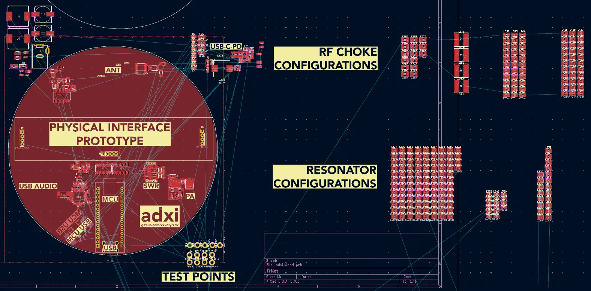
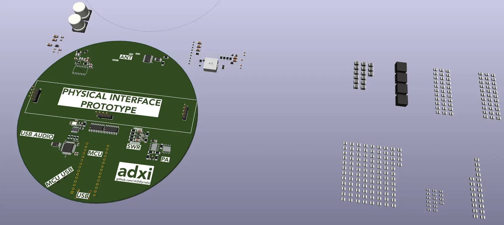
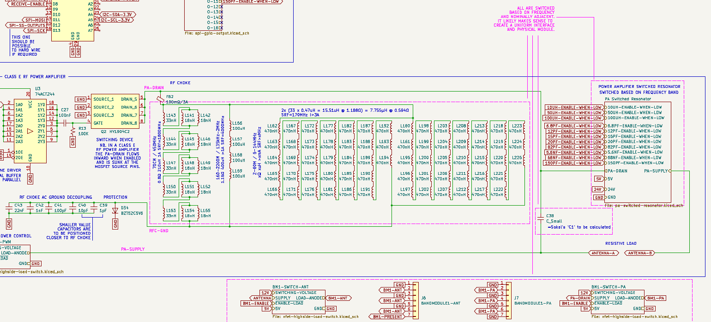
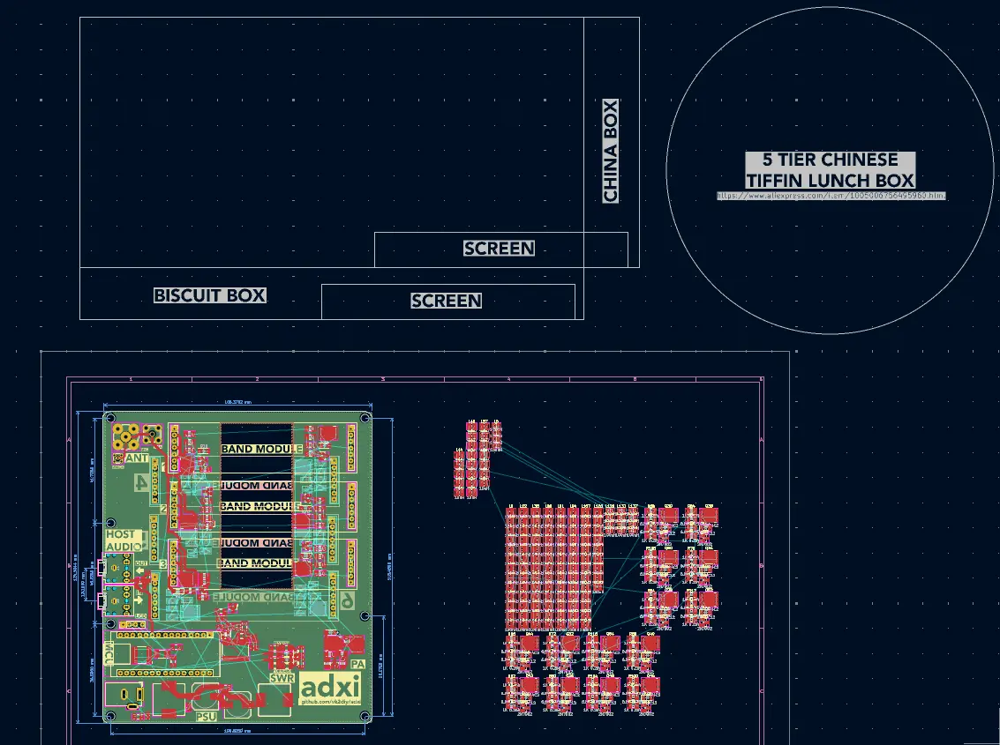
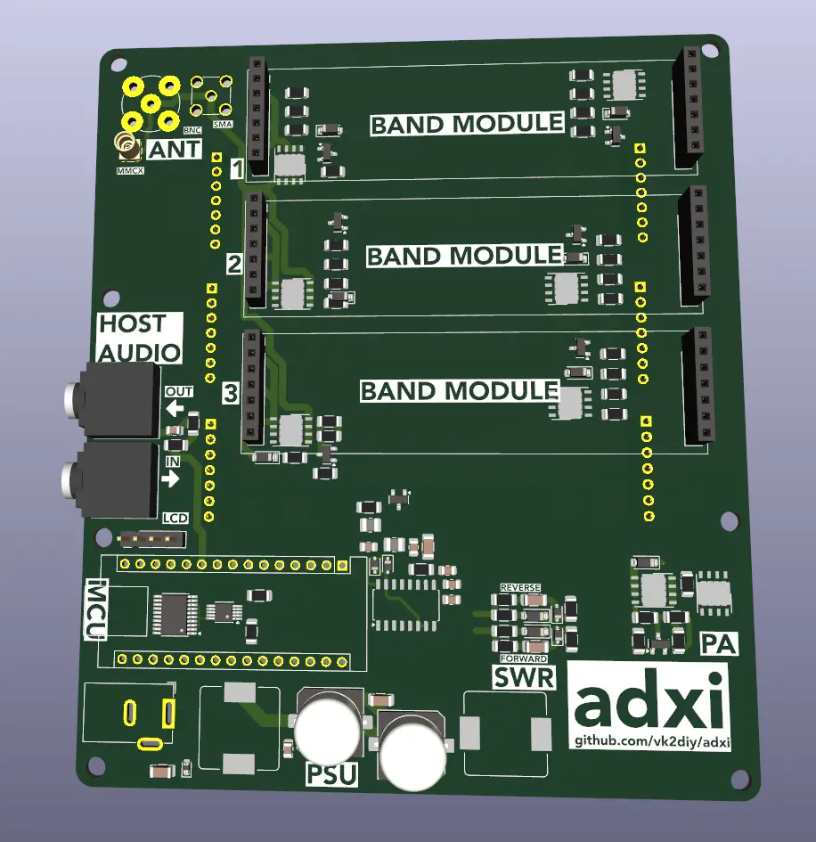

# adxi - ADX Improved

[ADX](https://github.com/WB2CBA/ADX) is an abbreviation for Arduino Digital Xceiver, a project emphasizing simplicity and Arduino hardware creating a [direct-conversion receiver](https://en.wikipedia.org/wiki/Direct-conversion_receiver) focused on [digital modes](http://www.arrl.org/digital-data-modes).

This fork is called __adxi__ (or "ADX Improved") with the following major changes:
 * __abandon simplicity as a design philosophy__ since it limits our feature set and understanding
 * __improved design documentation__ to facilitate learning
 * __restores access to the project for modern KiCad__
 * __integrate known bug fixes__
 * __operates from a single USB-C cable__ for programming and power (DC-IN option), instead of batteries/charge controller, audio in, audio out, sound card.
 * __broader power supply acceptance__ (USBC or any >6W ~12-36V nominal supply)
 * __full computer control__ (remove buttons/blinkenlights interface)
 * __improved filtering__
 * __SWR, forward power and reverse power metering__ for debugging, safety and performance analysis
 * __supports more amateur bands__: 70cm/2m/10m/15m/17m/20m/30m/40m/60m/80m/160m/630m/2200m
 * __use of modern surface mount components__ for repeatability
 * __using platformio__ to manage the firmware build and dependencies in a modern way

The project is not yet complete but is well on the way to a first revision production.

## Update (2024-08-29)

 * Detailed pin-wise documentation of MCU signals
 * Altered proposed PA schematic to show logical flow (top left to bottom right) with the proposed abstraction (*Sokal* flows "backwards" with respect to preferred schematic convention)
 * Completed crystal selection and load capacitance calculation for timer circuit (25MHz@12pF, 2x18pF)
 * Investigated frequency-specific questions regarding the MCU PA drive PWM line pullup, in particular to support 70cm frequencies, concluding no pullup is best (rely on MCU to set state, conserve power when operating in lower frequency bands, one less component)
 * Updated `TUSB321` power delivery chipset interface to remove mode-irrelevant pins and configuration.
 * Updated forward power, reverse power and standing-wave ratio (SWR) sensing schematic to provide better matching of voltage divider output to MCU ADC input range
 * Revised schematic for legibility, removed certain spurious elements
 * Reviewed original firmware

## Update (2024-08-28)

 * Completed audio summing for USB audio chip output
 * Wrapped frequency-response significant portions of the power amplifier (PA), the low pass filter (LPF) and antenna (ANT) interface in to a single unified prototype physical interface
   * Began to compare proposed component count board space with potential physical designs
   * An early stage prototype is shown in 3D and schematic views, based upon 3x2.54mm pin headers
   * Began to write this up as [doc/late-stage-interface](doc/late-stage-interface)





## Update (2024-08-27)

 * __Substantial amount of additional schematic work and documentation__
   * [USB hub](doc/usb-hub)
   * [Power supply](doc/power-supply)
   * [SPI level conversion](doc/spi-level-conversion)
   * Added many test points
 * More component footprints and models
 * Finished off some missing parts in earlier areas of the schematic
 * Readying to refocus on the new joint PA/LPF module mechanical and electrical interface design, after which layout should be straightforward

## Update (2024-08-24)

 * Power supply path further implemented
 * USB-C unified port for all purposes largely implemented including power delivery
 * USB hub configured
 * USB audio configured
 * New parts and footprints created
 * Minor amount of layout work

## Update (2024-08-22)

 * __New power supply mostly implemented__ with dual inputs, either USB-C PD or ~12-36V DC IN
   * Precise nature of fallback for USB-C power chain yet to be determined re. 1.5A negotiation failure
 * __Plan is now to onboard both the digital audio interface and a USB hub__ in order to facilitate the use of a __single USB-C cable to the host__ replacing six elements:
   * Batteries and a charge controller for mobile operation
   * DC-IN for fixed operation
   * Audio in
   * Audio out
   * Either an onboard module or external sound card for audio interfacing
   * Programming cable
 * It will be necessary to draw the schematics for these.

## Update (2024-08-21)

 * Early stage band module schematic proposal. 
   * The primary difference to the prior ADX design is that the physical module will include portions of the power amplifier (RF choke, Sokals' `C1`, resonator) in addition to the low pass filter (LPF).
   * This is thought to make sense because:
     1.  All of these elements were found to require adjustment when considering the revised design's wide aggregate proposed band capabilities; and
     2. "Getting it right first time" may not be either (a) rational expectation; or (b) therefore a cost-effective development trajectory.
   * In other words:
     * I don't trust myself enough to commit to a PCB run where these aspects cannot be further tuned.
     * By putting in the thinking up front to reduce my own development cost, it should also make the process of extending or tweaking the design further by others much easier.
   * Outstanding questions:
     * Since the modular portion includes all of the last stages of the transceiver, it would thus logically include the antenna connection
     * Since the antenna connection is something that people may want in various formats to suit various wavelengths and usage scenarios (IPEX, BNC, SMA) and some of those physical interfaces are not designed for longevity, and the "tiffin" approach will facilitate both vertical layering and improved EMI, it might make sense to zoom out to consider whether or not the antenna should be part of that module or signals should be routed back to the main board before connecting to the antenna.
       * Layering up makes sense because an antenna connection on top of the system would be a logical position, batteries are heavy and could fit below, and minimizing the overall inter-module routing of RF signals would be desirable.
       * Routing back makes sense because fewer modules are required and the specific modules would presumably work out cheaper. 
 * Design conclusions:
   * Don't bother with a screen, instead rely on the computer to provide status information.
   * Don't bother with a battery or charge controller, instead rely on an external USB power bank when mobile.
     * For the purposes of easier mobility and the fact that many laptops or embedded systems cannot supply anything near 1A on their USB ports it may be useful to obtain 5V nominal supply from one port and data from another port, ie. have two USB ports, one for MCU interfacing and one for power delivery.
     * For the purposes of maximum transmit power draw (~1A @ 5V) versus many USB supply limits (~900mA) and safety buffering, it may be useful to add a supercapacitor to the main board.
       * This could also allow switching between power sources without loss of operating state and configuration
     * Given that we are sailing so close to maximum draw it seems a tested solution would be desirable. A shortlist of potential integrated solutions includes:
       * TI TUSB312 - [Chinese](https://wmsc.lcsc.com/wmsc/upload/file/pdf/v2/lcsc/1809072322_Texas-Instruments-TUSB321RWBR_C139392.pdf), [English](https://www.ti.com/lit/ds/symlink/tusb321.pdf) @ $0.34
       * ST STUSB4500QTR - [English](https://wmsc.lcsc.com/wmsc/upload/file/pdf/v2/lcsc/2106070703_STMicroelectronics-STUSB4500QTR_C2678061.pdf) @ $1.29
       * ONSemi FUSB302 - [English](https://wmsc.lcsc.com/wmsc/upload/file/pdf/v2/lcsc/2304140030_onsemi-Fusb302mpx_C442699.pdf) @ $0.71
       * Cypress CYPD3177 - [English](https://wmsc.lcsc.com/wmsc/upload/file/pdf/v2/lcsc/2208051100_Infineon-Cypress-Semicon-CYPD3177-24LQXQ_C2959321.pdf) @ $0.81
     * Given that the TI chip is so much cheaper but they will all probably do the job I think it's worth moving forward with TI.
   * With increasing density comes decreased isolation and increased potential for electromagnetic coupling which is a double-edged sword.
 * Other developments:
   * Considering placing USB audio bridge, USB hub and port for MCU connection on board
     * This would allow programming and operation through a single port - no audio cables required
     * The only conceivable downside is, in a mobile scenario, USB power delivery capabilities of some host devices are limited
       * People can solve this themselves by using USB battery packs with built-in powered USB hubs
   * At this point, it sort of seems ridiculous to keep using the MCU as a module, but it is a pleasant eccentricity to preserve this design element and hard to match on price
     * Future versions could be released with newer MCUs, possibly mounted via adapter boards

## Update (2024-08-19)

 * Issues largely resolved with the PA choke.
   * Operating range was divided in to 3 band-groups (similar to resonator) and 2/3 completed with switching work yet to be done.
 * It seems that to obtain good values for `C1` (Sokal) it will be [necessary to recompute those at each end of the operating band for each resonator and choke selection](https://people.physics.anu.edu.au/~dxt103/calculators/class-e.php), and also to switch those when either PA or resonator change. If these figures work out, however, then confidence in the design should grow.
 * The fact that the Class E PA's RF choke, resonator, C1, and band-specific LPFs all require switching means it is probably best to redesign the group of adjacent passives as a single physical interface and module to support easier and more cost-effective experimental iteration.
 * This means the previous modularity scheme (ie. one of pluggable band-specific LPFs inspired by previous projects) is probably going to evolve to a higher component count, higher flexibility approach incorporating all of these functional blocks.

## Update (2024-08-18)

 * MCU output expansion added to drive switched PA resonator inductance and capcitance to achieve full band range
 * [Having issues](doc/class-e-pa/) identifying a sane strategy for an RF choke capable of the 70cm (450MHz) required
   * To this end, attempted to make at fabricating a coil for main RF choke but failed
   * Still keen to obtain an SMT solution

## Update (2024-08-15)



 * [Further work on power amplifier theory and component selection](doc/class-e-pa/)
   * We now have theoretically adequate SRF on inductor arrays for all bands
 * RF choke still needs a high SRF all-band solution but nominal values of near 220uF and an associated capacitor array have been chosen
 * Tiffin system added to potential footprint drawings

## Updated (2024-08-13)

Recent work:
 * More work on power amplifier
   * Three-mode RF choke inductor mostly completed (one tier to be re-specified)
   * Switchable capacitance calculated and to be added
 * Input of general dimensions of two boxes which have been selected as possible form factors. Have another idea to use this sort of thing as a modular approach: 
 * General cleanup of schematic

## Updated draft PCB (2024-08-10)



 * Further consideration of overall layout, switching placement.
 * It seems there will need to be a series-parallel array of RF choke inductors to cover the broad target frequency range.
   * This is not necessarily expensive, just complex.
   * There will also be at least one switchable inductor in the main RF choke.
 * Other additions:
   * I2C LCD pin header
   * Further antenna connector (MMCX)

## Updated draft PCB (2024-08-09)


This version adopts a band-module approach in order to reduce iteration cost.

The basic notion is that a 7x3cm module can be plugged in to provide band-specific low pass filtering.

There is space on the front of the PCB for three of these modules, and on the rear of the board another three modules. Modules are staggered to minimize the effects of electromagnetic coupling between modules and their terminals. Sockets are used on the board and pins on the filter modules in order to reduce the volume of metal present when less filters are connected.

## Initial draft PCB (2024-08-07)


 * Draft now changed, potentially to have pluggable LPFs instead of a monolithic all-band-onboard architecture
   * This requires the design of an interface for the same
 * Filter switching added

## Current documentation
 * Filters
   * [Bandpass filter model](doc/filter-models/bandpass-filter/) showing audio frequency bandpass filter
   * [CD2003 5V supply filter model](doc/filter-models/cd2003-supply-low-pass-filter/) showing power supply filtering for the radio receiver chipset
   * [DC blocking filter](doc/filter-models/dc-blocking-filter/) showing how capacitors block DC and their nominal frequency relationship
 * Schematic design notes
   * [Multi-band low pass filters](doc/multi-band-lpfs) showing various third party designs for multi-band LPFs and including notes considering practical aspects of the design problem.
   * [SWR and power metering](doc/swr-and-power-metering) discussing the planned approach to obtaining this information simply
 * Wireless protocols
   * *[The FT4 and FT8 Communication Protocols](doc/wireless-protocols/FT4_FT8_QEX.pdf)*

## ADX Original Project

### Features

 * ADX is a mono band (actually quad band) digital modes optimized HF transceiver that can cover four pre-programmed bands one band at a time by swapping Band LPF Modules.
   * It can work on 80m, 40m, 30m, 20m, 17m, 15m and 10m bands
   * It can operate on four of the most popular digital modes, FT8, FT4, JS8call and WSPR.
 * ADX supports computer control (CAT) by emulating KENWOOD TS2000 HF Transceiver over a 9600 8N1 serial link to control Band and Mode changes.

### Goals

The project was originally designed by [Barb (WB2CBA)](https://github.com/WB2CBA/ADX) ([original project website](https://antrak.org.tr/blog/adx-arduino-digital-transceiver/))  with the goal to design a simple HF Transceiver optimized for operating on Digital modes:
 - Simple to procure – meaning not effected by chip shortage
 - Simple to build – 2 modules, 2 IC’s and 4 Mosfets!
 - Simple to setup and tune – One simple calibration procedure is all needed.
 - Simple to operate – Plug in ADX MIC to soundcard MIC input and ADX SPK to PC soundcard speaker input and we are good to go with any digital modes Software.
 - Dirt Cheap – Costs less than 25$ to get all parts and PCB if we exclude ridiculous shipping costs!
 - Plug in a USB cable between ADX Arduino and your PC, Select Kenwood TS2000 with 9600bps,8,1 setup as your CAT rig and you will have CAT control on ADX!

It has since been built all over the world.

### Design

The original design was based on the following major physical modules:
 * Main ADX PCB
   * CD2003 radio chip
   * 74ACT244 buffer/line driver
 * Arduino Nano (ATmega328P MCU module)
 * Si535x clock generator module
 * uSDX LPF band module
 * External PC microphone interface (for sending received signals to the computer)
 * External PC speaker interface (for receiving encoded signals from the computer)

## Revised design

The revised design is not religiously focused on minimizing the number of components through using external circuit boards.

Instead, it:
 * brings the clock generator and band-specific filters on-board
 * seeks to remove the physical interface and replace it fully with host computer control (known as a "computer aided transceiver" or "CAT") via [wsjtx](https://wsjt.sourceforge.io/) (G4WJS/K9AN/IV3NWV) which is itself based on [hamlib](https://hamlib.github.io/) (VK3FCS/F8CFE/etc.)
 * provides a more flexible and well filtered power supply so that available AC-DC ~12-36V inputs can be used

## Building the firmware

Firmware is managed through [platformio](https://github.com/platformio/platformio-core).

Rationale:
 - While excellent in its simplicity, Arduino IDE is generally inappropriate for long lived projects.
   - Why?
     - It has brittle dependency management
     - It relies on non-scriptable GUI actions.
     - It lacks modern features like unit testing, CI/CD, etc.

Result:
 - You will need to install either [platformio-core](https://github.com/platformio/platformio-core) (command line) or [platformio IDE](https://platformio.org/platformio-ide).

Benefits:
 - Notes about specific versions of specific libraries and compatibility are now a thing of the past.
 - The addition of future libraries, compilers, or tools is easy
 - Users become familiar with more modern, cross platform and professional grade approach to firmware development and management while working on personal projects

### Under platform-io core (command line)

Simply change to the source code directory and type `pio run`.

```
$ cd firmware
$ pio run
```

### Under platformio IDE

Open the project in the IDE then use the buttons provided.


## Current status of this fork

 - Firmware now builds correctly under platformio
 - KiCad 8 redrawing of the schematic and a draft layout are well underway and nearing completion

### Next steps
 - Complete schematic and layout
 - Order boards
 - Verify functionality

## History

### 2024-08-07
 - First 'mostly there' release of Kicad v8 schematic and board design

### 2024-08-03

 - Forked, general cleanup and migrated to [platformio](https://github.com/platformio/platformio-core).
   - Previously Arduino IDE builds were the norm
   - Apparently the files had apparently not been opened since KiCad v4 ... KiCad is now at v8.0.4
 - Outstanding issues
   - KiCad has altered its library management so much that the old files will not import directly to v8.0.4
   - KiCad has improved its internal libraries so that external libraries for many parts are no longer required
   - KiCad has integrated the historic DigiKey library
   - The schematic is missing known PCB fixes not integrated but documented by the original author
   - The schematic uses a non-standard symbol for the MCU which is unhelpful
   - The schematic has a number of further errors making it suboptimal for introducing new students
   - The layout used a type of fill which is no longer supported by modern KiCad
   - The layout can probably be improved
 - Conclusion
   - Given the simple nature of the schematic it is better at this point to redraw the schematic and redo the layout, removing all previous KiCad 4 era files

### 2023-07-14

- Release band display bug fixes by Peter Petrov (LA7WRA) and Mark Culross (KD5RXT).

### 2023-06-10

- Cowtown Amateur Radio Club ADX Buildathon Construction Manual v1.5 by Richard Hinsley (W5ARH/VK2ARH)

### 2023-04-08

- SI5351 module pull up resistor fix added to build manual v1.4 by Richard Hinsley (W5ARH/VK2ARH)

### 2022-12-20

- Calibration procedure changed to protect EEPROM from R/W wear.
- Add zener diode PA mosfet protection from excessive SWR conditions.

## Contributors

### adxi project

 * VK2DIY

### ADX Project

 * [Barb (WB2CBA)](https://github.com/WB2CBA/ADX): Project conception and original design.
 * [Richard Hinsley (W5ARH/VK2ARH)](https://www.qrz.com/db/W5ARH): Buildathons, outreach and build documentation.
 * [Joerg Frede (DK3JF)](https://www.qrz.com/db/DK3JF): CAT and other software contributions.
 * [Peter Petrov (LA7WRA)](https://www.qrz.com/db/LA7WRA) and [Mark Culross (KD5RXT)](https://www.qrz.com/db/KD5RXT): Band display bug corrections.
 * [Burkhard Kainka (DK7JD)](http://elektronik-labor.de/): Initial FSK TX signal generation code - http://elektronik-labor.de/HF/SDRtxFSK2.html
 * [Jason Mildrum (NT7S)](https://www.qrz.com/db/NT7S): SI5351 Library - https://github.com/etherkit/Si5351Arduino
 * [Lajos Höss (HA8HL)](https://www.qrz.com/db/HA8HL): Inspiration for CAT code based on his TS2000 CAT implementation.
 * [JE1RAV](https://www.qrz.com/db/JE1RAV): Improved FSK TX signal generation code - https://github.com/je1rav/QP-7C
