# adxi - ADX Improved

[ADX](https://github.com/WB2CBA/ADX) is an abbreviation for Arduino Digital Xceiver, a project emphasizing simplicity and Arduino hardware creating a [direct-conversion receiver](https://en.wikipedia.org/wiki/Direct-conversion_receiver) focused on [digital modes](http://www.arrl.org/digital-data-modes).

This fork is called __adxi__ (or "ADX Improved") with the following major changes:
 * __abandon simplicity as a design philosophy__ since it limits our feature set and understanding
 * __improved design documentation__ to facilitate learning
 * __restores access to the project for modern KiCad__
 * __integrate known bug fixes__
 * __operates from a single USB-C cable__ replacing the need for an MCU programming cable, a power cable, an audio input cable, an audio output cable, and a host computer sound card.
 * __USB-C power supply__
 * __full computer control__ (remove buttons/blinkenlights interface)
 * __improved filtering__
 * __SWR, forward power and reverse power metering__ for debugging, safety and performance analysis
 * __supports more amateur bands__: 70cm/2m/10m/15m/17m/20m/30m/40m/60m/80m/160m/630m/2200m
 * __use of modern surface mount components__ for repeatability
 * __using platformio__ to manage the firmware build and dependencies in a modern way

## Project scope

The project scope generally includes the following:
 * Main board
 * Late stage board modules (each for different frequency bands)
 * Assembly information
 * Design documentation

## Current status of this fork

The first boards have been ordered.

Completed:

 - [x] Updated schematic (Kicad 8)
 - [x] Layout
 - [x] Late stage module interface design
 - [x] Design and layout of first late stage module 
 - [x] Firmware building correctly under platformio
 - [x] Final design review
 - [x] Order boards

Underway:

 - [x] Board testing and bringup
   - [x] USB hub verified
   - [x] USB audio verified
   - [x] USB MCU module passthru verified
   - [x] Power stage testing completed (issues found; resolution proposed and partly bench tested)
     - [x] Design and order power stage fix board
   - [ ] Firmware authoring to verify remaining functional blocks
 - [ ] Integrate and test late stage module
 - [ ] Verify system functionality

Future:

 - [ ] adxi-1.3 main board revision - incorporating power stage fixes and other improvements, after a full set are known

## Updates (2024-11-11)
 * Began rewriting firmware, made gross simplifications, probably broke some stuff, and found another hardware bug.
 * Designed and ordered a power stage fix board. This should resolve the issues detected to date.  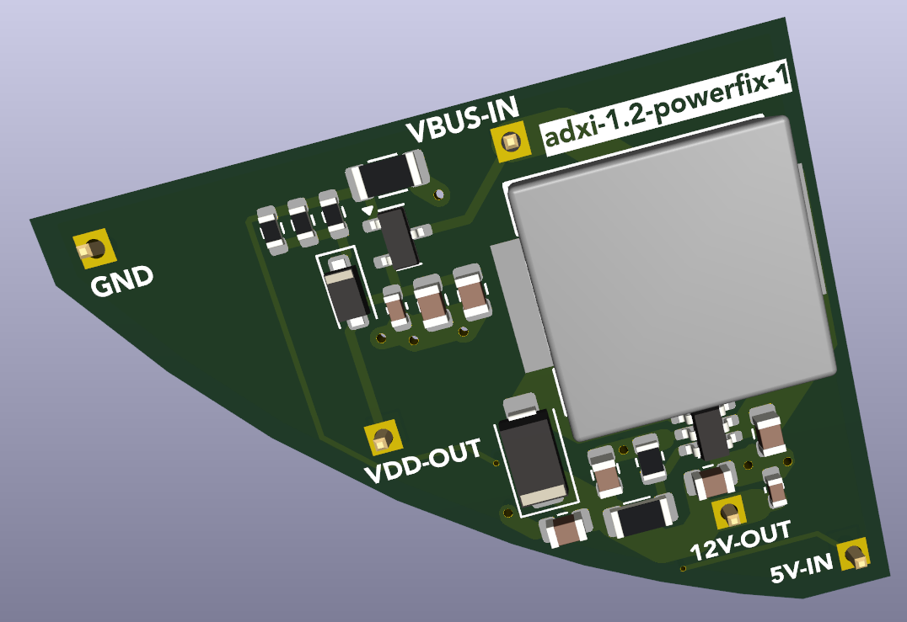 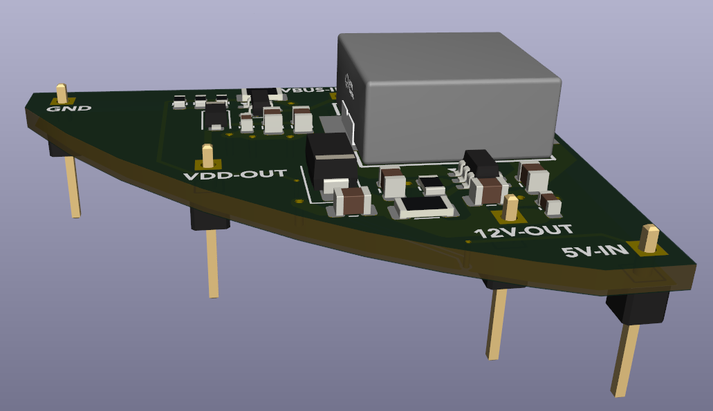

## Updates (2024-11-10)
 * [Bench testing](kicad-pcbs/adxi/) of the switchover part of the proposed power solution did not go according to plan, despite attempting two different combinations of Schottky diodes in a passive configuration, adding resistors and generally investing time.
   * The final perspective was that the issue could be the components themselves, could be the topology or could be a property of the bench supply channels when simultaneously applied to a circuit (various earthing options were tested).
   * The conclusion was to move to an active switching topology using a power MOSFET in a standard package size. This will disconnect the early stage supply once the regulated supply becomes available.

## Update (2024-11-09)
 * A [very busy week testing](kicad-pcbs/adxi/). 
   * Issues found in the power stages were numerous.
     * First there was a topology error in the USB power, mostly due to lack of personal dilligence in critically evaluating the datasheets, but also inexperience with USB power.
       * I am confident this should be resolved in the next revision or in a fix.
     * Second the boost converter had huge issues
       * First it was missing capacitance which was actually critical (unlike bulk output capacitance which may often be removed or reduced, high frequency capacitors are very important for stable boost conversion)
       * Second the inductor was oversized, as the datasheet simply suggested a range and I'd picked the larger end. Well, turns out there's a way to select these and I should have picked the middle to low end.
     * Third the unstable boost converter output with huge 75V swings was probably responsible for burning itself out, but also it was responsible for making the subsequent 12V regulator fail. Thankfully I was able to demonstrate that as soon as power was cut, however, the capacitor (added) was able to feed the 12V regulator and achieve perfect output.
   * None of these issues are critical, all can be resolved by power bypass or modification.
   * A potential fix board has been generally designed, but firmware testing to allow the evaluation of other functional blocks will proceed before an order is placed, just in case we have other issues and it may be more useful to redo the board as a whole.
   * Once this has been done, the new problem of testing the late stage module begins, which will no doubt involve some pretty NanoVNA graphs. I might cut one board to segment it in to functional blocks so that each can be characterised independently. This will not cause any loss of boards, because after testing is complete the board can be solder-configured for an alternate band (each initial late stage module supports 20m/30m/40m bands, but only one at a time, and I had 20 made for only 10 radios).

## Update (2024-11-05)

 * Boards arrived yesterday!
 * A [detailed log of debugging is available here](kicad-pcbs/adxi/)
 * Currently there is an issue with the USB power circuitry which I am working to resolve. It seems I made a mistake on this part of the design due to inexperience.
 * Bypassing that supply with a bench supply results in correct USB connectivity to all devices, which is very promising and quite rewarding given this is my first USB device.  
 * Probably, this means I can use the current boards by adding some external components, which have been ordered.
 * Further testing continues.

## Update (2024-10-24)

 * Finally ordered the boards, final versions as follows. 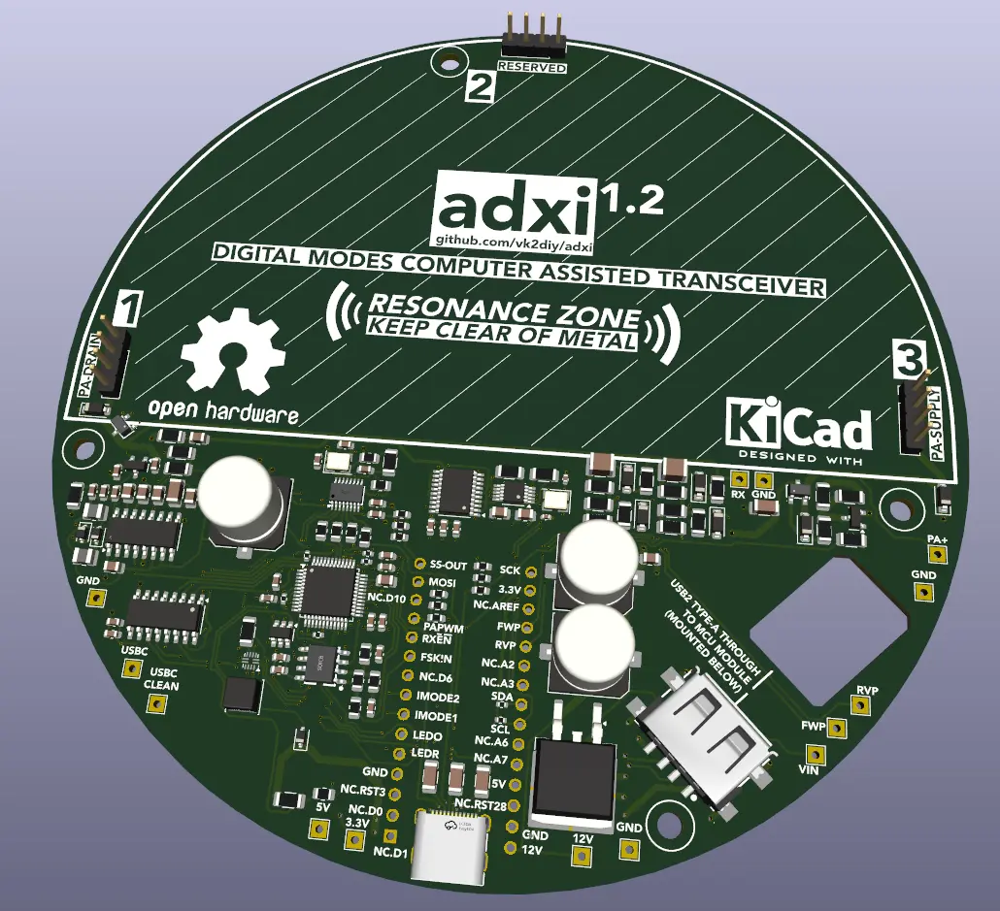 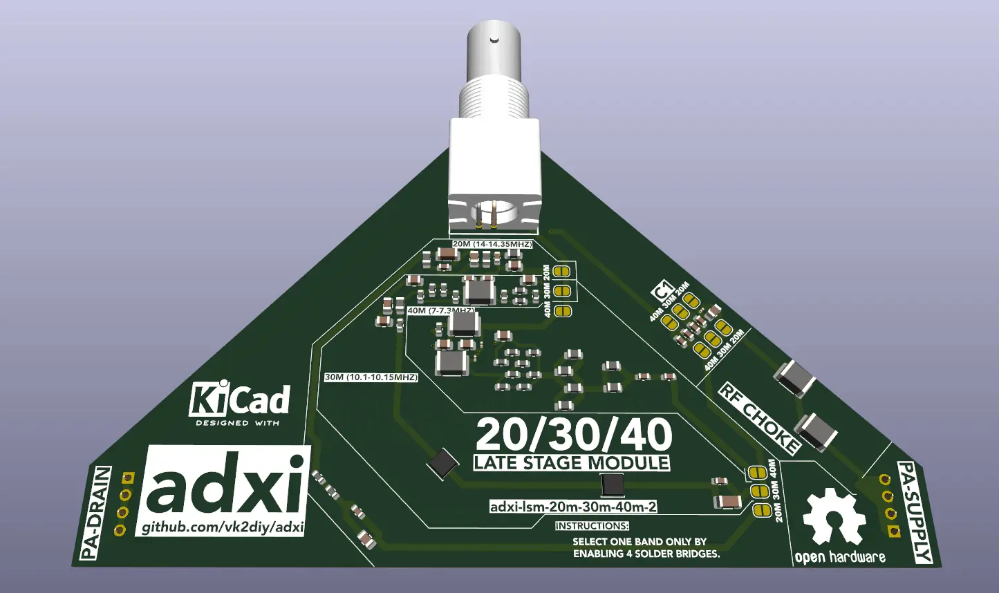
   * Delays were mostly due to the need to update [classe2-calculator](https://github.com/vk2diy/classe2-calculator) to replace portions deemed inappropriate during DFM review and other matters taking my time.
   * I expect to receive the boards in a couple of weeks... looking forward to testing!

## Update (2024-10-03)

 * Quite a lot of progress.
   * [classe2-calculator](https://github.com/vk2diy/classe2-calculator) (pronounced "classier calculator") is reaching a fairly mature state with some very useful output.
     * Three power amplifier topologies are support: `-t infinite`, `-t finite` and `-t inverse`.
     * Three matching network topologies are supported: `-M l`, `-M t` and `-M pi`.
     * 1st-7th order low pass Butterworth filter networks are supported, these are automatically generated for all orders.
     * In all cases, practical approximations using standard component values are generated and ranked in descending order of accuracy along with part counts.
   * Late stage module
     * The late stage module has been redesigned with the new calculations.
     * Upon advice, the antenna tuning features have been dropped.
   * Main board
     * The main board has been redesigned as v1.1 and subsequently (underway) as v1.2
     * When the v1.1 was ordered, a number of issues were uncovered:
       * Component selection: overpriced components, unavailable components and undue component quantities
       * Double-sided assembly: one of the key components that is unrealistic to manually assemble is the USB-C port which had been placed on the underside. This however needs to move to the top side for process reasons.
       * In order to facilitate the above, a hole must be cut in the board for the MCU to MCU USB-2 interface port cable, since it cannot be on top of the board.
       * Thankfully some component upgrades (1000uF caps) and consequent board space downsizing has shown there is probably *just* enough space to make this happen.
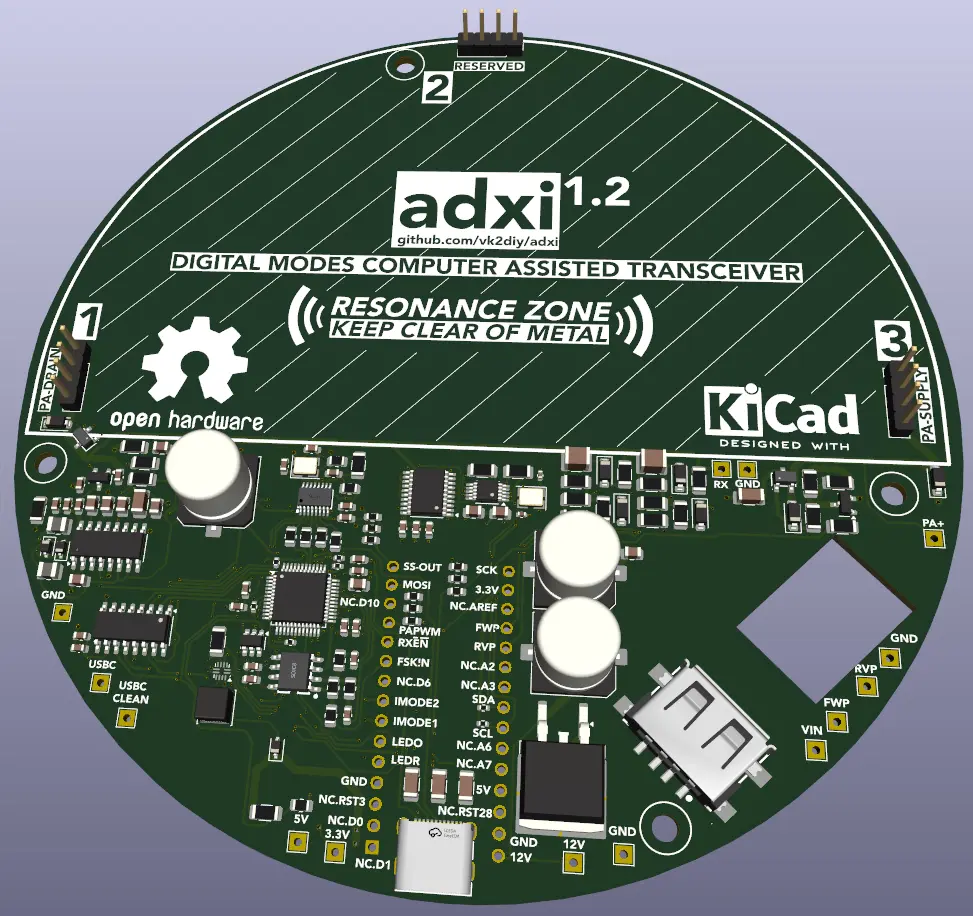
   * I will not be focused on this project for a little while due to other commitments but will finish it ASAP.


## Update (2024-09-18)

 * __Still working on the [novel Class E component calculator tool](https://github.com/vk2diy/classe2-calculator)__. Turns out there's a lot of background to the evolution of the physics equations and AC circuit theory is a bit different to the DC stuff I'm used to, so this is taking awhile.
 * __Discovered another component concern__, this time Zener Diodes. 
   * Basically due to the difficulty of finding high voltage rated components the approach of using zener protection had been put forward. This is not particularly common in resonators, and probably for good reason.
   * Further research revealed the reason why.  So it seems that the use of Zener Diodes creates an increase in effective shunt capacitance (somewhat similar to the output gate capacitance or `C(OSS)` of a MOSFET) which effectively works in parallel to the shunt capacitor `C1`.
   * The previous zener diode was selected for as low a voltage as possible, but this is not a good look, particularly when using multiple zener diodes in parallel (the design had three).
   * Apparently, the higher the zener diode voltage rating, the lower the capacitance, because:
     * Depletion region width: As the voltage rating of a zener diode increases, the width of the depletion region in the PN junction also increases, and the wider depletion region results in a lower capacitance, as capacitance is inversely proportional to the distance between charge carriers.
     * Doping levels: Higher voltage zener diodes typically have lower doping levels. Lower doping leads to a wider depletion region and thus lower capacitance
.
     * Junction area: For a given power rating, higher voltage zener diodes often have smaller junction areas. A smaller junction area results in lower capacitance.
     * Reverse bias effect: As reverse voltage is applied to a zener diode (before breakdown), the depletion region expands further, reducing capacitance.
     * Higher voltage zeners operate at higher reverse voltages, leading to lower capacitance.
     * This relationship can be expressed mathematically as $$C = \frac{K \times D^4}{(\rho V_C)^n}$$ or the Unicode equivalent `C = (K × D^4) / (ρV_C)^n`
       * `C` = Capacitance
       * `K` = Constant
       * `D` = Junction diameter
       * `ρ` ($\rho$) = Material resistivity (related to doping)
       * `V_C` ($V_C$) = Voltage across the junction
       * `n` = Exponent (typically around 0.5) 
     * As the voltage rating (`V_C`) increases, the capacitance (`C`) decreases.
     * Once the zener reaches its breakdown voltage, the capacitance tends to stabilize and doesn't change significantly with further increases in current.
 * __Discovered some low-voltage components__.
   * Certain components will be swapped out for higher voltage equivalents.
 * __Discovered less than ideal diode selection__.
   * Diode switching speed in the forward and reverse power sampling circuit was identified as a concern.
   * I have done a [write-up on this](doc/swr-and-power-metering)
 * __Discovered topology error__.
   * Through a manual review, discovered not one but two topology errors in the late stage modules.
   * One error was to do with the overall topology across the main board interface.
   * One error was to do with the ordering of resonator components (`L2`/`C2` inverse).
   * The first prototype late stage module schematic has been updated to reflect the correct topology.

## Update (2024-09-11)

 * No update for almost a week, but I have been busy! The design review has revealed a large number of issues requiring resolution.
 * __Two full days were spent creating and enhancing new Class E calculator software__.
   * This decision was prompted by the revelation that repeatedly running existing third party software was an inefficient means to explore the solution space and certain concerns were raised regarding ambiguities in the algorithm, inputs and outputs for third party tools. No final tool was created however a lot of functionality was explored, including:
   * The generation of basic Class E circuit values.
   * The generation of matching networks in both "L" and "Pi" configurations.
   * The storage, retrieval and referencing of band information, transistor information, capacitor and inductor information.
   * Efficient caching systems for achieving faster reslts than naive depth-first search in the solution space.
 * __Development of the tool put on hold temporarily, and to assist with verification a number of existing third party tools were surveyed__.
   * The conclusion of the existing software survey was that much existing (pre-SMD) software is sub-optimal for a modern SMD-based device design use case:
     * Often the software is produced by HAM hobbyists to scratch and itch and does not meet broader requirements.
     * A common shortcoming was the explicit assumption of the use of hand-wound coils and the provisioning of coil-winding instructions rather than SMD component selection information.
     * Another shortcoming was the use of imperial measurements (no metric support).
     * Another shortcoming was the use of simple algorithms where more advanced information and methods are now available. For example, it is generally impossible with most tools to model the use of a given circuit with anything but a 50% duty cycle.
     * The main and overwhelming shortcoming was a critical lack of design documentation, specifically including an explanation of which algorithm was in use, and for what purpose, informed by which literature, etc. The majority of HAM-grade tools just provide hand-wavey references to *Sokal*, *NM0S*, and it has been shown that the latter incorporate circular references of dubious or limited connection the broader scientific literature. This is just not a good basis for moving forward with a proper understanding of the design space.
 * From a practical standpoint:
   * __Transistor selection was shown to be bad__. The transistor somewhat arbitrarily selected has proven insufficient for the application and thus will be replaced. While the power handling was excellent, certain aspects of its design (in particular output capacitance) were shown to be far in excess of practical for this application. Currently it seems the preferred replacement citing availablity, cost and modeling will be the `SI2304DDS`.
   * In terms of design verification, education and tuning, __current sensing would be very useful__.
     * Specifically, the ability to sense current in order to visualize the switching action of the Class E Power Amplifier primary switching device across input drive signal, load current and load voltage in order to verify the primary properties of the Class E Power Amplifier are in tune with the required characteristics, ie. zero voltage and zero current at the time of switching.
     * According to various sources ([TI](https://www.ti.com/lit/eb/slyy154b/slyy154b.pdf), [Analog Devices / Linear Technology](https://www.analog.com/media/en/technical-documentation/app-notes/an-105fa.pdf), [Renesas](https://www.renesas.com/us/en/document/apn/current-sensing-low-voltage-precision-op-amps), [Bourns](https://www.mouser.com/pdfdocs/bourns_n1702_current_sense_accurate_measurement_appnote.pdf), [Mouser/Microchip/Vishay](https://www.mouser.com/pdfDocs/microchip-vishay-current-sensing-whitepaper.pdf) and [ElectroicDesign](https://www.electronicdesign.com/technologies/power/article/21806322/electronic-design-using-resistors-for-current-sensing-its-more-than-just-i-v-r)) and a cursory review of lab equipment available for current sensing with oscilloscopes, plus some prior experience building current sensing circuits within boards using op amps, __it seems that it would be desirable to provide a measurement test point across a shunt resistor specifically for the provisoning of current measurement__.
     * Not having had the need for higher frequency measurements in the past, __my oscilloscope is limited to 70MHz which the following calculations show is perhaps just within the recommended range for this purpose__. For the higher frequency bands, this sampling and verification strategy will certainly run in to issues with my current test equipment.

| Band | Frequency | Nyquist | Practical Rate (2.5x) | Recommended Rate (3-5x) |
| ---- | --------- | ------- | --------------------- | ----------------------- |
| 20m  | 14 MHz	   | 28 MHz	 | 35 MHz                | 42-70 MHz               |
| 30m  | 10 MHz    | 20 MHz  | 25 MHz                | 30-50 MHz               |
| 40m  | 7 MHz     | 14 MHz  | 17.5 MHz              | 21-35 MHz               |

 * From a theoretical standpoint:
   * It was found that Class F and Class E/F circuits are sometimes mislabelled as Class E in software and this should be kept in mind.
   * The generation of Class F and Class E/F could be a rational decision for the analysis software.
   * It seems *critical* to actually visualize the actual switching-time voltage and current in order to fully comprehend and verify a Class E implementation, thus hardware must be designed to facilitate.
   * The degree to which different component blocks interact or are operation or replaceable should be more thoroughly investigated. For example:
     * Many source suggest the L1 RF Choke should be 10-15x L2 (resonator inductance) but do not further specify tuning.
     * Some sources suggest the L1 RF Choke can be larger than specified without incident, thus a common large inductor might be selected to cross all bands.
     * L1 (RF Choke) is apparently possible to replace with a "finite DC feed inductance" (FDI) and this is apparently well known and desirable at higher frequencies, eg. our targeted 70cm.
 * Next steps:
    * It now makes sense to spin the emergent calculation tool off in to its own tool which can be managed separately
    * After that is in a state of relative verification (re. generates values that generally concur with alternative calculators, includes reasonable defaults, provides useful output) then the component values will be recalculated for the initial late stage module board
    * The late stage module will be modified to include a current sense resistor and test point explicitly to facilitate the visualization of current information on the oscilloscope to demonstrate and tune the Class E circuit operation

## Update (2024-09-05)

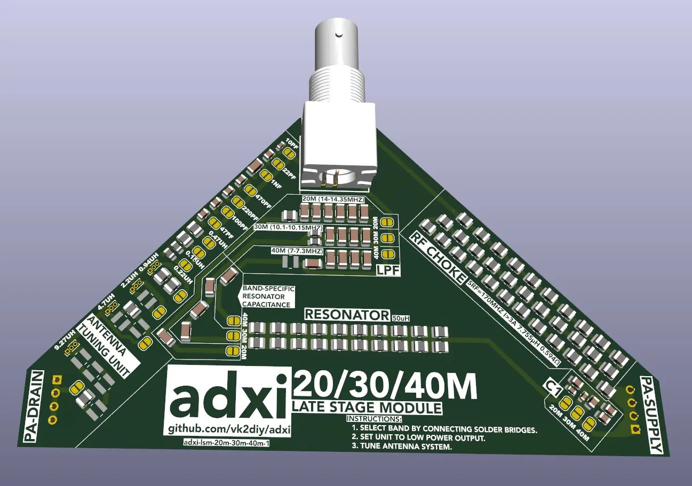

 * Improved prototype late stage interface module for 20m, 30m and 40m bands
   * Correct rather than vague geometry
   * Correct orientation
   * Inclusion of RF choke
   * Inclusion of Sokal `C1` capacitor
   * Silk screen labels
 * Built-in antenna tuning
   * Based on a series of SMD-fixed elements with a solder-bridge enable
     * This should allow for reasonable tuning without the need for a separate antenna tuning system

## Update (2024-09-04)

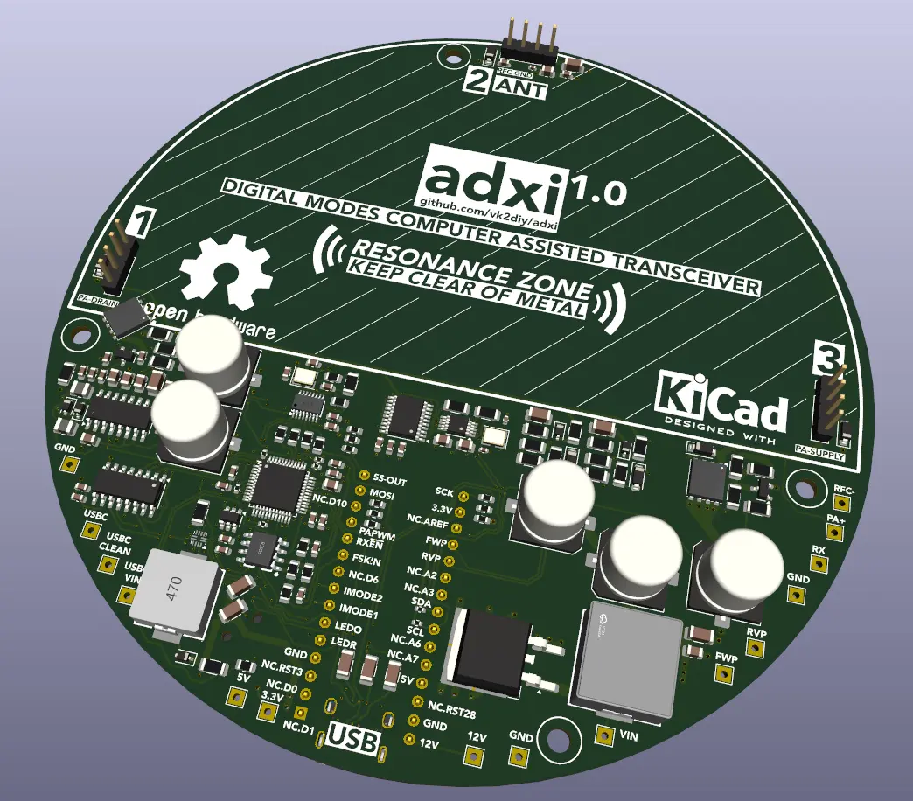
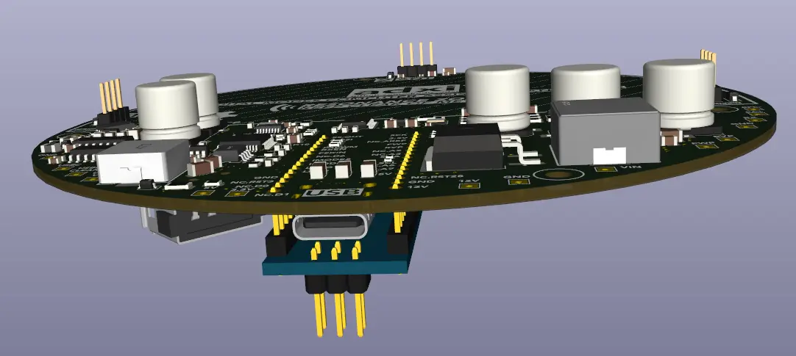
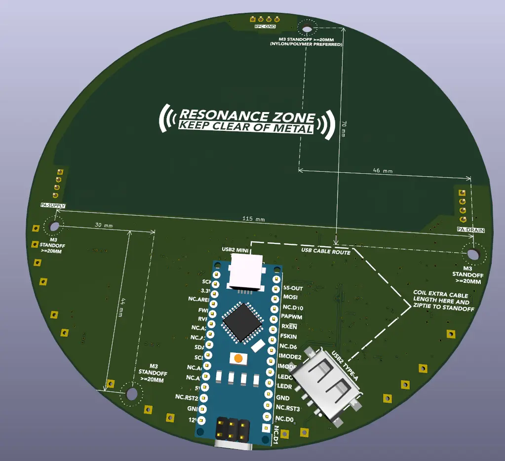

 * Add mount point dimensions
 * Updates to silkscreen, including a "what it does" description and MCU labels visible on all pins
 * Significant updates test pads (preferred compact format for oscilloscope attachment, add more `GND` points, reposition a few pads)
 * Add 3D model of Arduino Nano from [over here](https://github.com/g200kg/kicad-lib-arduino) for demonstrative visualization purposes
 * Revisit layout for more cost effective vias (0.3mm vs 0.2mm)
 * Specify (and order) standoffs and cables
 * Moved out late stage schematics (done ages ago) to a separate directory in preparation for late-stage module PCBs
 * __Layout complete! This is version 1.__
 * Bullet point design review to date:
   * Total part-time design time was about 4.5-5 weeks. Actual design time maybe 2 weeks.
   * Initial estimate of "maybe one week" vs actual time investment of 2 weeks and calendar time investment of 5 weeks off by around 100%/500% (not a bad guesstimate!) ... 
     * Learning: Next time multiply the optimistic estimate by five for a real calendar time estimate.
   * Learned a *lot* of basic RF and radio design - both areas totally new to me - including:
     * Which stages require frequency-specific considerations (almost all of them, thus a combined [late stage interface](doc/late-stage-interface) incorporating parts of the Class E Power Amplifier and the band filter made sense, this being an architectural distinction from the previous project)
     * The various classes of amplifiers and detail regarding [Class E Power Amplifier design](doc/class-e-pa)
     * [How to design band-specific LPFs](doc/multi-band-lpfs) and why SRF is important
     * [How to get power from USB](doc/power-supply) and negotiate different power levels, without relying on the MCU module for the same
     * How to on-board a [USB hub](doc/usb-hub)
     * How to on-board a [USB audio chipset](doc/usb-audio-chipset)
     * How to [combine audio channels in hardware](doc/audio-summing)
     * [How to implement SWR, forward power and reverse power metering](doc/swr-and-power-metering)
     * The design history and AM-side configuration of a major family of [receiver chipsets](doc/receiver)
     * Why the old HAM radio trick of building your own coils is a pain in the ass but nonetheless useful to understand
     * A bunch about [antenna tuning hardware](doc/antenna-tuning)
     * Roughly how to use a vector network analyzer and link it with Linux software to characterize an antenna system, filter system, etc. with a frequency response curve
   * Also learned some better fundamentals including:
     * More of a decent background on available filter topologies (usually I just copy whatever's recommended)
     * How to torture AI in to giving you insights in to aspects of electronics design you have no clue about
   * Also came up to date with a few ecosystem state of play issues regarding KiCad 8 library management, fabrication partner file format preferences, etc.
 * Outstanding items
   * No idea if this will work, rather than attempting to roll in a frequency sweep / filter-characterization feature using the spare channel of the programmable clock generator I thought it was best to just order one revision and get things working.
   * Late stage boards with band-specific hardware still require layout
     * Perhaps first produce one popular band so that we can validate the overall design before investing in the others
     * The 20m band has been selected as the band to go for, based upon [WSPRNet Activity](https://www.wsprnet.org/drupal/wsprnet/activity) which is reporting the following bands have the highest recent activity levels:
       * 20m (675× contacts)
       * 40m (540× contacts)
       * 30m (437× contacts)
     * Made an early-stage prototype with solder-selectable support for all three bands 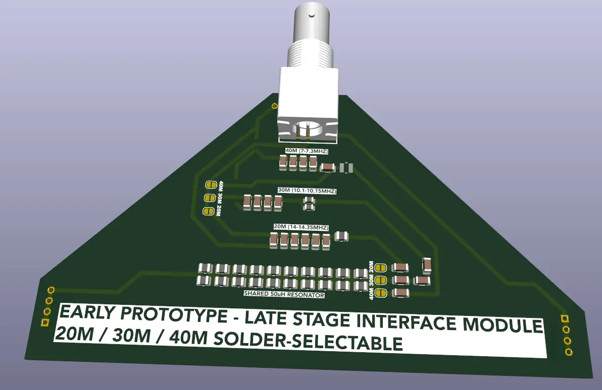
   * Ordering
   * Post-ordering
     * Further firmware review and development
     * Try to plan out a test process for each block

## Update (2024-09-03)

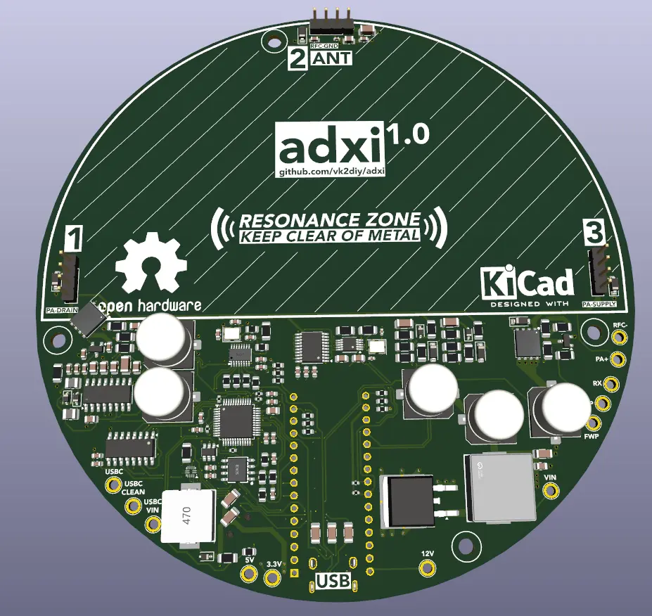

 * Add silkscreen graphics
 * Add four M3 mounting holes with screw head footprint indicator silkscreen
 * Improve certain footprints
 * Simplify power supply to USBC only
 * Complete layout and DRC. (Also [discover and report DRC bug in KiCad](https://gitlab.com/kicad/code/kicad/-/issues/18642).)

## Update (2024-09-02)

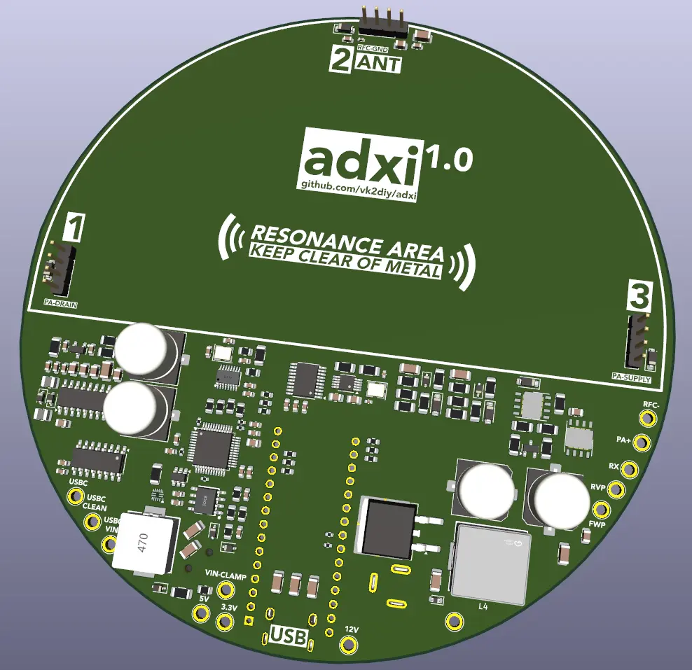

 * Remodeled and improved [receiver chip](doc/receiver) [power filter](doc/filter-models/cd2003-supply-low-pass-filter).
 * Changed [stereo to mono audio summing to op-amp based](doc/audio-summing) (despite probable functional futility thereof since this is sourced locally) as theoretically this results in a cleaner output for an extremely nominal cost, and integrated the correct output bias line.
 * Found, reported and worked around [some](https://github.com/TousstNicolas/JLC2KiCad_lib/issues/77) [bugs](https://github.com/TousstNicolas/JLC2KiCad_lib/issues/76) in an [upstream library tool](https://github.com/TousstNicolas/JLC2KiCad_lib).
 * Executed most basic layout and verified all components fit in the allocated board space.

## Update (2024-09-01)

 * Specified the majority of schematic components still lacking footprints
 * Reconsider [receiver chip](doc/receiver) associated circuitry using a plethora of datasheets from chips in this family.
   * Learn more about the benefits of DC isolation for mixed AC/DC ICs.
   * [Model RF LPF](doc/filter-models/cd2003-rf-low-pass-filter).
   * Update peripheral circuitry to reduce cost and improve outcomes.

## Update (2024-08-29)

 * Detailed pin-wise documentation of MCU signals
 * Altered proposed PA schematic to show logical flow (top left to bottom right) with the proposed abstraction (*Sokal* flows "backwards" with respect to preferred schematic convention)
 * Completed crystal selection and load capacitance calculation for timer circuit (25MHz@12pF, 2x18pF)
 * Investigated frequency-specific questions regarding the MCU PA drive PWM line pullup, in particular to support 70cm frequencies, concluding no pullup is best (rely on MCU to set state, conserve power when operating in lower frequency bands, one less component)
 * Updated `TUSB321` power delivery chipset interface to remove mode-irrelevant pins and configuration.
 * Updated forward power, reverse power and standing-wave ratio (SWR) sensing schematic to provide better matching of voltage divider output to MCU ADC input range
 * Revised schematic for legibility, removed certain spurious elements
 * Reviewed original firmware

## Update (2024-08-28)

 * Completed audio summing for USB audio chip output
 * Wrapped frequency-response significant portions of the power amplifier (PA), the low pass filter (LPF) and antenna (ANT) interface in to a single unified prototype physical interface
   * Began to compare proposed component count board space with potential physical designs
   * An early stage prototype is shown in 3D and schematic views, based upon 3x2.54mm pin headers
   * Began to write this up as [doc/late-stage-interface](doc/late-stage-interface)

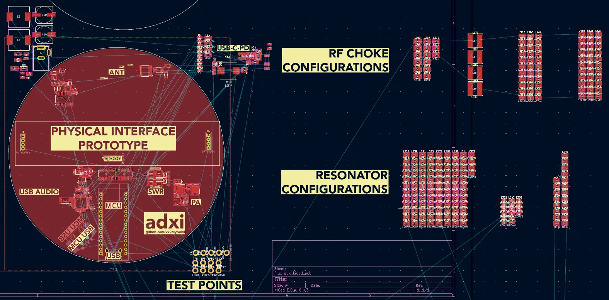
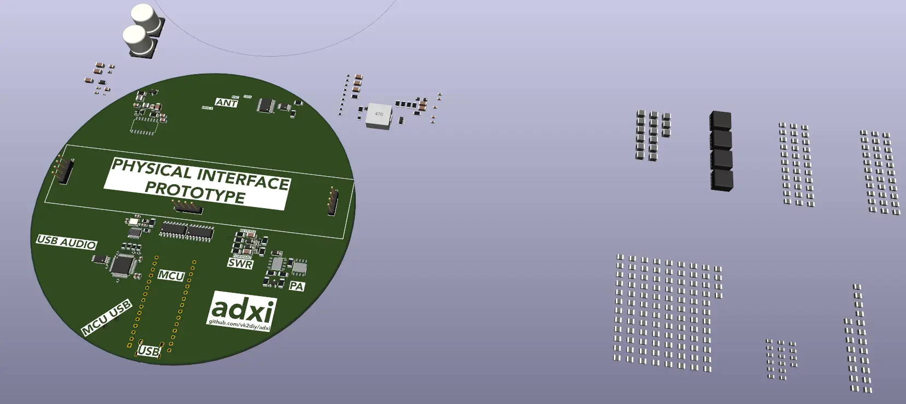


## Update (2024-08-27)

 * __Substantial amount of additional schematic work and documentation__
   * [USB hub](doc/usb-hub)
   * [Power supply](doc/power-supply)
   * [SPI level conversion](doc/spi-level-conversion)
   * Added many test points
 * More component footprints and models
 * Finished off some missing parts in earlier areas of the schematic
 * Readying to refocus on the new joint PA/LPF module mechanical and electrical interface design, after which layout should be straightforward

## Update (2024-08-24)

 * Power supply path further implemented
 * USB-C unified port for all purposes largely implemented including power delivery
 * USB hub configured
 * USB audio configured
 * New parts and footprints created
 * Minor amount of layout work

## Update (2024-08-22)

 * __New power supply mostly implemented__ with dual inputs, either USB-C PD or ~12-36V DC IN
   * Precise nature of fallback for USB-C power chain yet to be determined re. 1.5A negotiation failure
 * __Plan is now to onboard both the digital audio interface and a USB hub__ in order to facilitate the use of a __single USB-C cable to the host__ replacing six elements:
   * Batteries and a charge controller for mobile operation
   * DC-IN for fixed operation
   * Audio in
   * Audio out
   * Either an onboard module or external sound card for audio interfacing
   * Programming cable
 * It will be necessary to draw the schematics for these.

## Update (2024-08-21)

 * Early stage band module schematic proposal. 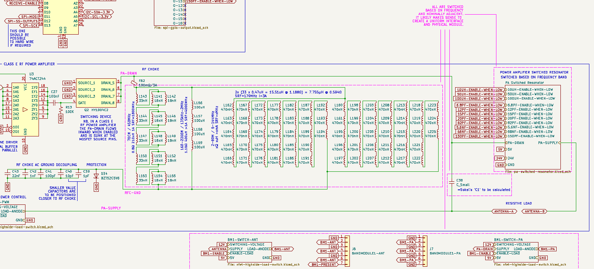
   * The primary difference to the prior ADX design is that the physical module will include portions of the power amplifier (RF choke, Sokals' `C1`, resonator) in addition to the low pass filter (LPF).
   * This is thought to make sense because:
     1.  All of these elements were found to require adjustment when considering the revised design's wide aggregate proposed band capabilities; and
     2. "Getting it right first time" may not be either (a) rational expectation; or (b) therefore a cost-effective development trajectory.
   * In other words:
     * I don't trust myself enough to commit to a PCB run where these aspects cannot be further tuned.
     * By putting in the thinking up front to reduce my own development cost, it should also make the process of extending or tweaking the design further by others much easier.
   * Outstanding questions:
     * Since the modular portion includes all of the last stages of the transceiver, it would thus logically include the antenna connection
     * Since the antenna connection is something that people may want in various formats to suit various wavelengths and usage scenarios (IPEX, BNC, SMA) and some of those physical interfaces are not designed for longevity, and the "tiffin" approach will facilitate both vertical layering and improved EMI, it might make sense to zoom out to consider whether or not the antenna should be part of that module or signals should be routed back to the main board before connecting to the antenna.
       * Layering up makes sense because an antenna connection on top of the system would be a logical position, batteries are heavy and could fit below, and minimizing the overall inter-module routing of RF signals would be desirable.
       * Routing back makes sense because fewer modules are required and the specific modules would presumably work out cheaper. 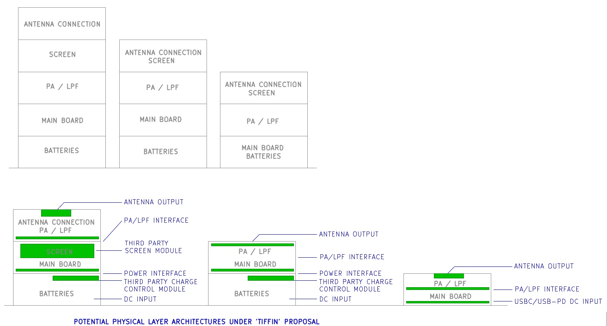
 * Design conclusions:
   * Don't bother with a screen, instead rely on the computer to provide status information.
   * Don't bother with a battery or charge controller, instead rely on an external USB power bank when mobile.
     * For the purposes of easier mobility and the fact that many laptops or embedded systems cannot supply anything near 1A on their USB ports it may be useful to obtain 5V nominal supply from one port and data from another port, ie. have two USB ports, one for MCU interfacing and one for power delivery.
     * For the purposes of maximum transmit power draw (~1A @ 5V) versus many USB supply limits (~900mA) and safety buffering, it may be useful to add a supercapacitor to the main board.
       * This could also allow switching between power sources without loss of operating state and configuration
     * Given that we are sailing so close to maximum draw it seems a tested solution would be desirable. A shortlist of potential integrated solutions includes:
       * TI TUSB312 - [Chinese](https://wmsc.lcsc.com/wmsc/upload/file/pdf/v2/lcsc/1809072322_Texas-Instruments-TUSB321RWBR_C139392.pdf), [English](https://www.ti.com/lit/ds/symlink/tusb321.pdf) @ $0.34
       * ST STUSB4500QTR - [English](https://wmsc.lcsc.com/wmsc/upload/file/pdf/v2/lcsc/2106070703_STMicroelectronics-STUSB4500QTR_C2678061.pdf) @ $1.29
       * ONSemi FUSB302 - [English](https://wmsc.lcsc.com/wmsc/upload/file/pdf/v2/lcsc/2304140030_onsemi-Fusb302mpx_C442699.pdf) @ $0.71
       * Cypress CYPD3177 - [English](https://wmsc.lcsc.com/wmsc/upload/file/pdf/v2/lcsc/2208051100_Infineon-Cypress-Semicon-CYPD3177-24LQXQ_C2959321.pdf) @ $0.81
     * Given that the TI chip is so much cheaper but they will all probably do the job I think it's worth moving forward with TI.
   * With increasing density comes decreased isolation and increased potential for electromagnetic coupling which is a double-edged sword.
 * Other developments:
   * Considering placing USB audio bridge, USB hub and port for MCU connection on board
     * This would allow programming and operation through a single port - no audio cables required
     * The only conceivable downside is, in a mobile scenario, USB power delivery capabilities of some host devices are limited
       * People can solve this themselves by using USB battery packs with built-in powered USB hubs
   * At this point, it sort of seems ridiculous to keep using the MCU as a module, but it is a pleasant eccentricity to preserve this design element and hard to match on price
     * Future versions could be released with newer MCUs, possibly mounted via adapter boards

## Update (2024-08-19)

 * Issues largely resolved with the PA choke.
   * Operating range was divided in to 3 band-groups (similar to resonator) and 2/3 completed with switching work yet to be done.
 * It seems that to obtain good values for `C1` (Sokal) it will be [necessary to recompute those at each end of the operating band for each resonator and choke selection](https://people.physics.anu.edu.au/~dxt103/calculators/class-e.php), and also to switch those when either PA or resonator change. If these figures work out, however, then confidence in the design should grow.
 * The fact that the Class E PA's RF choke, resonator, C1, and band-specific LPFs all require switching means it is probably best to redesign the group of adjacent passives as a single physical interface and module to support easier and more cost-effective experimental iteration.
 * This means the previous modularity scheme (ie. one of pluggable band-specific LPFs inspired by previous projects) is probably going to evolve to a higher component count, higher flexibility approach incorporating all of these functional blocks.

## Update (2024-08-18)

 * MCU output expansion added to drive switched PA resonator inductance and capcitance to achieve full band range
 * [Having issues](doc/class-e-pa/) identifying a sane strategy for an RF choke capable of the 70cm (450MHz) required
   * To this end, attempted to make at fabricating a coil for main RF choke but failed
   * Still keen to obtain an SMT solution

## Update (2024-08-15)

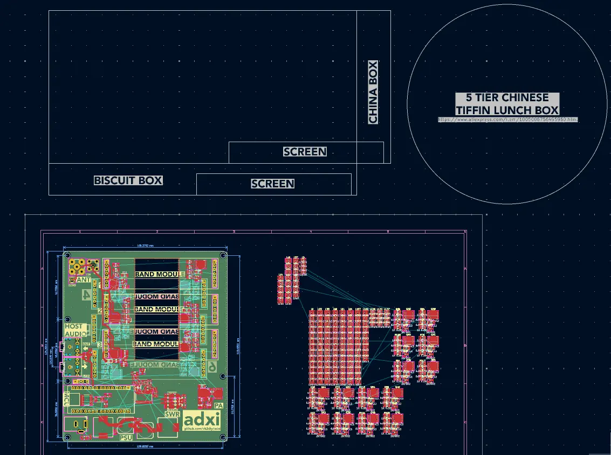

 * [Further work on power amplifier theory and component selection](doc/class-e-pa/)
   * We now have theoretically adequate SRF on inductor arrays for all bands
 * RF choke still needs a high SRF all-band solution but nominal values of near 220uF and an associated capacitor array have been chosen
 * Tiffin system added to potential footprint drawings

## Updated (2024-08-13)

Recent work:
 * More work on power amplifier
   * Three-mode RF choke inductor mostly completed (one tier to be re-specified)
   * Switchable capacitance calculated and to be added
 * Input of general dimensions of two boxes which have been selected as possible form factors. Have another idea to use this sort of thing as a modular approach: 
 * General cleanup of schematic

## Updated draft PCB (2024-08-10)

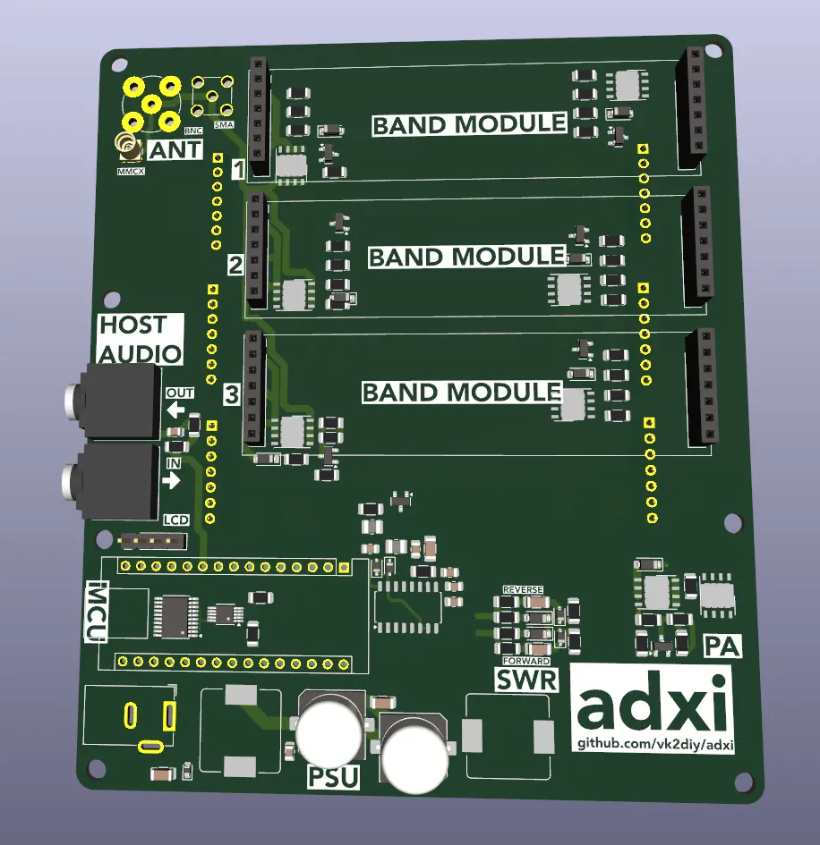

 * Further consideration of overall layout, switching placement.
 * It seems there will need to be a series-parallel array of RF choke inductors to cover the broad target frequency range.
   * This is not necessarily expensive, just complex.
   * There will also be at least one switchable inductor in the main RF choke.
 * Other additions:
   * I2C LCD pin header
   * Further antenna connector (MMCX)

## Updated draft PCB (2024-08-09)

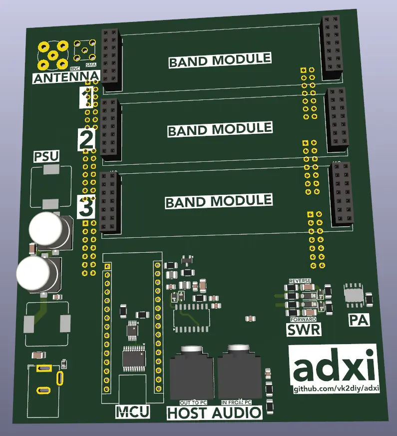
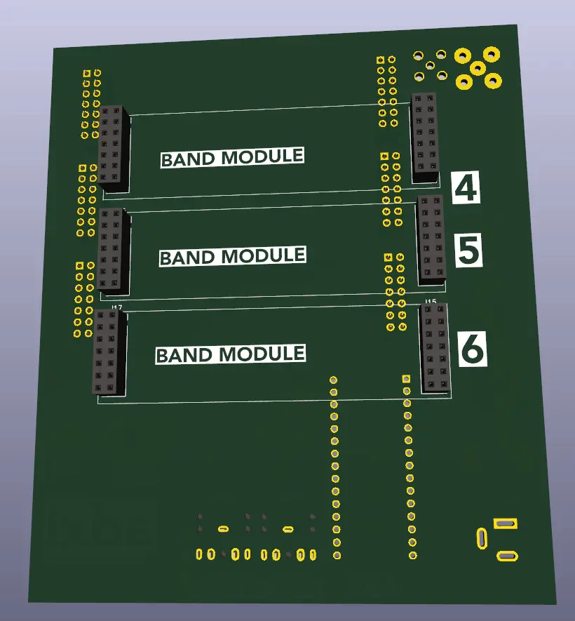

This version adopts a band-module approach in order to reduce iteration cost.

The basic notion is that a 7x3cm module can be plugged in to provide band-specific low pass filtering.

There is space on the front of the PCB for three of these modules, and on the rear of the board another three modules. Modules are staggered to minimize the effects of electromagnetic coupling between modules and their terminals. Sockets are used on the board and pins on the filter modules in order to reduce the volume of metal present when less filters are connected.

## Initial draft PCB (2024-08-07)

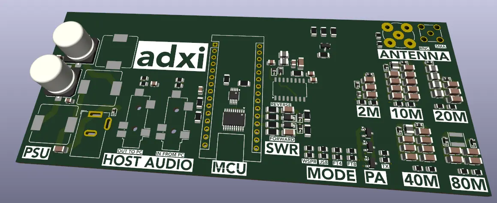

 * Draft now changed, potentially to have pluggable LPFs instead of a monolithic all-band-onboard architecture
   * This requires the design of an interface for the same
 * Filter switching added

## Current documentation
 * Filters
   * [Bandpass filter model](doc/filter-models/bandpass-filter/) showing audio frequency bandpass filter
   * [CD2003 5V supply filter model](doc/filter-models/cd2003-supply-low-pass-filter/) showing power supply filtering for the radio receiver chipset
   * [DC blocking filter](doc/filter-models/dc-blocking-filter/) showing how capacitors block DC and their nominal frequency relationship
 * Schematic design notes
   * [Multi-band low pass filters](doc/multi-band-lpfs) showing various third party designs for multi-band LPFs and including notes considering practical aspects of the design problem.
   * [SWR and power metering](doc/swr-and-power-metering) discussing the planned approach to obtaining this information simply
 * Wireless protocols
   * *[The FT4 and FT8 Communication Protocols](doc/wireless-protocols/FT4_FT8_QEX.pdf)*

## ADX Original Project

### Features

 * ADX is a mono band (actually quad band) digital modes optimized HF transceiver that can cover four pre-programmed bands one band at a time by swapping Band LPF Modules.
   * It can work on 80m, 40m, 30m, 20m, 17m, 15m and 10m bands
   * It can operate on four of the most popular digital modes, FT8, FT4, JS8call and WSPR.
 * ADX supports computer control (CAT) by emulating KENWOOD TS2000 HF Transceiver over a 9600 8N1 serial link to control Band and Mode changes.

### Goals

The project was originally designed by [Barb (WB2CBA)](https://github.com/WB2CBA/ADX) ([original project website](https://antrak.org.tr/blog/adx-arduino-digital-transceiver/))  with the goal to design a simple HF Transceiver optimized for operating on Digital modes:
 - Simple to procure – meaning not effected by chip shortage
 - Simple to build – 2 modules, 2 IC’s and 4 Mosfets!
 - Simple to setup and tune – One simple calibration procedure is all needed.
 - Simple to operate – Plug in ADX MIC to soundcard MIC input and ADX SPK to PC soundcard speaker input and we are good to go with any digital modes Software.
 - Dirt Cheap – Costs less than 25$ to get all parts and PCB if we exclude ridiculous shipping costs!
 - Plug in a USB cable between ADX Arduino and your PC, Select Kenwood TS2000 with 9600bps,8,1 setup as your CAT rig and you will have CAT control on ADX!

It has since been built all over the world.

### Design

The original design was based on the following major physical modules:
 * Main ADX PCB
   * CD2003 radio chip
   * 74ACT244 buffer/line driver
 * Arduino Nano (ATmega328P MCU module)
 * Si535x clock generator module
 * uSDX LPF band module
 * External PC microphone interface (for sending received signals to the computer)
 * External PC speaker interface (for receiving encoded signals from the computer)

## Building the firmware

Firmware is managed through [platformio](https://github.com/platformio/platformio-core).

Rationale:
 - While excellent in its simplicity, Arduino IDE is generally inappropriate for long lived projects.
   - Why?
     - It has brittle dependency management
     - It relies on non-scriptable GUI actions.
     - It lacks modern features like unit testing, CI/CD, etc.

Result:
 - You will need to install either [platformio-core](https://github.com/platformio/platformio-core) (command line) or [platformio IDE](https://platformio.org/platformio-ide).

Benefits:
 - Notes about specific versions of specific libraries and compatibility are now a thing of the past.
 - The addition of future libraries, compilers, or tools is easy
 - Users become familiar with more modern, cross platform and professional grade approach to firmware development and management while working on personal projects

### Under platform-io core (command line)

Simply change to the source code directory and type `pio run`.

```
$ cd firmware
$ pio run
```

### Under platformio IDE

Open the project in the IDE then use the buttons provided.


## History

### 2024-08-07
 - First 'mostly there' release of Kicad v8 schematic and board design

### 2024-08-03

 - Forked, general cleanup and migrated to [platformio](https://github.com/platformio/platformio-core).
   - Previously Arduino IDE builds were the norm
   - Apparently the files had apparently not been opened since KiCad v4 ... KiCad is now at v8.0.4
 - Outstanding issues
   - KiCad has altered its library management so much that the old files will not import directly to v8.0.4
   - KiCad has improved its internal libraries so that external libraries for many parts are no longer required
   - KiCad has integrated the historic DigiKey library
   - The schematic is missing known PCB fixes not integrated but documented by the original author
   - The schematic uses a non-standard symbol for the MCU which is unhelpful
   - The schematic has a number of further errors making it suboptimal for introducing new students
   - The layout used a type of fill which is no longer supported by modern KiCad
   - The layout can probably be improved
 - Conclusion
   - Given the simple nature of the schematic it is better at this point to redraw the schematic and redo the layout, removing all previous KiCad 4 era files

### 2023-07-14

- Release band display bug fixes by Peter Petrov (LA7WRA) and Mark Culross (KD5RXT).

### 2023-06-10

- Cowtown Amateur Radio Club ADX Buildathon Construction Manual v1.5 by Richard Hinsley (W5ARH/VK2ARH)

### 2023-04-08

- SI5351 module pull up resistor fix added to build manual v1.4 by Richard Hinsley (W5ARH/VK2ARH)

### 2022-12-20

- Calibration procedure changed to protect EEPROM from R/W wear.
- Add zener diode PA mosfet protection from excessive SWR conditions.

## Contributors

### adxi project

 * VK2DIY

### ADX Project

 * [Barb (WB2CBA)](https://github.com/WB2CBA/ADX): Project conception and original design.
 * [Richard Hinsley (W5ARH/VK2ARH)](https://www.qrz.com/db/W5ARH): Buildathons, outreach and build documentation.
 * [Joerg Frede (DK3JF)](https://www.qrz.com/db/DK3JF): CAT and other software contributions.
 * [Peter Petrov (LA7WRA)](https://www.qrz.com/db/LA7WRA) and [Mark Culross (KD5RXT)](https://www.qrz.com/db/KD5RXT): Band display bug corrections.
 * [Burkhard Kainka (DK7JD)](http://elektronik-labor.de/): Initial FSK TX signal generation code - http://elektronik-labor.de/HF/SDRtxFSK2.html
 * [Jason Mildrum (NT7S)](https://www.qrz.com/db/NT7S): SI5351 Library - https://github.com/etherkit/Si5351Arduino
 * [Lajos Höss (HA8HL)](https://www.qrz.com/db/HA8HL): Inspiration for CAT code based on his TS2000 CAT implementation.
 * [JE1RAV](https://www.qrz.com/db/JE1RAV): Improved FSK TX signal generation code - https://github.com/je1rav/QP-7C
