# 20m / 30m / 40m Fan Dipole

This was the first ever antenna I have built, except for near-field communications.

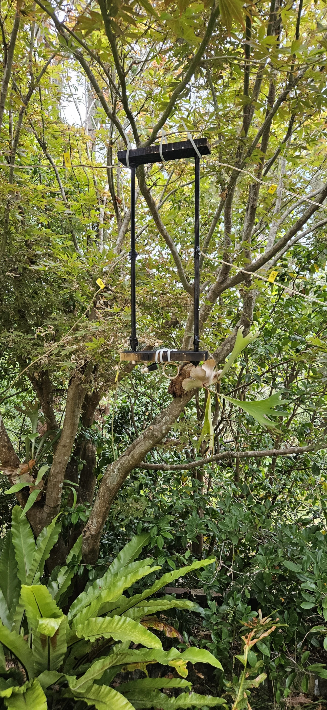
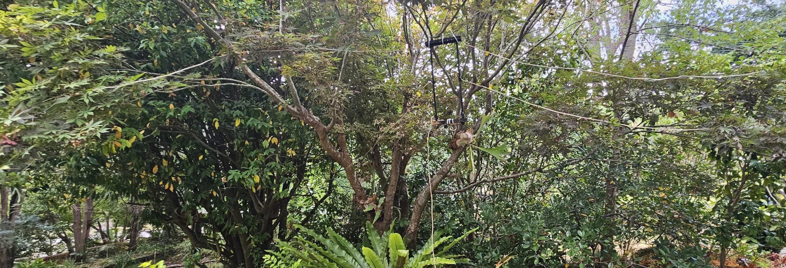
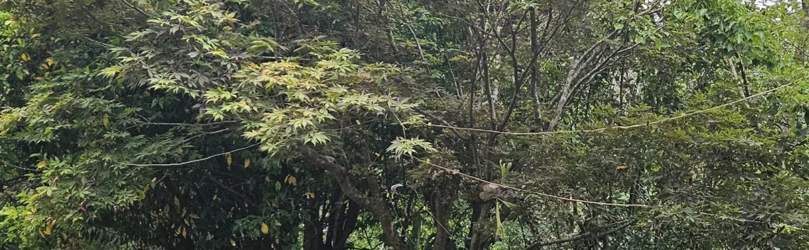

## Wires first

The general strategy was to follow [this page](https://www.hamuniverse.com/multidipole.html).

First I ordered [30.48m (100ft) of cheap AWG16 speaker wire from Amazon](https://www.amazon.com.au/dp/B006LW0W5Y).

Then I ordered [10m of terminated RG316 coax from Amazon](https://www.amazon.com.au/dp/B09SCKGDLH) as the lst time I terminated coax was approximately 1995 and I have no interest in revisiting that stuff.

Thus armed, I proceeded to cut six lengths of wire as follows:
 - 2 x 20m 1/4 wavelength pieces @ 5.1m
 - 2 x 30m 1/4 wavelength pieces @ 7.7m
 - 2 x 40m 1/4 wavelength pieces @ 10.2m

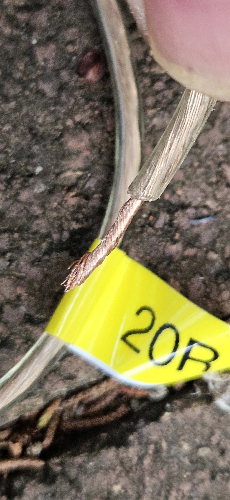

Each line was labelled so I could recall which length it was. `20L` for 20m band, left side, `20R` for 20m band, right side, etc. This helped to prevent getting things crossed during construction.

## Interrupt

I then stuffed everything under the house for a few weeks to get festive.

Finally I pulled it out again and started writing the process down...

## Moving on

### Central distribution point

The next problem was some sort of central distribution point. This needs the following:
 - Feed line termination
   - Physical connections to the feed line, ideally with strain relief and tension maintenance elements
   - Electrical connections to the left and right side feed lines
 - Distribution elements
   - Bring out the feed line wires in to some form of multiple attachment capable distribution element for supporting fan line termination
 - Fan line termination
   - Physical connections to the left and right side 1/4 wavelength fan lines maintaining adequate spacing, ideally with strain relief and tension maintenence elements
   - Electrical connections to the various 1/4 wavelength fan lines
 - Mechanical mount
   - To hold everything together
 - Optional weather sealing
   - To reduce environmental wear and tear

#### Fabrication

I looked at just making a PCB but the spacing makes PCBs relatively unsuitable.

One reasonable option would be a metal bar or rod which I could drill holes in and then use a combination of tensioned washers and/or solder.

I had a spare [10mm diameter 1mm thickness aluminium tube](https://www.bunnings.com.au/metal-mate-10-x-1mm-1m-aluminium-round-tube-1m_p1067742) from a previous project so decided to use that.

The US army apparently recommends one meter between fan dipole lines at the center, others recommend way less.

In any case, all sources agree something like 5.5" (15cm) should be fine. I decided to go with 20cm because I had a 20cm ruler handy and enough rod.

This was fabricated by locking the rod in a bench vise, tapping the 20cm distant points with a center punch, then going back to drill them right through.

Two such rods were needed, these were be mounted 20cm apart using wooden center distribution rod spacers at the top and bottom.

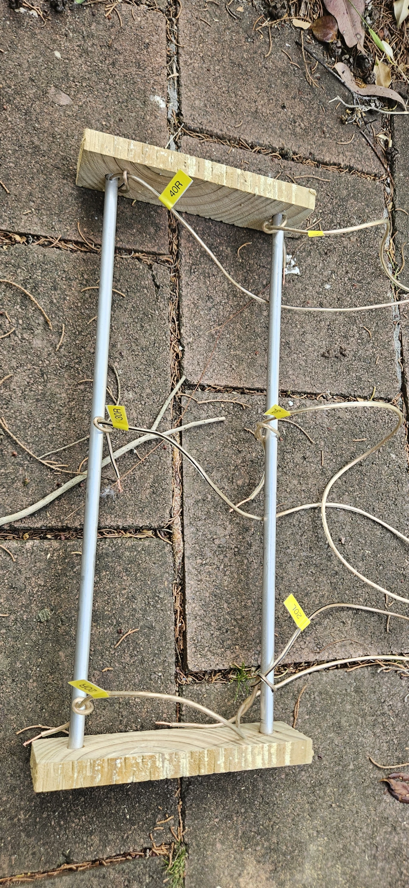

Once these were done I spray painted the whole thing black.

#### Connecting the lines

I found some through-bolts to use (16mm M3) and release-resistant nuts (with nylon inserts) as well as M3 washers.

I curved a 'U' shape of the wire end around the bolt and then tightened down under the washer, after first preparing the surface by sanding off the paint and spraying with contact cleaner.

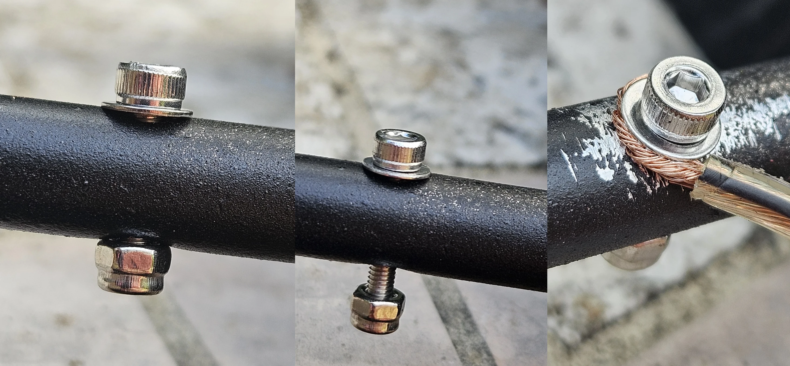

Finally, I taped the ends.

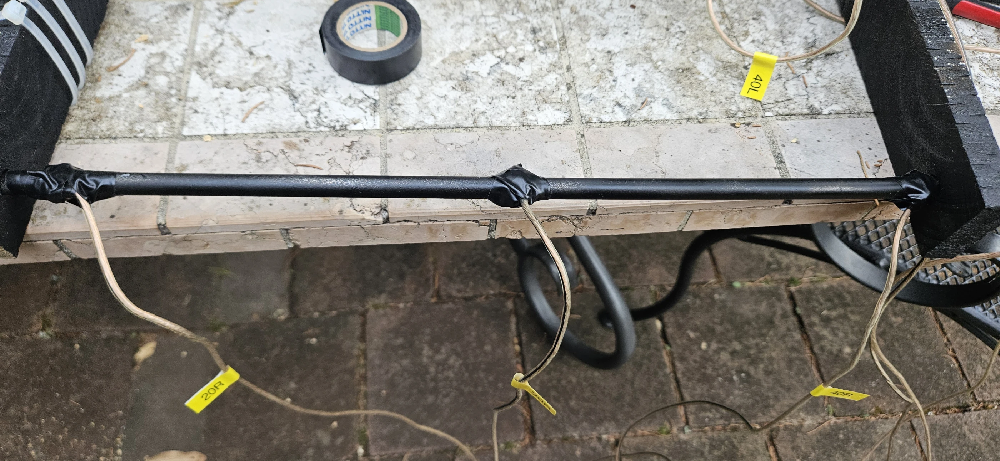

#### Feed line connection

For testing purposes I just used a BNC to double screw terminal connector and then ran the same speaker wire to the ends of the rods and soldered them on. The soldering was hard but eventually took. I added a bunch of zip ties for strain relief. Even so, one came loose and had to be soldered again. Not a great solution, but good enough for testing.

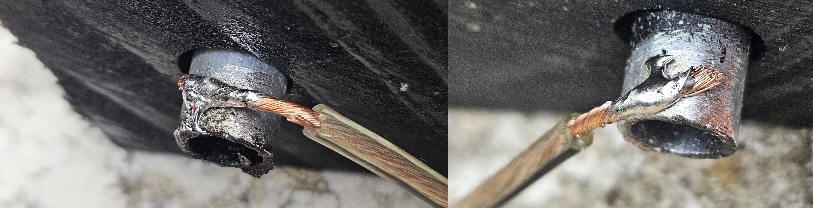

Before strain relief.

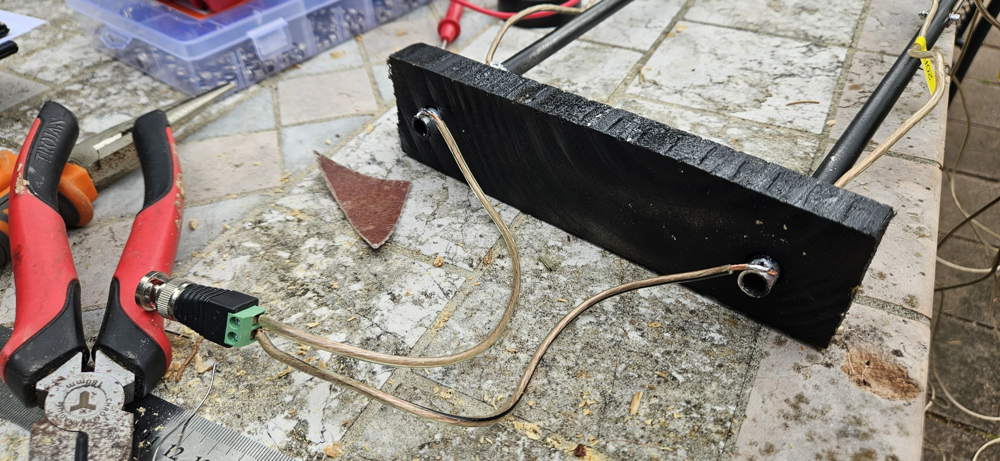

After strain relief.

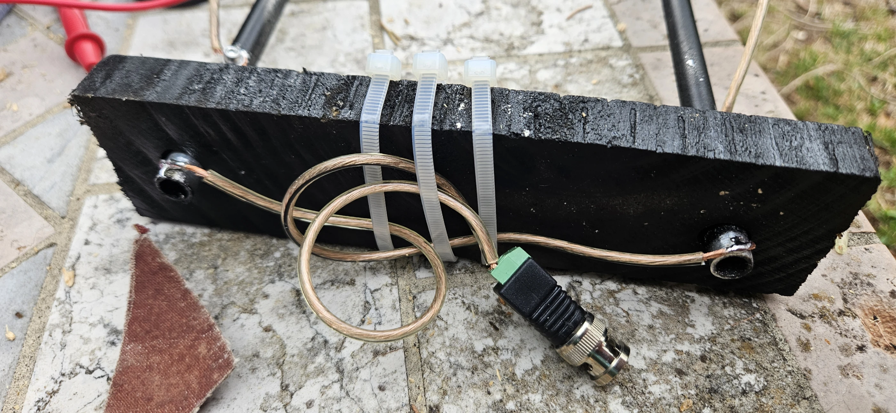

### Spacers

Some spacers to maintain adequate spacing are highly desirable. Some people make these rigid, I decided to use zip ties to keep things cheap and cheerful, but wound up just using tree branches.

### Hoist

Finally, some sort of hoisting mechanism to allow the antenna to be raised and lowered between two mounting points. In my case these will likely be trees.

However, for testing I just added another zip tie and hung the top wooden spacer on a tree.

I can't see this moving in the near future, since it seems to work fine.

### Line distribution

For testing I just ran the lines off in different directions through nearby trees. I didn't worry too much about symmetry or height, just maintaining at least 20cm of gap between them for the whole run.

## Initial Test Results

After calibration with a 10dB attenuator, the temporary test setup was measured with the NanoVNA with only the first trace enabled in SWR mode.

The MHz ranges for the 20m, 30m, and 40m amateur radio bands are:
 * 20m band: 14.000-14.350 MHz
 * 30m band: 10.100-10.150 MHz
 * 40m band: 7.0-7.3 MHz

The observed local minima points for SWR were at:
 * 12.4MHz (not 14-14.35MHz) - below target somewhat
 * 9.8MHz (not 10-10.15MHz) - pretty close, below target slightly
 * 6MHz (not 7-7.3MHz) - below target somewhat

Since longer wires correspond to lower frequencies, this implies the extra length that was left in the antenna wires is dragging the target frequency downward, which is as expected and a correctible problem.

## Retuning

Thunder arrived so I had to call it quits for awhile.

Later on, the weather improved so I went out again and tried doubling back a lot of the wire manually, end by end, piece by piece, using a pair of zipties (one at the end to enforce the 180 degree turn, and another to keep the end aligned with the original wire) and then re-reading the frequencies from the minima. This successfully raised all frequencies.

Eventually all three bands were adjusted with minima at precise points, showing SWR as follows:
 * 20m: 13.97MHz @ SWR1.2
 * 30m: 10.2MHz @ SWR1.6
 * 40m: 6.95MHz @ SWR1.445

It was now possible to test all three bands.

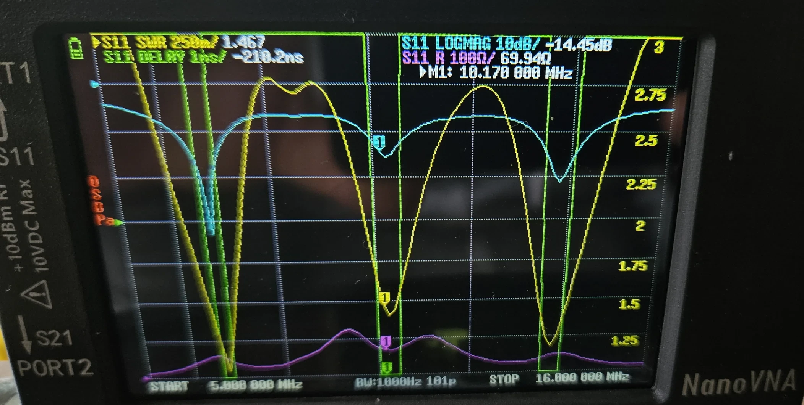
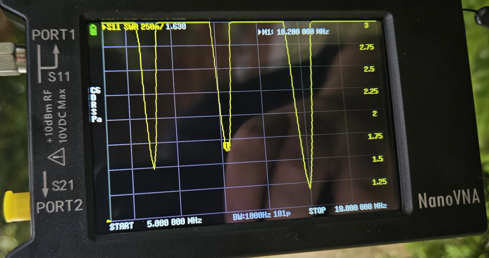

## Independent hardware test

Since I had no actual radio (only this adxi project), I wasn't sure how to test after the NanoVNA but felt this was important.

Then I remembered I had some RTLSDR hardware (2x).

I fiddled with that for quite some time and ifnally determined that it was not generally possible to tune this hardware to below 28MHz (10m) while the antenna was 20m, 30m, 40m.

Therefore I made a new antenna, just a regular dipole for 10m, tuned that, and caught my first FT8 signals from a whole bunch of countries in Europe and Asia as well as Brazil from here in Sydney, Australia.

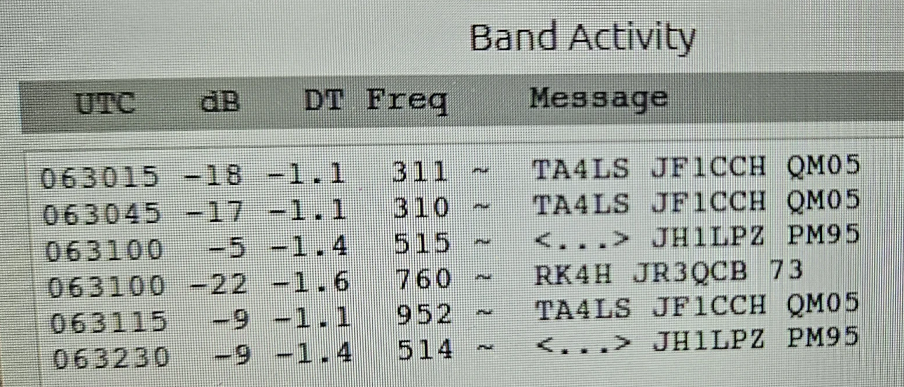

That was kind of cool.

The next day I hit on [this document](https://osmocom.org/projects/gr-osmosdr/wiki/GrOsmoSDR#RTL-SDRSource) which explains that you can enter an extra parameter `direct_samp=2` when configuring the device in [gqrx](https://www.gqrx.dk/), then pass the resulting audio stream to [wsjt-x](https://wsjt.sourceforge.io/wsjtx.html) which grant the ability to tune down to those frequencies with the significant drawback that quality will suffer without some kind of extra hardware which I wasn't about to buy.

After substantial time invested and a switch back to the original antenna I managed to get some decodes to happen on 20m and 30m, from countries like:
 * Australia
 * Brazil
 * China
 * France
 * Germany
 * Guyana
 * Indonesia
 * Japan
 * Malaysia
 * New Caledonia
 * New Zealand
 * Poland
 * Russia
 * Singapore
 * Spain
 * Thailand
 * Ukraine
 * United States
 * Vietnam

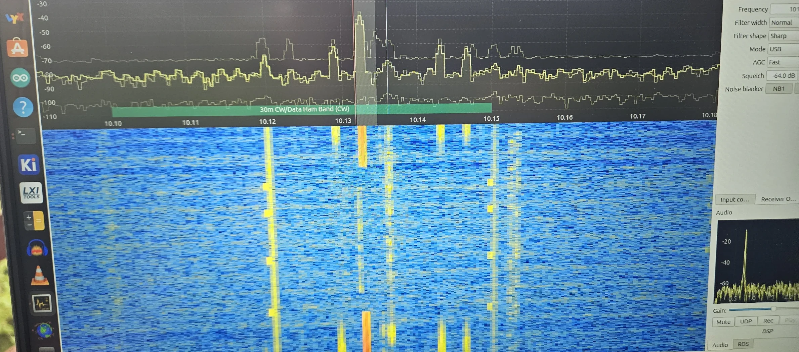

Didn't manage anything on 40m which is all noise, I think this is due to the RTLSDR dongle's design limitations.

I also acquired an external antenna tuner box.

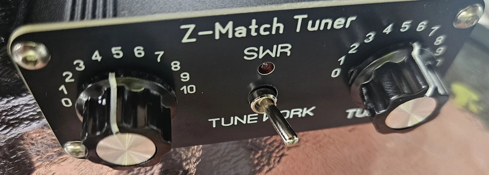

Using that, I managed to tune SWR down to under 1.1.

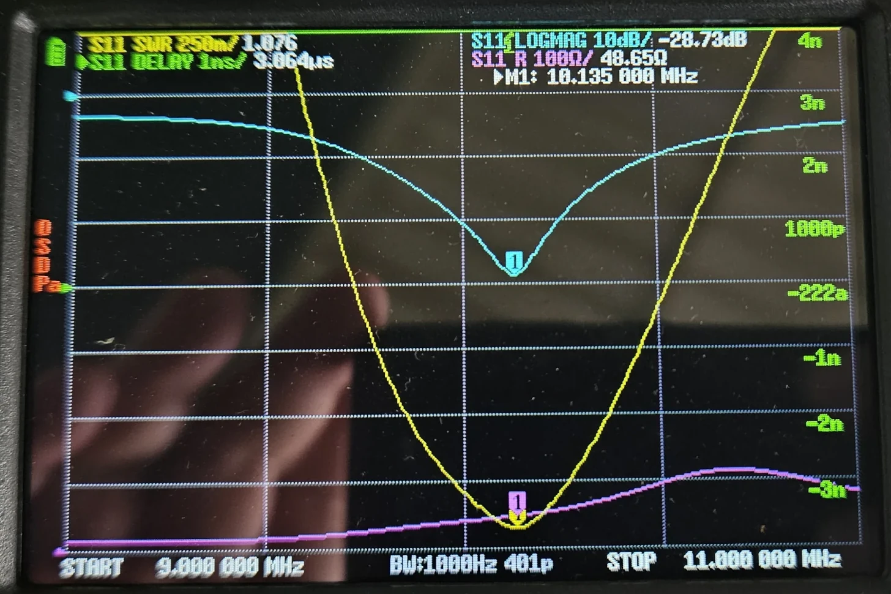

I also acquired a large toroid (`FT240-52`) but didn't really see much difference from adding a few turns of this next to the tuner at the interface to the antenna system. Just guessing, but this may be because I had already built an air choke at the feed point.

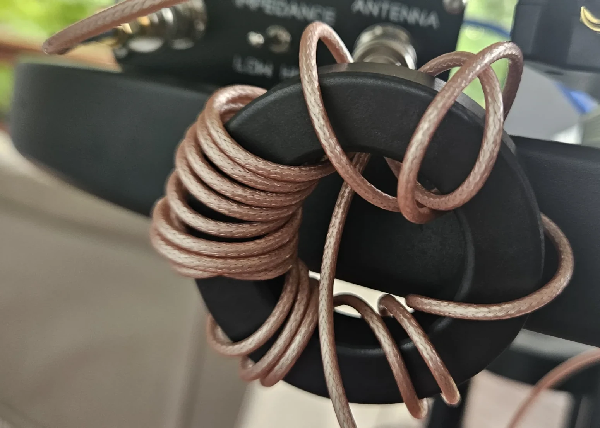
