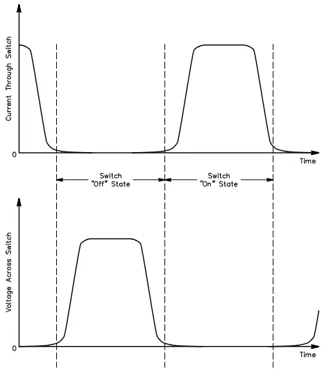
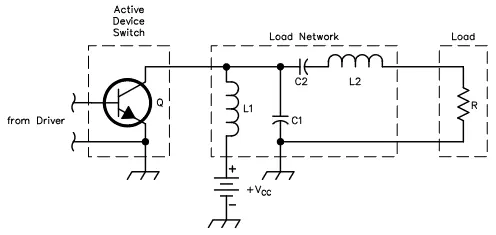
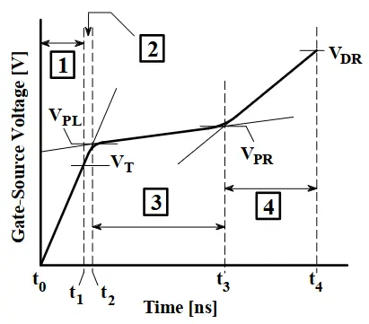

# Class E Power Amplifier

A power amplifier takes an input signal, amplifies it, and then sends it onward.

The amount of amplification is described as the 'gain' of the amplifier, which is measured in decibels (dB).

Usually, there is also a maximum input power in dB, and a maximum output power in dB. 

Exceeding these limits will degrade signal quality or cause harmful interference in a radio transceiver's emissions.

Power amplifiers are used in a range of situations, including audio circuits and motor control. Our power amplifier is the final stages of a radio system, and is therefore referred to as an [RF Power Amplifier](https://en.wikipedia.org/wiki/RF_power_amplifier).

## Basic theoretical categories of power amplifiers

Power is dissipated in device whenever voltage and current exist at the same instant in time. As we reduce the amount of time the device has current flowing through it there is less overlap in the voltage and current waveforms which leads to higher efficiency. The relationship between these two states is referred to as the conduction-angle (θ).

Various designs exist, and [power amplifiers are conventionally classed using a letter system](https://en.wikipedia.org/wiki/Power_amplifier_classes) primarily based upon the conduction-angle (θ). They are also more broadly categorised in to __linear__ (meaning output power is proportional to the square of the input excitation voltage), and __nonlinear__ or __switched__ (where output power is configurable in some other way).

 * __Class A__: Linear design that conducts for the entire signal (θ=360°). Good signal integrity. Simple. However, least efficient (maximum of 25% with resistive bias, or 50% with inductive bias) and reduced device lifetime due to high duty cycle.
 * __Class AB__: Linear design that conducts for more than half of the input period (θ>180°). At the cost of some complexity and compromise achieves an efficiency between Class A and Class B.
 * __Class B__: Linear design that conducts for half the input period (θ=180°). Poor efficiency (usually 60%, theoretically 78.53% maximum).
 * __Class C__: Linear design that conducts for less than half the input period (θ<180°). High distortion without additional effort tuning. Improved efficiency (usually 80% but theoretically up to 100%).
   * __Class D__: Switching design with a pulse-width modulation (PWM) or similar control. Works by converting the analog signal in to [pulse-width modulated pulses](https://en.wikipedia.org/wiki/Pulse-width_modulation), amplifying the resulting stream, then smoothing the results back in to a waveform. High efficiency, typically 75%-90% but up to 100% in theory. Can operate on digital inputs without a digital to audio converter (DAC).
   * __Class E__: __Switching design for radio frequencies (RF) where the switch operates solely at points of zero current (on to off switching) or zero voltage (off to on switching) to minimizes power loss. Uses a tuned reactive network between the switch and the load. Highly efficient (theoretically 96%). The design used in this circuit.__
   * __Class F__: Switching design which boosts efficiency and output by using harmonic resonators in the output network to shape the output waveform into a square wave. Can be highly efficient (theoretically 88.36%).
   * __Class G__: Variant of Class AB with switching power supply rails of differing voltage levels to increase efficiency.
   * __Class I__: Variant of Class B known as an "Interleaved PWM amplifier" where positive and negative signal portion amplifier switching devices are respectively driven by mutually inverse PWM signals.
   * __Class S__: Variant of Class D where the conversion of audio to an intermediate signal occurs through delta-sigma modulation.
   * __Class T__: Variant of Class D where the conversion of audio to an intermediate signal occurs through pulse width modulation.

## Elements within Class E Power Amplifiers

Class E power amplifiers operate solely at points of zero current (on to off switching) or zero voltage (off to on switching) to minimize power loss.  The following figure is from from Sokal (2001).

In a class E circuit, which is commonly selected for radio frequency (RF) use, a MOSFET is typically used. This is due to its rapid speed of switching (ie. high frequency support) and also due to its high power handling capacity relative to the older discrete [bipolar junction transistors](https://en.wikipedia.org/wiki/Bipolar_junction_transistor) (BJTs).

Here is the schematic of a low order Class E Power Amplifier. The following figure from Sokal (2001).

In the circuit you can see the following elements:
 * __Drive line__ - a pulse-width modulated (PWM) signal from the driver.
 * __Active Device Switch__ (`Q`) - a MOSFET switching element.
 * __Tuned reactive load network__
   * Located between the switch and the load
   * __RF choke__ (RFC) consisting of an inductor (`L1`) and a capacitor to ground.
   * __Resonator__ consisting of a series inductor (`L2`) and capacitor (`C2`)
   * __Shunt capacitor__ (`C1`) to ground
 * __Resistive load__ (antenna) to ground

### Drive line

The drive line is used to convey the required switching frequency to the active device switch.

### Active device switch

Typically consisting of one or more MOSFETs in most amateur radio situations.

In terms of choosing the device, many factors come in to play, but chiefly the switching time and voltage limits should be considered. In addition, other properties of switching like the specific timings, gate charge and resistances should be considered.

The switching time is theoretically important because it limits frequency. Quoting [N7VE / Ozarkcon (1994)](http://norcalqrp.org/files/Class_E_Amplifiers.pdf): "For class E, need On/Off to be 30% of ½ RF cycle (QEX 1/01)". If that is true, then:

 * If we roughly state that a frequency on the 2m band is 140MHz = 140,000KHz = 140,000,000Hz, then an RF cycle lasts for 1/140,000,000 second or 0.00000000714285714286 seconds which equates to 7.14 nanoseconds. Half of an RF cycle is therefore 3.55 nanoseconds, and 30% of half an RF cycle is around 1.18 nanoseconds. I have read a lot of MOSFET datasheets, but have not seen anything that fast. The good stuff seems to max out around 5ns td(on) and 12ns td(off), or ~15-20ns total (ignoring rise and fall time).
 * If we drop down to the 70cm band from 2m, then the working frequency is higher again at 420-450MHz = 450,000KHz = 450,000,000Hz, then an RF cycle lasts for 1/450,000,000 second or 2.2ns. Half an RF cycle is therefore 1.1ns, and 30% of half an RF cycle is around 0.3ns. `tDS(On)+tDS(off)<0.3` seems wishful thinking territory.
 * At the higher 10m band the maximum frequency is 29.7MHz = 1/29,700,000 second or 0.00000003367003367 seconds which equates to 33.67ns. So half an RF cycle is therefore 16.8ns, and 30% of half an RF cycle is around 5.6ns. Still, it would not be feasible to find from regular MOSFETs a response time where `tDS(On)+tDS(off)<5.6`.

A reasonable gut feeling conclusion then, and that's what "worst case you pay for it" experimentation is based upon, is that the theory proffered in this source is too constrained. It is unlikely we need an ultra-exotic MOSFET just to talk in the 10m band. In fact, I don't even think the MCU can keep up with that kind of sample rate. Therefore I'm going to note this as a concern but continue regardless.

The voltage limit is important because the resonant circuit will produce at multiples of the voltage determined by the Q factor of the other components. For example, at a Q factor of 10 and a nominal supply voltage of 12V DC the voltage peaks will be at 120V. However, it is rare to find MOSFETs rated at higher than 100 or 150V, and Q factors go up to the 20s, 30s and higher. Therefore, it would seem that the use of external zener diodes for transient peak voltage limiting is a better strategy than obsessing over voltage limits in the switching MOSFET.

A traditional choice of MOSFET for Class E Power Amplifier active device within amateur radio circles has apparently been the `IRF510` ([datasheet here](https://www.vishay.com/docs/91015/irf510.pdf)).

We instead select the `HY1904C2` ([datasheet here](https://wmsc.lcsc.com/wmsc/upload/file/pdf/v2/lcsc/2404031758_HUAYI-HY1904C2_C358116.pdf).

|             | `IRF510`             | `HY1904C2` | Comparative notes |
| ----------- | -------------------- | ---------- | ----------------- |
| Form factor | Leaded through hole  | SMD PPAK   | PCB thermal diffusion, optional heat sink. |
| RG          | 2.5-11.6Ω            | 1.5Ω       | Much better
| (B)VDSS     | 100V                 | 40V        | Neither are adequate @ Q>10 peak voltages.
| VGSS        | ±20V                 | ±20V       | Equivalent
| TJ          | 175°C                | 150°C      | Equivalent
| IS          | 20A                  | 65A        | Vastly higher current capacity.
| PD@25°C     | 43W                  | 48W        | Slightly better
| td(on)      | 6.9ns                | 13ns       | 2x worse (still good)
| tr          | 16ns                 | 11ns       | 0.5x better (middling)
| td(off)     | 15ns                 | 41ns       | 2.5x worse (yes it's bad)
| tf          | 9.4ns                | 14ns       | 1.5x worse (middling)
| trr         | <200ns               | 23ns       | 9x better (very good)
| QG          | 8.3nC                | 56.5nC     | 7x worse (yes it's bad)

In short, the `HY1904C2` offers a smaller and more modern package with improved options for thermal diffusion, greatly reduced on resistance and thus one assumes greatly reduced thermal loading, and generally equivalent functionality, although it will not reach the same frequency owing to higher gate charge (`QG`) and much slower off time (`td(off)`). It seems a reasonable choice, at least for the majority of frequencies, possibly not for 70cm, but frankly I do not currently have an adequately detailed comprehension of MOSFET switching states to judge which of the timings, if any, will have a significant effect on the output. The notes I have found from others do not appear to make sense with the timings shown in component datasheets.

All that said, I would anticipate that slowness in `td(on)` is partly offset by improved `tr` and that `trr` may not be significant. 

A cursory review of alternate MOSFET selections suggests that while many smaller and faster MOSFETs exist, they come with lower maximum voltages, lower current carrying capacity, higher on resistance, and greatly reduced capacity for thermal dissipation. In a longevity-optimized, high peak voltage exposed circuit, it seems that `HY1904C2` should prove a rational choice, but may not function well or at all for the 70cm band.

In any event, "the proof is in the pudding"!

### Tuned reactive load network

This in turn consists of specific component blocks.

#### RF choke

The RF choke is an inductor to ground. It should be selected based upon the frequency range for which it is expected to perform. Unlike the inductor within the low pass filter (LPF), this inductor should have a low `Q` factor. It must, however, have a significantly higher self-resonant frequency (`SRF`) than the maximum frequency at which it is expected to operate.

In addition, it is conventional to add a capacitor to provide a low impedance path to ground for high frequency signals to ensure they do not leak in to other parts of the circuit or the power supply.

The capacitor or parallel capacitor array may be selected based upon the operational frequencies, in this case up to 140MHz.

High quality (eg. `C0G`) capacitors should be selected with low equivalent series resistance (ESR) and equivalent series inductance (ESL).

#### Resonator

...
