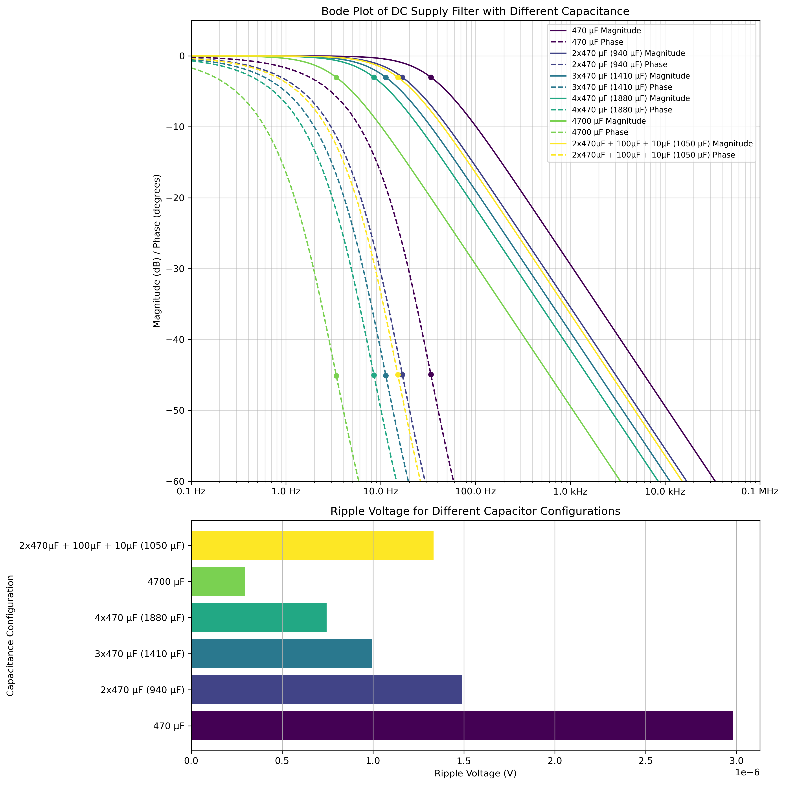

# CD2003 Supply Low Pass Filter

The graphs depict two different views of a range of potential filter configurations.

The upper graph is a [Bode plot](https://en.wikipedia.org/wiki/Bode_plot), which shows two things:
 * Solid line: The frequency magnitude response. This is how much the signal is reduced, measured in decibels (dB).
   * A standard but rather arbitrary cutoff value of -3dB (meaning "significantly attenuated" or "effectively weakened" in many general cases) is marked with a point.
 * Dashed line: The frequency phase response. This is how 'out of phase' the signal will be, measured in degrees. 
   * A standard cutoff value of 45 degrees (meaning "one quarter out of phase") is marked with a point.

The conclusion is that higher capacitance equals lower cutoff and thus a more effective filter. However, this is a naive view and some additional factors are not considered. In particular, it is considered good practice to include capacitors of different orders of magnitude in order to better deal with high frequency noise. This is why the preferred configuration has 2x470uF + 100uF + 10uF.

The lower graph is a bar graph comparing the simply / naively simulated ripple voltage in each configuration. This simulation was made with the assumption of a 10.5mA load (advertised as typical within the `CD2003` datasheet) and a frequency of 7MHz (chosen arbitrarily as a medium frequency band). The conclusion is that higher capacitance equals lower ripple voltage.

## Result

The filter screens against the following noise types which all primarily occur above 150kHz:
 * Switching Power Supplies
 * Industrial Equipment
 * Microcontroller Clocks
 * Ham Radio
 * AM Broadcast
 * Shortwave Broadcast
 * CB Radio
 * Power Line Harmonics
 * Switching Transients
 * Wi-Fi

## Note

 * The initial 'pi'-type model was wrong, this 'RC'-type model is thought to accord much better with reality and be simpler/cheaper/equally effective.
 * The 4700uF recommendation was an AI recommendation which is thought to be impractical with surface mount components.
 * The use of multiple 470uF capacitors was driven by the fact that was an existing bulk capacitor present on the board.
 * The use of additional capacitors was driven by the knowledge that combining differing scale capacitors enhances high frequency noise rejection.
 
