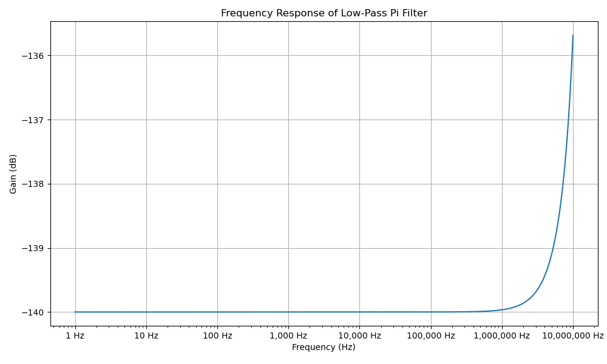

# CD2003 Supply Low Pass Filter

This cutoff nominally screens against the following noise types which all primarily occur above 150kHz:
 * Switching Power Supplies
 * Industrial Equipment
 * Microcontroller Clocks
 * Ham Radio
 * AM Broadcast
 * Shortwave Broadcast
 * CB Radio
 * Power Line Harmonics
 * Switching Transients
 * Wi-Fi

## Note

 * The initial 'pi'-type model was wrong, this 'RC'-type model is thought to accord much better with reality and be simpler/cheaper/equally effective.
 * The 4700uF recommendation was an AI recommendation which is thought to be impractical with surface mount components.
 * The corresponding use of 2x470uF capacitors was driven by the fact that was an existing bulk capacitor present on the board.
