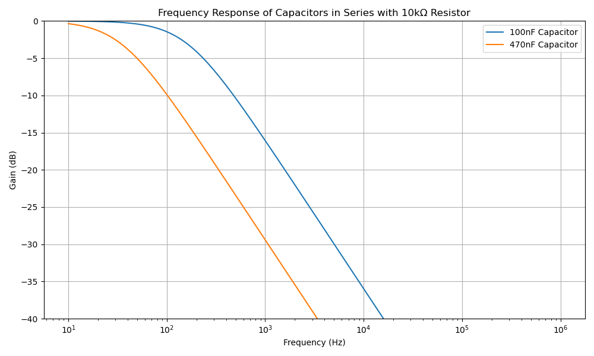
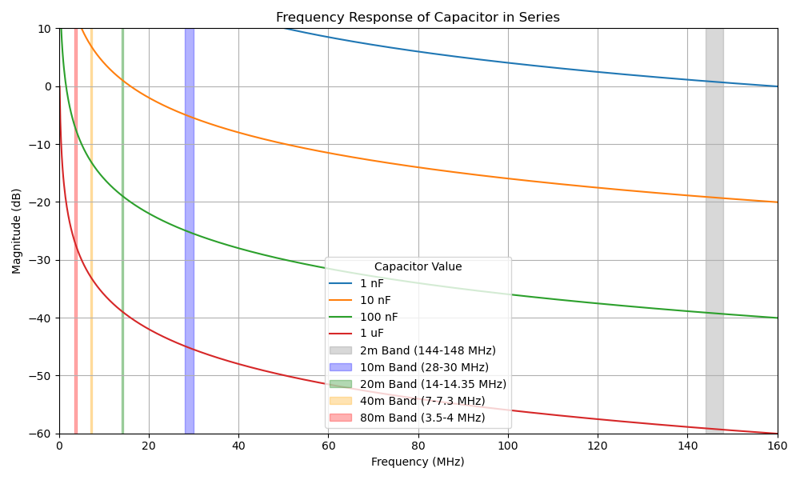

# DC Blocking Filter

The external audio ports used to communicate with the host PC include a capacitor which functions as a DC blocking filter.

Here you can see the frequency response curves for two separate configurations, 100nF and 470nF.

More broadly and generally, in the following graph you can see the attenuation relative to the working frequencies of various HAM bands.

