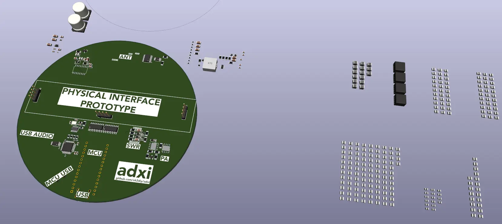

# Late Stage Interface

## Requirement

The prior ADX project simply used a third party project's existing late-stage low pass filter (LPF) module and left the PA on the board thus not providing any capability for adjustment.

This limited the frequency bands that the aggregate radio system could be effectively used for.

In this derivative design we are attempting to broaden the supported frequency bands to a much larger set which necessitates respecting the limited frequency response characteristics of certain Power Amplifier (PA) components and other late-stage components.

## Primary Design Options

### Low cost

It is not useful to design a perfect system if nobody can afford it.

### Switchable (software select) vs pluggable (hardware select)

In a __switchable (software select) system__, components for multiple frequency bands can be placed on the board simultaneously and then activated digitally as required.  Such an approach allows the sharing of components between frequency bands, reducing cost.  However, it comes at the cost of significant complexity and substantially increases the cost of design iterations.

In a __pluggable (hardware select) system__, components for each frequency band can be placed on their own circuit board, and then these can be combined physically before activating the radio in order to allow for system reconfiguration. Such an approach comes with the additional cost of the weight, wear, design, and financial overhead of additional interface components (such as plugs, sockets, etc.) and due consideration must be given to factors including but not limited to associated mechanical considerations including physical stress, strain, wear, handling, access. However, it greatly reduces the cost of system iteration by separating portions of the overall system. It also lends itself to teaching by reducing the cognitive load (complexity) of each portion.

It is also possible to create a __multi-tier pluggable__ system with different pluggable parts for the PA, for example one for the choke, one for the resonator, one for the capacitor, one for protection, etc. This adds a lot of overhead but nominally recuces the total number of variants required and the cost of each.

### Physical interface

In selecting an interface there are many mechanical considerations which may not be obvious to first time electronics designers.

Even experienced engineers often have problems finding appropriate connectors for certain types of applications, particularly when these span industrial, high precision, or harsh environment and other design factors such as spatial constraints or cost are being prioritized.

There are factors that are not immediately obvious to the casual observer such as locking and disengagement methods, resistance to sheering forces, temperature ratings, gaseous and liquid ingress considerations, supply chain security, etc.

In our case, if we wish to mount the antenna on a module, then the physical module interface will need to account for sheering unless some kind of alternate strain resistance can be guaranteed, which could be difficult if we wish to use unreliable supply chains in order to obtain the benefits of RF-shielding metal enclosures which may correspondingly vary in precise form, size and thickness over time or between vendors.

### Electrical interface

While the nominal power requirement is only 5W, which translates to <0.5A at 12V, which can be handled by a single 2.54mm PCB pin, transient voltages at Q=10 and nominal V=12 may be up to 120V so we should at least allow 150V of nominal voltage rating on these connectors. A brief investigation of some generic products in this category suggests that this should not be a problem as they tend to be rated around 550V magnitudes.

## Primary Design Constraints

### Footprint required

After investing significant time in learning how to select and modeling out market-available surface mount components that appeared suitable for the __resonator__, __RF choke__ and __capacitor__ portions of the Class E Power Amplifier, I had some draft designs ready which could provide a reasonable estimate of the amount of circuitboard space (termed "footprint") that band-specific components would require.

### RF isolation

Regarding free space, the inverse-square law states that the intensity of electromagnetic radiation decreases proportionally to the square of the distance from the source, ie. every time the distance from the source doubles, the intensity of the radiation decreases to one-quarter of its previous value. Therefore, leaving space around critical components, in particular the Power Amplifier's resonator, is a desirable strategy.

Regarding nearby metal, it is harder to make general statements but grounded shielding in close proximity to noisy or protected components is practically preferred, the classic example being an ethernet port shield.

Because it may be impractical to fabricate custom sheet metal shielding to an appropriate degree of precision, viable strategies may be either:
 - finding a source of pre-made shielding; or
 - providing partial shielding (such as a PCB with a flood fill of copper inserted perpendicular to the host PCB plane); or 
 - repurposing an existing metal product or common extrusion with sufficient geometric precision to act as a shield

It is also very time consuming to simulate and test RF matters and I am not familiar with these, so it may be best to adopt a best-effort design incororporating careful placement distances and revisit the question of shielding as necessary at a later time.

## Prototype Design

### Pluggable single-tier

Initially, the switchable approach was investigated however once it was found that there would be a large number of components and that these components would need to be switchable through multiple stages it was decided that an initial revision should be build as pluggable single tier (all late-stage components on one board).

### Early prototype

The resulting prototype design currently under consideration is one based upon a three-way 2.54mm pin interface.

This is a common strategy used on many extensible systems and can be seen in embedded systems at least as old as the 1990s (see PC/104) and probably the 1980s and earlier.
