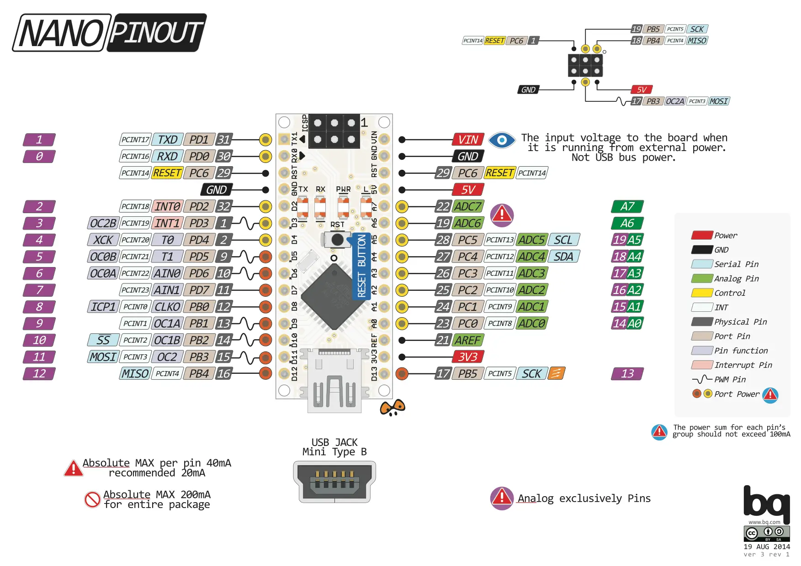

# MCU

## Generalities

The chosen microcontroller unit (MCU) is the Arduino Nano v3 module.

This is largely due to inertia from the previous project, but also due to low cost and excellent perceived availability.

Module means the chip and support circuitry is already present on a circuitboard which can be used as a combined unit optimized for prototyping.

The main benefit of prototyping with a module is a reduction in iteration cost, which is to say that you do not require a correct understanding of, specification of, placement of the selected major component (in this case a microcontroller) and related support circuitry for power, communications, etc. This reduces the cognitive load for the user as well as the initial iteration cost in time and money, and subsequent iteration costs in terms of money.

The main drawback is that the design is fixed and cannot be altered, and that some labour is required to connect it.

The Arduino Nano is an ATMega328P processor (AVR architecture) module and includes a power regulator to provide 3.3V and 5V out based upon a 9-12V input voltage (`VIN`).

The major drawbacks of this MCU are speed (it's quite old), memory (it's quite limited) and pin count (it has very few general purpose IO (GPIO) pins).

With regards to the question of speed and memory, the prior ADX project has already shown that these can be overcome.

With regards to the question of pin count, we can use an external output expansion methdology to resolve this issue if necessary.

It is very important to only allocate signals to compatible pins, and many mistakes can be made due to factors like:
 - subtle differences between pins on these modules and the raw pins on the microcontroller
 - the propensity of beginners to reference only vague online information from the Arduino community rather than the actual ATMega328P microcontroller datasheet
 - the potential presence of other circuitry on the lines, in particular in a vertical stackup

Another gotcha for early players is voltage levels: most modern ICs operate at 1.8V or 3.3V, rather than 5V as per this MCU. For a signal input line it can "just work" coming from a 3.3V source, but for signal output adjacent devices may be damaged by the higher than expected voltage.

In general most connections to this MCU are straightforward, with some specific notes.

## Visual overview

## Pin-specific notes

 * The pins `D0` and `D1` are best left unused as they are utilized internally by the module between its USB UART chipset (usually `CH340`) and the MCU itself when flashing firmware over USB connection from the host PC and any use runs the risk of interfering with this important function
 * The pins `D2` and `D3` are the `CM108B` [embedded USB audio chipset](../usb-audio-chipset/)'s LED outputs, which are 3.3V signals.
   * The pin `D2` is the `CM108B` [embedded USB audio chipset](../usb-audio-chipset/)'s `LEDR` output, termed `CM108B-LEDR`. This is a 3.3V signal.
     * This pin is usually low (ie. 0V) indicating the `CM108B` is recording audio.
     * When the CM108B's recording function is muted using the `MUTER` pin, the pin goes high (ie. 3.3V).
     * This pin could be re-assigned to a non interrupt capable pin if a better use is found. Currently it is placed here to be adjacent to the next pin, `LEDO`.
   * The pin `D3` is the `CM108B` [embedded USB audio chipset](../usb-audio-chipset/)'s `LEDO` output, termed `CM108B-LEDO`. This is a 3.3V signal.
     * This pin is usually high (ie. 3.3V) indicating the `CM108B` is powered.
     * When a transmit event occurs (ie. presumably when microphone data is sent across USB) this light toggles.
     * By monitoring fluctuations here (using an ATMega328P interrupt, available on this pin) we can potentially verify that the CM108B is reporting successful host data transfer.
 * The pins `D4` and `D5` are the status output pins of the USB power delivery chipset, the `TUSB321`.
   * `D4` is `IMODE1`. This line is normally high for default current mode, but is asserted low by the `TUSB321` to indicate medium current mode (1.5A) or higher.
   * `D5` is `IMODE2`. This line is normally high for default or medium current mode, but is asserted low by the `TUSB321` to indicate high current mode (3A).
 * The pin `D6` is currently unused.
 * The pin `D7` receives `HOST-FSK-INPUT`, an audio stream of [frequency shift keying](https://en.wikipedia.org/wiki/Frequency-shift_keying) (FSK) encoded data from the host PC over USB via the `CM108B` [embedded USB audio chipset](../usb-audio-chipset/). This is decoded in software, presumably using an implementation of the [Goertzel algorithm](https://en.wikipedia.org/wiki/Goertzel_algorithm), noting however that no documentation is present within the original ADX firmware so this is unverified.
 * The pin `D8` is the `RECEIVE-ENABLE` pin, which controls whether or not the `CD2003` AM receiver chip receives the input of the antenna.
   * This is presumably used in the original design to disable the path from the antenna circuit to the `CD2003` during periods of transmission.
   * This makes the overall circuit a [half-duplex](https://en.wikipedia.org/wiki/Duplex_(telecommunications)#HALF-DUPLEX) system (ie. only transmit or receive at one time, never simultaneously).
   * Another way to implement this would be to use the inverse of the transmit pin, which would guarantee that they are never enabled simultaneously, however having these two signals on separate MCU outputs allows a software-configurable delay between turning off the transmit power and re-enabling the receive path which provides time for the late stage antenna circuitry to settle between inbound (receive) and outbound (transmit) modes, reducing the chance of unwanted artifacts and interference at the time of mode switch.
 * The pin `D9` is the `PA-DRIVE-PWM` pin, intended to modulate (or control) the [Class E Power Amplifier (PA)](../class-e-pa/)
   * The pin connects to the active-low enable switch of the PA drive control MOSFET switch circuit
   * This means the default value should be high (5V)
   * However, a pullup supporting this frequency of operation would waste a lot of power at lower frequencies.
   * Therefore, no pullup is specified.
 * The pin `D10` is currently unused.
 * The pins `D11`, `D12` and `D13` are used for the SPI bus.
   * `D11` provides master-out, slave-in (MOSI) output on the SPI bus at 5V.
   * `D12` provides slave-select (SS), sometimes called chip-select (CS), output for selecting the 3.3V output expansion system, at 5V.
   * `D13` provides the serial clock (SCK) output for the SPI bus at 5V.
 * The pin `A0` and `A1` provide forward and reverse power sensing, which is used to calculate [standing wave ratio](https://en.wikipedia.org/wiki/Standing_wave_ratio) (SWR) thus determining the aggregate real time status of the antenna system (ANT).
   * The main purpose of these readings is to ensure that potentially damaging transmit power is not generated when no antenna is connected to the system.
   * The secondary purpose of these readings is to provide feedback for antenna system tuning.
   * A potential future use is, as an adjunct to a frequency sweep based upon the third output of the clock generator chipset, characterization of the frequency response of the antenna system (in particular the low pass filter (LPF) block).
 * Pins `A2` and `A3` are currently unused.
 * Pins `A4` and `A5` are used for [I2C](https://en.wikipedia.org/wiki/I%C2%B2C) communications.
   * Pin `A4` is the I2C SDA (bidirectional data) pin.
   * Pin `A5` is the I2C SCL (serial clock output) pin.
