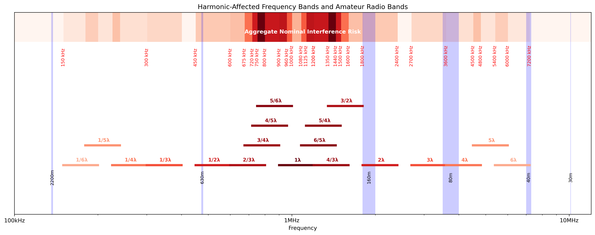

# Power Supply

## Requirement

ADXI aims to support 5 watt output since this is the most common output level limitation in regulations globally affecting amateur radio operators.

Given the 5 watt output goal, the majority of power consumption is going to be in trasmit power, since the rest of the components are unlikely to consume a significant amount of power.

Therefore, we should expect rapidly changing power draw as transmit is enabled and disabled, and this will nominally peak at 5 watts.

Almost all of this power will be on the 12V power supply (noting that power supply lines are conventionally termed "rail", so "12V rail" would refer to the 12V supply line).

Although the power amplifier (PA) operates at a nominal 12V, the minor current requirements for the rest of the system are mostly measured in 5V or 3.3V.

## Design evolution

Initially the design was to be made using a conventional DC input jack (as seen on the "wall wart" style power-pack supplies ubiquitous in pre USB-C electronics), however it was later reasoned that introducing USB-C would probably be feasible, and this would simplify cabling substantially from the four-cable original ADX design (DC power + USB to MCU + audio in + audio out) to a single cable design (USB-C only). The decision was made to keep both a conventional DC input jack and USB-C support to support debugging, future expansion, and flexibility.

Later, this decision was rescinded and only USB-C was retained.

## Design overview

The USB-C input power path is governed by the TUSB321 chipset, which:
 - Detects connectivity using its `VBUS_DET` pin
 - Reads the requested USB power configuration from its `CURRENT_MODE` pin
 - Negotiates the delivery of power through its `CC1` and `CC2` pins
 - Reports on its current states through the `OUT1`, `OUT2` and `VCONN_FAULT` pins
 - Provides power through its `VDD` pin

The chip can be configured to support a range of [USB-PD (USB power delivery)](https://en.wikipedia.org/wiki/USB_hardware#USB_Power_Delivery) modes.

If you are unfamiliar with the internals of USB-PD as I was, then the best high-level summary of the evolution of USB connectors and capabilities with respect to USB power delivery I have found online is [this article](https://www.toradex.com/blog/add-usb-c-to-your-next-carrier-board-design-1). Basically, the connector has to support orientation detection and negotiation and fallback across a number of different power delivery configurations, which is where the complexity lies and the need for the IC.

An important point of note is:
 - "One crucial aspect of USB-C is that the VBUS is not always powered. Unlike the previous USB standards, which had VBUS always powered, the VBUS on the USB-C is switched only after the source side detects a connected sink by observing the voltage levels at the CC pins."

The mode for which the TUSB321 chipset is configured to perform is UFP ("Upstream Facing Port"), meaning a USB client and power sink. The chip in this schematic is to request 5V 1.5A, which equates to 7.5 watts. Apparently there are actually two modes that can enable this power level, either "USB BC 1.2" (Type-A and backward compatible power delivery) or "USB-C 5V/1.5A" (USB-C specific mode). However, the former mode relies upon shorting the data pins and is used only in a charger, which is not appropriate to this situation because we intend to use the data pins for access to programming the MCU and interacting with the embedded USB sound card. Therefore, we use the latter mode. From the perspective of power provided, either mode would be identical to the device and provide a comfortable conversion loss margin for subsequent power stages. Modern USB-C can go much higher (15W, 60W, 100W or even 240W), but it is better not to over-specify the requirements because fallbacks and failure handling then become a requirement.

The `VBUS_DET` pin is adjacent to a resistor which provides for safe connection of the pin to the bus when the bus is in higher voltage modes. There is an additional resistor provided around 900K value in order to reduce the maximum potential bus voltage to a safe level for the IC.

The requested 5V power is however of an insufficient voltage for much of the radio circuit. Therefore, we need to upconvert ("boost") the voltage from 5V to 12V.

The inexpensive component selected for this purpose is the `MT3608B` boost converter which can be configured through a resistor divider to boost input voltages as low as 2.5V to output voltages as high as 24V and has 4A current support and relatively high and stable efficiency of around 93% declining to 90% at 1A.

The `MT3608B`:
 - Accepts an on/off control signal on its enable (`EN`) pin
 - Draws input power on its `IN` pin
 - Controls current flow with its `SW` pin
 - Determines current output state with its feedback `FB` pin

The output voltage is configured through a resistor divider ratio which is calculated as follows:
 - Desired VOUT = 12V
 - Feedback voltage from `MT3608B` datasheet = 0.6V
 - Required reistor-divider ratio = 20/0.6 = 19

We use 5.1K and 100K resistors for this purpose, as they are commonly available values matching this ratio.

An additional couple of capitors are provided to smooth the output of the boost converter before a diode which guarantees the correct direction of current flow with respect to the second potential input power path.

However, we should take note of the switching frequency which is variously described as 900kHz-1.2GHz. Therefore a model has been made showing its relationship to amateur radio bands.

Subsequent to the USB-C input power path, there is bulk capacitance to provide a stable basis for the system. Here we parallel two 470uF electrolytic capacitors to provide a lower [equivalent series resistance](https://en.wikipedia.org/wiki/Equivalent_series_resistance) and some increased longevity in the face of potential capacitor decay, as well as provide filtering.

The filtering is broken in to two parts, a capacitor filter using 100nF and 10nF capacitors which are suitable for high frequency attenuation, and an inductor.

The resulting net is termed `VIN` and is used as input to the regulator, an `L7812`, which provides the final 12V rail to the system.

For the 5V and 3.3V supplies, we rely on the onboard regulator on the MCU module.
