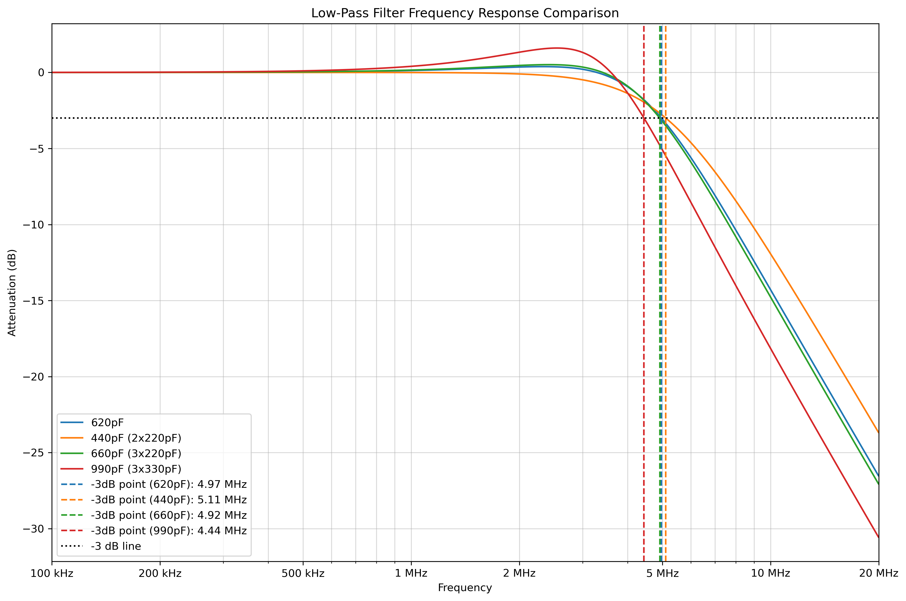

# Receiver

The receiver chipset is the `CD2003` which is a pin-compatible to the Toshiba TA2003, itself a pin-compatible upgrade to the TA8164.

While copying the previous ADX project's schematic without understanding it is certainly an option that would probably work, it would be best to comprehend fully all aspects of the solution.

After all, we're here to learn, right?

## Datasheets

There are a range of datasheets with background on this class of chipset.
 * Toshiba TA8164
 * Toshiba TA2003
 * UTC TA2003 (two datasheet versions available)
 * Wuxi CD2003

## Pins

From the CD2003 datasheet:

 * __Pin 1 (`INFMR`)__: FM RF Input (not used). In our case this is shorted to `GND`.
 * __Pin 2 (`GNDIN`)__: `GND`
 * __Pin 3 (`OUTFMM`)__: FM Mixer Output (not used). In our case this is not connected (`NC`).
 * __Pin 4 (`OUTAMM`)__: AM Mixer Output. This is pin that outputs the audio stream after the receiver has demodulated the RF input. Note that the signal is weak and requires amplification if used to generate audio output.
 * __Pin 5 (`AGC`)__: AGC Control. In our case this is shorted to `GND`.
 * __Pin 6 (`VCC`)__: Supply voltage. We supply a well-filtered 5V.
 * __Pin 7 (`AMIF`)__: AM Intermediate Frequency input. In our case this is shorted to `VCC` but with a 100nF cap to `GND` which allows AC to pass through but blocks DC.
 * __Pin 8 (`FMIF`)__: FM Intermediate Frequency input. In our case this is not connected (`NC`).
 * __Pin 9 (`GNDOUT`)__: Output `GND`. In our case this is shorted to `GND`.
 * __Pin 10 (`QUAD`)__: Called `FM_DET` on our symbol, this pin presumably indicates presence of an FM carrier signal based on quadrature FM detection. In our case this is not connected (`NC`).
 * __Pin 11 (`OUTDET`)__: Detector output. Apparently a logical OR output for AM detection and FM detection. In our case this is not conneted (`NC`).
 * __Pin 12 (`OSCAM`)__: AM Oscillation. Linked to `CLK1` line of clock generator, via a 100nF capacitor which allows AC to pass through but blocks DC.
 * __Pin 13 (`OSCFM`)__: FM Oscillation. In our case this is not connected (`NC`).
 * __Pin 14 (`SW`)__: AM/FM Switch. In our case this is linked to `GND` with an 100nF cap. My understanding is that the addition of the capacitor was to help providing enhanced EMI/RFI noise suppression through better isolating on-chip DC signals from external ground transients which may be encountered in certain real world conditions such as electrostatic discharge, EMI/RFI, etc.
 * __Pin 15 (`TUNFM`)__: FM Tuner. In our case this is linked to `VCC`.
 * __Pin 16 (`INAMR`)__: AM RF Input. This is the modulated RF signal feed from the antenna system.

## Peripheral circuits

There are two associated low pass 'pi' filters (LPFs):
 * __[5V supply LPF](../filter-models/cd2003-supply-low-pass-filter)__: This functions to filter out unwanted noise on the power line in order to ensure correct and reliable functioning for the receiver IC.
 * __[AM RF signal LPF](../filter-models/cd2003-rf-low-pass-filter)__: This functions to filter inbound radio frequency (RF) signals and remove extraneous noise. In the previous ADX project this consisted of 2x2.2uH inductors and a 620pF capacitor, which is an odd value. We instead use 3x220pF capacitors in parallel which provides effectively identical filtering but decreased ESR, better approximation of ideal component values, and increased resistance to component breakdown in addition to being cheaper to produce. 

There is a limiting circuit:
 * __Signal clamp__: The two fast-switching diodes on the signal line form a type of clamping or clipping circuit to ensure signals fall within an expected voltage range (positive and negative). This protects the IC from unexpected transient voltages. This type of circuit is also known as a bidirectional diode limiter, double-ended clipper or symmetrical clipper. See [Wikipedia](https://en.wikipedia.org/wiki/Clipper_(electronics)#Combinational_two-level_diode_clipper) which calls it a 'combinatorial two-level diode clipper'. Three cheers for standard terminology!
