# adxi-1.2-powerfix-1

## Timeline

 * Conceived: 2024-11-08ish
 * Designed: 2024-11-11
 * Ordered: 2024-11-11
   * Cost: $5 for 10 pieces of 2-layer PCB + $23.57 for surface mount and components = $28.57 for 10 boards, or $2.86 each
   * Shipping: $28.58
   * Effective cost: $5 each
 * ETA: 2024-11-21
 * Received: 2024-11-17 (morning) - ie. 6 days!
 * Assembled: 2024-11-17 (evening)
   * VBUS-IN pin and 12V-OUT pins must be clipped short by around 50% as they are not through-hole and the others are
   * Other pins may require some bending/re-alignment
 * Installation: 2024-11-18 (morning)
   * Proposed process:
     1. Remove `R80` (100K) beneath `VIN-OUT` pin. This has the effect of disabling existing boost conversion stage upstream connectivity from the 12V regulator.
       * Done
     2. Remove `L226` (22uH) east of below the `VDD-OUT` pin. This has the effect of disabling boost conversion stage resonance.
       * Done
     3. Remove `U8` (MT3608B) east of below the `VBUS` pin. This has the effect of disabling boost conversion entirely.
       * Done
     4. Verify pin alignment in all cases.
       * Done
     5. Solder in place.
       * First load solder on to the two non through-hole pins, ie. `VBUS-IN` and `12V-OUT`, because the first one is beneath an undercut and the second one also has reduce accessibility.
         * Done
       * Now tack down `VBUS-IN`. Verify the connectivity with a multimeter between the `VBUS-IN` pad on the fix board and the northern (inner) pad of the ferrite bead `FB6` at the `MCU`.
         * Done
       * Solder all through-hole pins from below.
         * Done
       * Finally solder the remaining pin, `12V-OUT`, to the pad. Verify the connectivity with a multimeter between the `12V-OUT` pad on the fix board and pin 1 on the mainboard regulator `U3`.
         * Done

## Test process

### Initial power tests

Rather than plugging the board straight in to USB-C it might be worth testing the power subsystems one by one before doing so, to prevent losing the soldering and assembly work and another board.

What can be realistically tested?

First of all we can test feeding 12V from the `GND` and `12V-OUT` pins on the fix board through to the regulator and see if the other power channels come up.

We will try 0.1A 12V for a short period and instrument 12V, 5V, and 3.3V during the test. If these all come up, then we know source power pass-through is working and should be able to plug in a USB source.

First, the power supply configuration will be programmed for 0.1 seconds in the test program `debugging/powertest` which activates the PSU's channel #2 for a short period and takes a PSU screenshot under load before shutting down.

A dry run resulted in the expected output.


After hooking up channel #2 as an input to the board, the oscilloscope channels need to be connected and set to trigger with input power. 

```
$ ./powertest
DP832 PSU
 - Status: OFF
 - Version: RIGOL TECHNOLOGIES,DP832,DP8C233203778,00.01.16
 - Self test: TopBoard:PASS,BottomBoard:PASS,Fan:PASS

Turning channels off... OK
Setting up channel #1
 - Voltage: 24.000V
 - Voltage limit: 24.000V
 - Voltage limiting: ON
 - Current: 0.500A
 - Current limit: 0.500A
 - Current limiting: ON
Setting up channel #2
 - Voltage: 12.000V
 - Voltage limit: 12.000V
 - Voltage limiting: ON
 - Current: 0.100A
 - Current limit: 0.100A
 - Current limiting: ON
Setting up channel #3
 - Voltage: 5.000V
 - Voltage limit: 5.000V
 - Voltage limiting: ON
 - Current: 0.500A
 - Current limiting: ON

Triggering channel 2 (12V) for test period
 - Enable
Saved screenshot_192.168.8.3_2024-11-18T07:02:51.png
 - Disable
```

Hrrm. Well the first run didn't trigger the scope or show any draw on the PSU screenshot.


A second attempt, leaving the channel on manually for a under a second resulted in an overcurrent condition on the PSU channel.

Let's increase the current to 0.3A, which was the level in the previous test scripts, and retry with the programmatic approach.

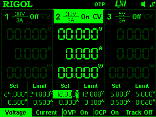

Same thing, no output, no capture.

Let's try increasing the time to one second or so.


Aha! We can see some draw at least. I wonder why the scope didn't trigger?

I tried switching it to real time and repeated, all the scope channels did move.

After changing the scope configuration (shorter time window, reset trigger level, change trigger to omnidirectional, etc.) I retried and it worked.


Needs to zoom out, clearly, but you can see the `VIN` input from the power supply is ramping up.

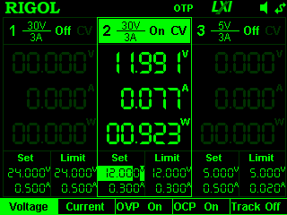


Zoomed out, retried.


And again... bang! We're in business.

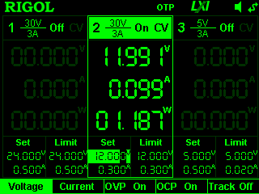


Here you can see all channels have ramped up, although not yet stabilised.


And finally here is the full view of all power rails from zero to stable.


The conclusion is that, as expected, after performing surgery on the original board and connecting the fix board carefully we can confirm there is still expected and correct functionality obtained in terms of power system startup when powering the 12V rail directly from the fix board's output. The total time from power input to stable operation is around seven divisions of 20ms each, or 7x20 = 140ms.

### USB VBUS power test

The next most conservative test we can try is to directly power the USB `VBUS` input with 5V and a virtual USB2 VBUS current level of 0.5A with overcurrent protection enabled.

This test is intended to simulate the USB having been plugged in to a legacy peer device which does not support higher modes, such as 1.5A USB2 charging or USB3 power delivery (PD). With this approach we will limit the current to a practically conservative level and look to see whether or not sourcing power directly from the USB VBUS line without a compliant USB2 or USB3 device supporting higher current negotiation or provisioning results in correct startup.

What we would anticipate seeing is some level of power up, although the state indication output pins of the `TUSB321` device would not indicate high power availability, we should in practice still be able to use the whole system to some level, certainly the MCU and receive functionality, if not some sporadic or burst transmission as well. While we can't fully test those later-stage features, we will test that the power does come on and get distributed correctly across the board.

After an initial test proving this is the case, we should repeat the test a few times leaving the power on for slightly longer periods working up to 10 or 20 seconds and see if there are any thermal issues.

Should the test conclude with correct power and no thermal issues then we are should be in a relatively confident position to plug in a real USB device, without current limiting, and observe the results.

Let's modify the previous test script to power only the 5V channel, set that channel to come on for a short time, and rewire the 5V channel anode to supply voltage directly to the `VBUS-IN` pad on the fix board.

```
DP832 PSU
 - Status: OFF
 - Version: RIGOL TECHNOLOGIES,DP832,DP8C233203778,00.01.16
 - Self test: TopBoard:PASS,BottomBoard:PASS,Fan:PASS

Turning channels off... OK
Setting up channel #1
 - Voltage: 24.000V
 - Voltage limit: 24.000V
 - Voltage limiting: ON
 - Current: 0.500A
 - Current limit: 0.500A
 - Current limiting: ON
Setting up channel #2
 - Voltage: 12.000V
 - Voltage limit: 12.000V
 - Voltage limiting: ON
 - Current: 0.300A
 - Current limit: 0.300A
 - Current limiting: ON
Setting up channel #3
 - Voltage: 5.000V
 - Voltage limit: 5.000V
 - Voltage limiting: ON
 - Current: 0.500A
 - Current limit: 0.020A
 - Current limiting: ON

Triggering channel 3 (5V) for test period
 - Enable
Saved screenshot_192.168.8.3_2024-11-18T09:28:04.png
 - Disable
```

Very encouraging result! The `5V` input can be seen scaling up, and the `12V` can be seen beginning to scale up.

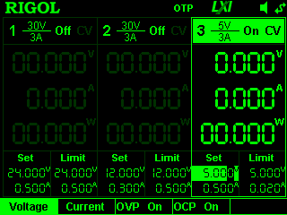


Obviously the startup time is slower due to the limited current available, but what we're seeing does indicate that the 12V rail is rising and the boost supply is working.

Before changing any parameters let's zoom out and repeat the test to see the bigger picture.


Great! Here we can see the bench supply ramps up to 5V and remains stable while we see the 12V regulator output begin to increase toward 2V. Once it reaches approximately 1V, we see the 5V downstream regulator begin to ramp up output, and the 3.3V regulator begins its own output thereafter.

Almost immediately after this final supply has come online but before a stable state is reached the test script cuts power and all rails ramp down.

This is an excellent result, showing that we can indeed power the system from the `VBUS` rail with only limited current availability.

Let's try the same test with some additional time, perhaps 2 more seconds, and see what happens.


Here we can see `VIN` fully stabilizes, at it looks like `3V3` comes close, but neither the main `12V` nor the `5V` reach a stable state. We'll add three more seconds and retry.

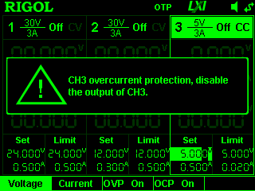


Uh-oh! The overcurrent protection activated on the power supply and we got about the same result as last time.

This shows that the current draw during the startup phase that is presented by our device exceeds the minimum `VBUS` current provisioning that is guaranteed by USB2.

This is potentially bad news, because it means our device is not going to be compliant. However, in practice this is probably not a great concern.

The test options for this issue are:
 * Turn off current limiting (ie. hopefully keep supplying 0.5A until the current draw drops, once the 3x1000uF capacitors are charged)
 * Raise the current limit (ie. model the case that our USB device is happy to provide more current than the bare minimum)
 * Give up and test with live USB.

Looking forward, we should probably consider implementing some form of hold-off, which is to say a temporally staged startup whereby the 12V regulator is not switched in until higher current capability is negotiated on `VBUS`.

For now, we'll raise the current limit to 0.7A and see what happens. We would anticipate that the PSU continues to supply 0.5A and then things become stable.

Nope, same issue.


And after raising to 1.5A it's the same. This means our capacitors are really pulling too much power too quickly.

We could perhaps have added a resistor between the large capacitors and ground to limit their speed of charging.

For the moment, at the risk of burning something, we'll turn off current limiting entirely and shorten the time that power is applied and see if that works.

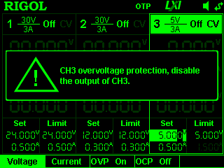


Well this looks different!

Firstly, we're seeing an overvoltage limit. That's very much unexpected and could indicate some sort of bad behaviour with respect to the resonator on the fix board. Let's review instrumentation and see if we can't get a better picture of that input side of the equation.

Secondly, we're seeing all of the levels come up a lot higher. In turn:
 * `VIN` which is the output of the revised boost converter on the fix board, comes up to around 12V. This looks perfect.
 * `12V` which is the output of the 12V regulator, comes up to around 12V. This looks perfect.
 * `5V` which is the output of the downstream 5V regulator, ~~comes up to 5V precisely. This is perfect.~~ reaches only 3.7V. This is a concern.
 * `3V3` which is the output of the downstream 3.3V regulator, comes up to around 3.3V. This looks perfect.

So, overall, we're seeing absolutely correct outputs, except for 5V. Our major concern is the overvoltage limit being triggered on the input side.

Let's switch the `3V3` probe (channel #4) over to instrument the input side (to be clear - not `VIN` which is the prior location, being the output of the new boost converter on the fix board, but rather `VBUS-IN`, which is the input to the new fix board, being the output of the bench supply and the simulation of the USB `VBUS` line.

We'll now repeat the same test, with the new channel scaled down 50% (2V per demarcation) and see what we find.


Here the interesting feature is that `VBUS` suddenly raises from `2.5V` (where it appears to be held for some time as the other downstream power rails draw from it) to 5V (as those power rails become stable). It is at that point at which we see a rapid shutoff driven by the overvoltage protection of the bench supply.

Thankfully, we do not see transients at substantially higher voltages as we had worried, of the sort we had observed on the original main board with the poorly configured inductor.

However, we should probably ensure this is really the case by "zooming in" a bit to cover the area where all power rails ramp up fully and obtaining some closer traces.

If those look clean, and we are confident they are not lying, then we could try iteratively raising the overvoltage limit to a slightly higher level to see if this quietens the PSU and allows the system to enter a fully stable powered up state. That would be ideal.

First then, we'll zoom in and see what we can see with more detail.


Here we see the portion of the power-on in which all levels are at their most stable and high state. However, after enabling measurement statistics, we can see that the `VBUS` line does not actually reach 5V volts, but rather something lower like 4.6V.

Why is this?

Reviewing the schematic I think I found a problem. The diode `D13` appears to be backwards. This would affect this part of the circuit.

One way to test if this is the source of the issue is to remove it.

Removing it could be done in two ways: using heat, or by cutting it out. I cut it out.

Repeating the test now, what occurs?


The same thing. Overvoltage limit, similar curves.

So what is going on? The `VBUS` line is configured on the PSU to be raised to 5V, with a 5V limit. On the scope we see it rise to around 4.6V.

There are a few potential issues here:
 * Firstly, the scope could be miscalibrated. 
 * Secondly, there could be some ground differences between the earth on the PSU and the ground on the scope channel.
 * Thirdly, there could be some connection problems on the GND or VBUS connectivity on the fix board. Perhaps that part could be resoldered, although this would require removing all instrumentation and power and replacing it afterwards.

### Next day perspective

I left this and came back to it the next day. Turns out placing a probe on the `VBUS-IN` pad had clipped the connection, this was probably not the cause but was a concern. Solder iron resolved this, and the multimeter confirmed the fix. All other connections were also tested:
 * `VBUS-IN` to ferrite bead: OK (corrected broken solder)
 * `GND` to other ground points: OK (also added more solder)
 * `VDD-OUT` to pad of removed inductor: OK (also added more solder)
 * `5V` to the MCU output 5V pin: OK

In aggregate, there could have been too high resistance on the grounding leading to a floating ground on some probes. Perhaps all probes should use the same ground point, rather than a convenient ground point, or two grounding options could be tested in succession to determine whether this is (or remains) a factor.

For now, let's rewire the previous test and look to repeat the same behaviour.

The key mysteries:
 * Why did the input jump suddenly after ramp-up
 * Why did the overvoltage error occur
 * Why did overcurrent occur

Rewiring is done, and photographically documented. Time for a retest.

Oscilloscope to single capture mode, script execute.

```
DP832 PSU
 - Status: OFF
 - Version: RIGOL TECHNOLOGIES,DP832,DP8C233203778,00.01.16
 - Self test: TopBoard:PASS,BottomBoard:PASS,Fan:PASS

Turning channels off... OK
Setting up channel #1
 - Voltage: 24.000V
 - Voltage limit: 24.000V
 - Voltage limiting: ON
 - Current: 0.500A
 - Current limit: 0.500A
 - Current limiting: ON
Setting up channel #2
 - Voltage: 12.000V
 - Voltage limit: 12.000V
 - Voltage limiting: ON
 - Current: 0.300A
 - Current limit: 0.300A
 - Current limiting: ON
Setting up channel #3
 - Voltage: 5.000V
 - Voltage limit: 5.000V
 - Voltage limiting: ON
 - Current: 0.500A
 - Current limit: 1.500A
 - Current limiting: ON

Triggering channel 3 (5V) for test period
 - Enable
Saved screenshot_192.168.8.3_2024-11-19T06:04:06.png
 - Disable

```

Result was:


The oscilloscope did not trigger. 

Changes:
 * We will zoom in a bit to get a better chance of capture (higher frequency sampling).
 * I altered the 5V overcurrent protection to 7V

Re-ran the script.


Same result. Let's switch the scope to free-running instead of trigger capture mode and see if we can see action.


Yes, we saw the input rise to 5V as it should. This is better than yesterday's oddball voltage level. Let's change the trigger to trigger on `VBUS` rise, zoom out and retry.


OK, so here what do we see:
 * Nothing else is apparently coming up, only the `VBUS` line.
 * When the `VBUS` line drops, there is a bit of a shake on the `12V` and `VIN` lines.
 * `5V` stays flat.

Noting I had the probe in the `VIN` port on the mainboard, this will be moved to the `12V-OUT` pin between the fix board and the mainboard to retry.

This made no difference.

I moved some other probes around. During this period I noticed the overvoltage protection on channel #3 was still displaying as 5V, not 7V. I tried setting this manually and received and error to the effect that 5.5V was the limit. I updated the script. Retry.

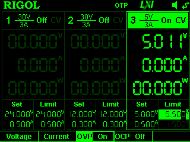


This is progress. We have a stable run, no tripped protection conditions, and the maximum voltage appears to be just over 5V which is fine.

However, we still have nothing showing for the other channels.

I moved some probes around and we retry. Disregard the channel names here, we're just looking for activity.

Same again. Truly confusing.

It looks like, relative to yesterday, we're seeing absolutely no action on the fix board in terms of power generation.

### Making our way back

Let's step back and instrument stage by stage using the schematic.

First of all, we have verified that the `VBUS` is incoming from the bench supply.

Looking at the fix board schematic, the output we should see is on the `12V-OUT` pad.

Let's remove the other probes from the equation and work our way back toward a signal, starting at the `12V-OUT`.


Nothing.

Let's try probing pin 2 (`SW`) on the inductor.


Still nothing. Extremely odd. It looks like the boost converter never really starts up.

Visual inspection shows the boost converter to be in perfect condition.

However, a nearby chip marked `1003` which is a 100K resistor looks potentially damaged. This could have been soldering damage or damage from input. We could potentially replace it. However, first let's note what it looks like.

The model is `1206W4F1003T5E` which is rated at 250mW and 200V. We should not have seen this die, given that it should only be drawn through the feedback pin, but perhaps it was a solder accident yesterday? I could replace it with a non surface mount component.

But first I tried walking back further toward nominal 5V input. Nothing.

Aha! The problem.

Heat from the soldering of the pin had contorted the plastic base holding it in place such that the bench supply alligator clip was clamping to the plastic and not to the metal, thus no current was flowing in to the circuit!

I fixed this by soldering on a short pin and replacing the probes.

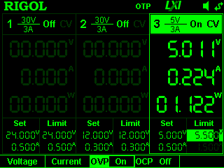


Voila. 12V happy.

Let's get back to a more fully instrumented state by adding back two additional probes for main board 12V (being distinct from boost converter board 12V out which is regulator input) and main board 5V (which should be 5V exactly). We can assume 3.3V comes up fine if 5V is stable, but.

### Back to forwards

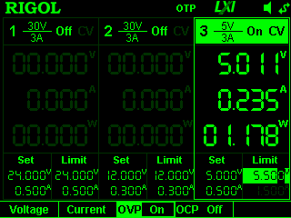


Fantastic.

This looks a lot healthier, and on the face of it here we can see everything coming up as anticipated, no exceptional trigger conditions, and a ramp-down generally in line with onboard capacitance.

Let's take the precaution of documenting it explicitly to ensure we're not missing anything.

 * Channel 1 (Yellow) is 12V on the main board. It comes up just after 12V output from the boost converter and stabilizes around 11V. __This is a lower than what we'd like.__
 * Channel 2 (Light blue) is the 12V output from the boost converter. It comes up just as power is applied and stabilizes around 12V.
 * Channel 3 (Purple) is 5V on the main board. It comes up just to 5V and stabilizes.
 * Channel 4 (Dark blue) is our VBUS input. It steps up to 2.5V then 4.6V. It is unclear why it does not come up to 5V, and this is a significant gap, both with the expected condition and the voltage shown on the bench supply. Perhaps it is related to poor grounding on the probes, an earth difference between the scope and the PSU, or some other such issue.

Let's try running an earthing wire between the scope and the bench supply and repeating the same test.


Looks pretty much equivalent.

Well, I think we're close. Let's leave the power on a bit longer and see if we can detect any thermal conditions.

After 30 seconds to 1 minute of on time, no thermal conditions were detected and current draw remained stable at 5V 0.2A or around 1W.

While it would be nice if this was lower, because really it is pretty high, we should be now confident for a final test.

### Toward the final test

We can plug in the USB peer and see if the device comes on.

Normally we would expect this to function correctly however we removed a diode which we figured may have been backwards. We can replace this with another diode, which should be rated at something higher than 5V breakdown voltage and correctly oriented with positive toward the source. Let's revisit that and select an appropriate leaded diode from stock.

First of all let's review the design and model out what we expect to occur.

 * When power is applied to `VBUS`, a low current capability must be assumed. This is 5V 0.2A in practice, which is basically our idle draw! When we power on, however, a much higher draw is assumed.
 * Since our last test was performed with overcurrent protection disabled, let's try enabling it and walking back the current limit from 3.3A (PSU maximum) downward until the protection trips. This should give us some idea of the actual peak draw during startup.
   * __3.3A__
     * Woah! That 5V is now all over the place. Is this a function of ? Why are we seeing this on 5V and not on VBUS? Did we bump a connection or something? . Let's retry after reseating probes.
     * Much better, but still some oddball behaviour. Let's add some physical support to keep the probe stable and try again. 
     * Still oddball at the start, but further improved. 
     * I switched the scope over to live and monitored the output. It seems even when the device is unpowered and the PSU is switched off there is some sporadic noise on the 5V channel. The probe is closest to my USB hub which has some transmitting devices including keyboard and mouse. I tried unplugging these as a test. This may have reduced but certainly did not remove the problem. Another issue was that the 5V probe had its 1x/10x switch poorly seated. A final issue was that the other channels started to show the same noise. I think this must be related to ground from the PSU - using unshielded cables for supply is a bad idea. It could also be related to an earth loop on the new PSU to scope lead. Let's remove that and see if it resolves. Nope. Hasn't resolved. After working my way through the nearby devices, even turning off the monitor and the speakers and all other devices, I couldn't find the source. However, when the PSU is off it didn't come through. This suggests it was probably ground noise on the supply line rather than something local to the circuit. I guess I need to get my house rewired, but I knew that already. Until then, I'll trust weird scope traces when they turn up 2-3x in succession. Moving on back toward the problem at hand, then, we should look in to the current limit. Let's set 1.5A and see what happens.
  * __1.5A__
    * OK
  * __0.5A__
    * OK
  * __0.3A__
    * Weird brown-out conditions not worth investigating including 12V only reaching 8V-ish... 

Having established something of a threshold of normalcy (ie. 0.5A+ for good startup), since the `TUSB321` nominally negotiates 1.5A at 5V meaning 7.5W (before losses) and our idle draw is 1W (including losses) we should be fine, as long as it comes up relatively quickly. If it hasn't negotiated successfully we will expect to see the same issue, ie. the 12V regulator on the main board will fail to reach 12V.

This now brings us back to the immediate problem of restoring the missing diode.

The purpose of the diode is to ensure that current flows in only one direction when combining the two possible 5V current sources to the `TUSB321` chip itself, namely the early-stage current source (the peer USB device provided `VBUS` voltage) and the later-stage current source (our MCU module's regulated 5V).

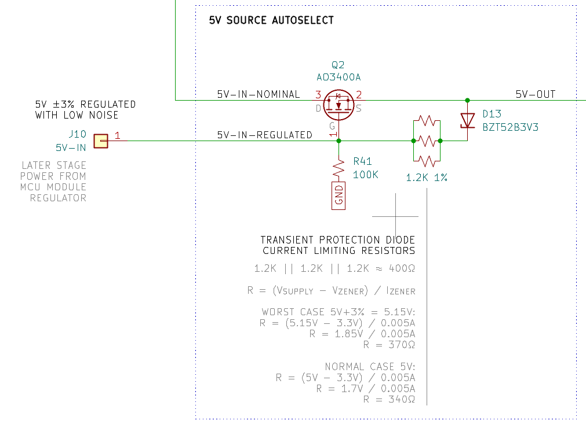

If we don't have this diode restored, what may happen is that the `TUSB321` powers on with the temporary `VBUS` supply, then gets powered off when regulated `5V` becomes available. This would, assuming a correctly performing USB peer device, potentially result in the device being depowered. (However, we can probably safetly assume the (USB powered hub) device is not correctly performing all USB current negotiations and probably just provides heaps of current with some kind of cut-off, and additionally that it will never cut out unless a limit is tripped.)

Since I can't see a bad result from this, it should be safe to test.

First let's do a final bench test:
 * __0.4A__: Yes, 12V comes up to the ~11V point finally seen in prior conditions.
 * __0.35A__: No, this fails. 

So around 0.4A is our minimum for stable power-on.

### Final test

We plug the device in to USB to see what happens.

Nothing happens.

After some fiddling including setting a trigger on 5V at a level slightly above noise to capture the plug event, I realised what may be going on is that the `VBUS` voltage is not reaching the fix board. 


This could be because the original tap point is no longer connected by solder. Let's double-check that with the multimeter. Yep.

Solder iron dab, resolution confirmed with multimeter, retry with `VBUS` as the trigger source.

Retry - yes!


USB 3 plug based power on is working. Let's get a more detailed view of that.


So we're still seeing the 11V issue on the 12V line, but basically once the boost converter powers on and starts outputting 12V, we're seeing a stable state reached within 30ms.

Fantastic.

In order to fix the 11V issue, we can attempt to adjust the boost converter's configuration resistor divider network to output a slightly higher voltage.

First, let's read [the datasheet for the relevant mainboard regulator](https://wmsc.lcsc.com/wmsc/upload/file/pdf/v2/lcsc/2403130950_XBLW-L7812CDTR-XBLW_C22357877.pdf), `L7812`.

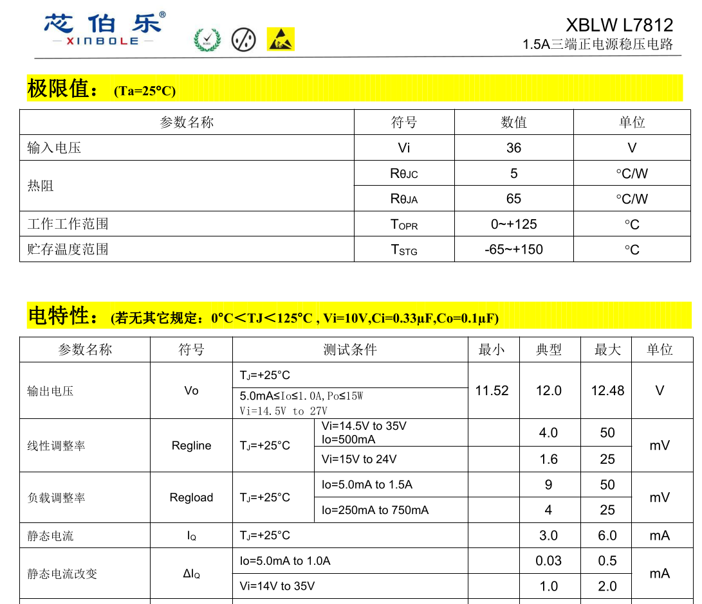

Here we can see the regulator accepts up to 36V but would prefer 14.5V or, better yet, 15V as input. Let's configure for 15.5V then and see if we can't fix the problem.

To reconfigure the resistor-divider network for a higher voltage we can add a 10K resistor in parallel to the 5.1K in order to obtain something like 17V.

However, this proved too fiddly for my middle-aged soldering skills so I gave up on bothering.

In any event, we're powered, and USB devices are present.

```
$ lsusb -t
        |__ Port 003: Dev 021, If 0, Class=Hub, Driver=hub/4p, 480M
            |__ Port 001: Dev 023, If 0, Class=Audio, Driver=snd-usb-audio, 12M
            |__ Port 001: Dev 023, If 1, Class=Audio, Driver=snd-usb-audio, 12M
            |__ Port 001: Dev 023, If 2, Class=Audio, Driver=snd-usb-audio, 12M
            |__ Port 001: Dev 023, If 3, Class=Human Interface Device, Driver=usbhid, 12M
            |__ Port 002: Dev 022, If 0, Class=Vendor Specific Class, Driver=ch341, 12M
```

## Back to diode

We should try to check that the diode is going to allow power to the `TUSB321` to flip over when it becomes available as a regulated source.

First we should test with the diode-absent condition and see the voltage fail.

Second we should test with the diode-present (corrected polarity) condition and see the voltage be retained.

## Issues list

 * Resistor network for boost converter should be reconfigured for 15.5V output, ie. ~3.9K resistor. Higher is also fine, `15V < V_INPUT < 36V`
 * Diode should be flipped. Only once this is done can we check that it actually
