# adxi

## Timeline

 * Conceived: 2024-08-03
 * Designed: 2024-08-03 - 2024-10-10ish
 * Ordered: 2024-10-24
   * Cost: $41.40 for 10 boards + $154.20 for 10 pieces SMT = $195.60 for 10 pieces / 10 = $19.56 each (ex shipping)
   * Note that the ordering was delayed for 2 weeks or something owing to the late stage module design needing revision and wanting to share shipping costs, and this required updates to the [classe2-calculator](https://github.com/vk2diy/classe2-calculator) software.
 * ETA: 2024-11-06 
 * Received: 2024-11-04 (~midday) - total time since ordering ~10-11 days
 * Testing:
   * 2024-11-04: Blew up two boards, discovered USB power issue.
   * 2024-11-05: USB hub, audio and MCU passthru verified with bypass supply. Restored lab to functionality. Worked on a fix, ordered parts.
   * 2024-11-06: Parts received. Testing done manually powering the `TUSB321` chipset and negotiation appears to occur. This suggests a fixable situation. The boost converter still needs debugging.
   * 2024-11-07: Boost converter block instrumentation and testing.

## Initial test

 * Visual inspection
   * No obvious defects
   * The silkscreen now appears to be printed with an inkjet and is much less clear than previous eras
 * Multimeter inspection
   * The GND net appears to be consistent across the board
   * None of the power nets short to GND
 * Assembly test
   * Hard to get the cable through the hole.
   * While easy to thread (dimensions are fine) I failed to account for the solid plug being in the way of the cable
 * Fiddly to tighten nylon nuts around standoffs

## Initial soldering

 * Found pins for MCU not easy to solder, maybe soldermask problem
 * Put one in backwards (oops!)
   * Result: First destroyed board. Nine remain.

## Issue #1: USB-C Power Distribution
 * Next board tried connecting USB-C to a powered USB2 hub just to probe board power
 * See some power on USBC = 0.xV and USBC CLEAN = 0.xV but nothing elsewhere, have to trace back using schematic.
 * Soldered some test leads on to the related test points
 * Configured oscilloscope to view these channels:
   * The scope shows 300mV for CH2 = USBC CLEAN and 500mV for CH1 = USBC
 * Both boards show this issue, which suggests a probable design problem
 * Test results for all three cases (backwards MCU on otherwise new board, no MCU on new board, correct orientation MCU on new board):
   * Test point '5V' = 0V
   * Test point 'USBC' = 500mV
   * Test point 'USBC CLEAN' = 300mV
   * Net 'USB-C-VBUS' = 5V
 * __Conclusion__
   * Design, configuration or placement problem regarding `TUSB321` chipset.
   * Chip is too small to probe directly. but pins are as follows:
     * CC1 = bidirectional USB PD channel
     * CC2 = bidirectional USB PD channel
     * ...
   * __Hypothesis__
     * I misunderstood the datasheet.
       * Instead of the chip relaying the power, which is obtained through the CC channels, it in fact requires a separate supply, which it was not given (and I was treating as an output).
       * Therefore, no power was being relayed to the rest of the board.
       * Additionally, the last page of the datasheet specifies that a 100nF bypass should be present at the VDD pin.
     * The good news is this should be possible to fix without a board revision by bringing VDD power from the 5V verified as present on the `USB-C-VBUS` net, after the ferrite bead.

 * __Attempted fix #1: Jumper cable__
   * Soldered a cable between the `USB-C-VBUS` output after the ferrite and the `USB-C-CLEAN` net (which connects to the `TUSB321` `VDD` pin.
   * __Hypothesis__
     * This should have taken 5V to the 5V clean output as input to the `TUSB321` boost converter, allowing it to negotiate more power.
   * __Result__
     * The `TUSB321` boost converter released magic smoke instantly.
     * Second destroyed board. Eight remain.
   * __Analysis__
     * IC orientation is visually verified as correct
     * Unsure why this occurred, in particular:
       * Given that 5V was measured
       * Given `TUSB321` is supposed to have thermal shutdown
       * Given `TUSB321` only has two inputs, the feedback pin and the main input pin, the latter receiving 5V only
       * Given that the feedback circuit had been modeled.
   * __Conclusion__
     * Design, configuration or placement issue within the `TUB321` circuit
   * __Potential next steps__
     * Use the first destroyed board where this section is intact to test the circuit more carefully using a bench supply and the oscilloscope.
       * This will rely on restoring the test equipment network which appears to be down right now.
       * Very short pulses of power or power with a current cutoff could be measured on the input, output and feedback pins to understand the behaviour without destroying the chip.
       * In the worst case, it should be possible to simply relegate this portion of the circuit to next edition and power the board through the 12V test point.
       * If it appears things are generally in order, then, to reduce inrush current, bulk capacitors could perhaps be disconnected.
     * Bypass the power stage with a direct supply

 * __Attempted bypass #1: Direct 12V supply__
   * Prepared an LXI network configurable power supply Rigol DP832 to connect to 12V test point and GND test point
     * Channel configuration is 12V with overvoltage protection enabled, and 0.05A with overcurrent protection enabled
   * A timed script will enable power for a short time so that the oscilloscope can capture the effect of the power on the other power rails (5V, 3.3V) which should come up.
     * The current limit will be iteratively increased slightly until bring-up succeeds.
     * If these come up, based on the MCU module's internal regulator, then we should be in business, and can move on to testing USB functionality.
     * We may also discover additional problems, although shorts have already been ruled out with multimeter-based continuity probing.
   * Before this test can proceed:
     * I had to debug some issues with my test network due to long period of disuse (network cable had been removed and replaced for another purpose)
     * I had to verify connectivity to the oscilloscope (for screenshot capability) and power supply (for control purposes)
     * It would be good to to first verify the script and control circuit with no load using the multimeter.
   * Configuration screenshot: 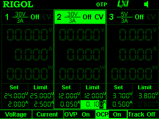
   * Script output: 
```
Tue Nov  5 09:21:44 AM AEDT 2024
DP832 PSU
 - Status: OFF
 - Version: RIGOL TECHNOLOGIES,DP832,DP8C233203778,00.01.16
 - Self test: TopBoard:PASS,BottomBoard:PASS,Fan:PASS

Turning channels off... OK
Setting up channel #1
 - Voltage: 24.000V
 - Voltage limit: 24.000V
 - Voltage limiting: ON
 - Current: 0.500A
 - Current limit: 0.500A
 - Current limiting: ON
Setting up channel #2
 - Voltage: 12.000V
 - Voltage limit: 12.000V
 - Voltage limiting: ON
 - Current: 0.050A
 - Current limit: 0.050A
 - Current limiting: ON
Setting up channel #3
 - Voltage: 5.000V
 - Voltage limit: 5.000V
 - Voltage limiting: ON
 - Current: 0.500A
 - Current limiting: ON

Triggering channel 2 (12V) for test period
 - Enable
Saved screenshot_192.168.8.3_2024-11-05T09:21:44.png
 - Disable

Tue Nov  5 09:21:45 AM AEDT 2024
```

   * Analysis:
     * The screenshot showed no current consumption
     * Connections were therefore checked and an alligator clip was replaced with a soft solder tie-down to the test point
     * The script still ran without change, however re-enabling the channel manually resulted in an overcurrent alarm
     * The current was manually increased as follows: 0.1A, 0.2A
     * At 0.2A power-on occurs and the LED from the MCU can be seen, but this is not reliable.
     * At 0.3A reliability is attained 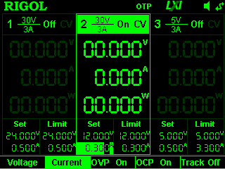

```
Tue Nov  5 09:37:42 AM AEDT 2024
DP832 PSU
 - Status: OFF
 - Version: RIGOL TECHNOLOGIES,DP832,DP8C233203778,00.01.16
 - Self test: TopBoard:PASS,BottomBoard:PASS,Fan:PASS

Turning channels off... OK
Setting up channel #1
 - Voltage: 24.000V
 - Voltage limit: 24.000V
 - Voltage limiting: ON
 - Current: 0.500A
 - Current limit: 0.500A
 - Current limiting: ON
Setting up channel #2
 - Voltage: 12.000V
 - Voltage limit: 12.000V
 - Voltage limiting: ON
 - Current: 0.300A
 - Current limit: 0.300A
 - Current limiting: ON
Setting up channel #3
 - Voltage: 5.000V
 - Voltage limit: 5.000V
 - Voltage limiting: ON
 - Current: 0.500A
 - Current limiting: ON

Triggering channel 2 (12V) for test period
 - Enable
Saved screenshot_192.168.8.3_2024-11-05T09:37:43.png
 - Disable

Tue Nov  5 09:37:44 AM AEDT 2024
```

   * Conclusion:
     * Board is at least partly functional with MCU power-on detected
     * Additional channels of 5V and 3.3V also come up as follows  

## USB testing

Now that we have power, it may be possible to test USB connectivity.

Firstly we should take care before plugging in the USB to ensure that the USB VBUS does not burn anything else. The jumper lead that allowed this to burn the boost converter has been removed and the initial state (some minor voltage seen through `TUSB321` `VDD` pin presumably bleeding through from `VBUS_DET` via the large resistor) should be replicated. Since this is insufficient to enable `TUSB321` we should see it remain idle, and the subsequent power stage which burned, namely the jumpered input to the boost converter `MT3608B`, has been removed. Subsequent diodes should prevent further issue.

So the plan is:
 * Plug in USBC
 * See whether anything burns or gets hot
 * If not, then proceed to apply power.
 * After applying power, see if the USB hub comes up, USB audio chipset comes up, or the passthru to the MCU for serial control and programming over the shared USB-C line works.

Here we go... success! `dmesg` output showed the following.

```
[131935.240875] usb 5-4.3: new high-speed USB device number 9 using xhci_hcd
[131935.354394] usb 5-4.3: New USB device found, idVendor=1a40, idProduct=0101,
bcdDevice= 1.00
[131935.354397] usb 5-4.3: New USB device strings: Mfr=0, Product=1, SerialNumbe
r=0
[131935.354399] usb 5-4.3: Product: USB2.0 HUB
[131935.364516] hub 5-4.3:1.0: USB hub found
[131935.364585] hub 5-4.3:1.0: 4 ports detected
[131935.747540] usb 5-4.3.2: new full-speed USB device number 10 using xhci_hcd
[131936.021358] usb 5-4.3.2: New USB device found, idVendor=1a86, idProduct=7523
, bcdDevice= 2.54
[131936.021362] usb 5-4.3.2: New USB device strings: Mfr=0, Product=2, SerialNum
ber=0
[131936.021365] usb 5-4.3.2: Product: USB2.0-Ser!
[131936.360870] usb 5-4.3.1: new full-speed USB device number 11 using xhci_hcd
[131936.635396] usb 5-4.3.1: New USB device found, idVendor=0d8c, idProduct=0012
, bcdDevice= 1.00
[131936.635398] usb 5-4.3.1: New USB device strings: Mfr=1, Product=2, SerialNum
ber=0
[131936.635399] usb 5-4.3.1: Product: USB Audio Device
[131936.635400] usb 5-4.3.1: Manufacturer: C-Media Electronics Inc.
[131936.675747] input: C-Media Electronics Inc. USB Audio Device as /devices/pci
0000:00/0000:00:02.1/0000:03:00.0/0000:04:0c.0/0000:14:00.0/usb5/5-4/5-4.3/5-4.3
.1/5-4.3.1:1.3/0003:0D8C:0012.0009/input/input33
[131936.734251] hid-generic 0003:0D8C:0012.0009: input,hidraw8: USB HID v1.00 De
vice [C-Media Electronics Inc. USB Audio Device] on usb-0000:14:00.0-4.3.1/input
3
[131936.762002] usbcore: registered new interface driver usbserial_generic
[131936.762010] usbserial: USB Serial support registered for generic
[131936.766921] usbcore: registered new interface driver ch341
[131936.766929] usbserial: USB Serial support registered for ch341-uart
[131936.766937] ch341 5-4.3.2:1.0: ch341-uart converter detected
[131936.767494] ch341-uart ttyUSB0: break control not supported, using simulated
 break
[131936.767523] usb 5-4.3.2: ch341-uart converter now attached to ttyUSB0
[131937.067790] usb 5-4.3: USB disconnect, device number 9
[131937.067792] usb 5-4.3.1: USB disconnect, device number 11
[131937.137341] usb 5-4.3.2: USB disconnect, device number 10
[131937.137450] ch341-uart ttyUSB0: ch341-uart converter now disconnected from t
tyUSB0
[131937.137464] ch341 5-4.3.2:1.0: device disconnected
```

This tells us that:
 * USB data lines work both on the host-side and the board-side
 * The USB hub works
 * The audio chipset is detected
 * The USB cable passthru to the MCU module works
   * The CH341 serial UART on the MCU is detected

Fantastic! Let's power it on a bit longer to get a USB tree display.

```
        |__ Port 003: Dev 015, If 0, Class=Hub, Driver=hub/4p, 480M
            |__ Port 001: Dev 017, If 0, Class=Audio, Driver=snd-usb-audio, 12M
            |__ Port 001: Dev 017, If 1, Class=Audio, Driver=snd-usb-audio, 12M
            |__ Port 001: Dev 017, If 2, Class=Audio, Driver=snd-usb-audio, 12M
            |__ Port 001: Dev 017, If 3, Class=Human Interface Device, Driver=usbhid, 12M
            |__ Port 002: Dev 016, If 0, Class=Vendor Specific Class, Driver=ch341, 12M
```

Great. 

Here we can see four device interfaces on the audio chipset, three audio and one USB HID (used for microphone buttons).

The audio devices are used to receive audio from and send audio to the transceiver.

The final device is the MCU module's CH341 serial UART interface which is used for serial control and programming.

## Next steps

A reasonable step might now be to __attempt to program the device__ in order to better verify on-board functionality.

Alternatively, we could __go back and try to solve the USB C power distribution issue__.  Let's do that as it's annoying me that we've been so lucky with the later-stage USB devices but failed with the base power.

## Back to the USB power distribution problem

It seems that what may have happened is that I misunderstood the USB-C power distribution system, as it is my first time designing both USB devices and USBC powered devices.

Basically, there are three logical lines related to power on the USB C standard:
 * The `VBUS` line, which is the USB bus voltage. This goes all the way back to USB 1.0.
 * The `CC1` and `CC2` lines, which are new to USB-C and used for the negotiation of more power.

It seems that my wrong-headed design-time assumption was that the power would be negotiated on *and distributed on* the `CC1` and `CC2` lines, because `VBUS` has far too many backwards compatibility issues to be brought up to a high voltage and amperage.

However, it seems this assumption was wrong, and that in fact the `VBUS` line is used for the power distribution and the `CC1` and `CC2` lines are only used for power negotiation. This is odd to me, but I suppose that's how it is, because it would explain our situation as follows:
 * The `TUSB321` chip never comes up
 * The `TUSB321` documentation final page suggests adding a 100nF bypass cap on the `VDD` pin (implying external power input required through this pin)
 * The direct connection between `VBUS` and the boost converter fried it, because:
   * After `VDD` was powered on for `TUSB321` (since it's on the same net that was directly powered), it negotiated more power which was in excess of the boost converter `MT3608B` `IN` pin's absolute maximum voltage.

This is a sketchy comprehension but seems like it may be heading in the right direction.

If that holds, and we could probably do some further testing to verify the theory, then:
 * In terms of safely bringing up the TUSB321 using only USB power, we could perhaps cut the connection from VDD to the `MT3608B` and instead connect it to pin 5 (`VBUS_DET`) which lies behind a protective 909K resistor which the `TUSB321` datasheet states is for reducing modern high VBUS voltages to a safe small level. Presumably this power level may be adequate for powering the chip.
 * The `TUSB321` datasheet says that it should be functional at 4.5V, that all pins have an absolute maximum of 6-6.3V, and that the threshold voltage should be 4V
 * We should perhaps go back to re-measure the threshold voltage presented before and after the 909K resistor, however I believe the voltage is well below 1V and thus insufficient.

Some potential fixes:
 * Some __parallel, alternate resistor configuration__ to obtain a higher voltage (eg. 200K instead of 909K)
 * A __5V regulator__ capable of the higher voltages that may be presented on the `VBUS` line
   * Most regulators seem to fail around 17V (AMS1117)
   * I found a local supply of 35V 1.5A capable 5V regulators, L7805CV, and procured them. They should arrive tomorrow.
 * A __12V regulator__ to reduce the `VBUS` line (if higher than 5V) down to 12V stable, instead of the current boost converter

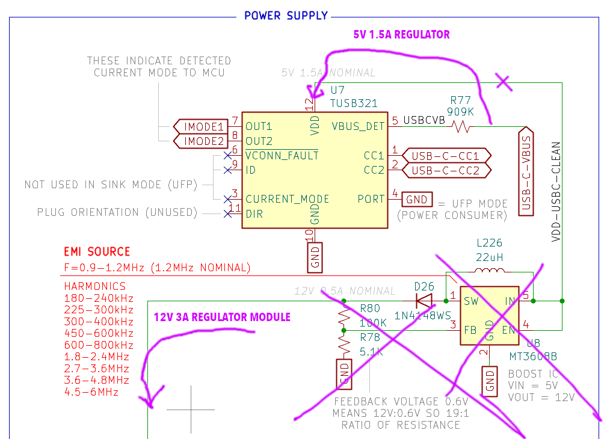

## The Plan

 * Cut the connection between the `TUSB321` and the `MT3608B`.
 * Wire a 5V regulator output or a resistor setup to the `TUSB321` chip's `VDD` pin.
 * Instrument `CC1`, `CC2`, `VDD` and the USB `VBUS` line.
 * Run a power-up test capturing oscilloscope output to verify that `TUSB321` is now powering up correctly, and what effect this has if any on the `VBUS` line voltage.
 * Then, move on to `MT3608B` subsystem testing based on the newly clarified and verified context.
   * If, as suspected, the `TUSB321` negotiates changes to the `VBUS` line that present a voltage higher than desired for the `MT3608B`, use a 12V regulator module instead.
   * If, after verifying power-up, the `TUSB321` negotiates changes to the `VBUS` line that only present a higher amperage, further consideration will be required.

## Regulator insertion

It seems this test point is the correct place to target: solderable, large, out of the way.

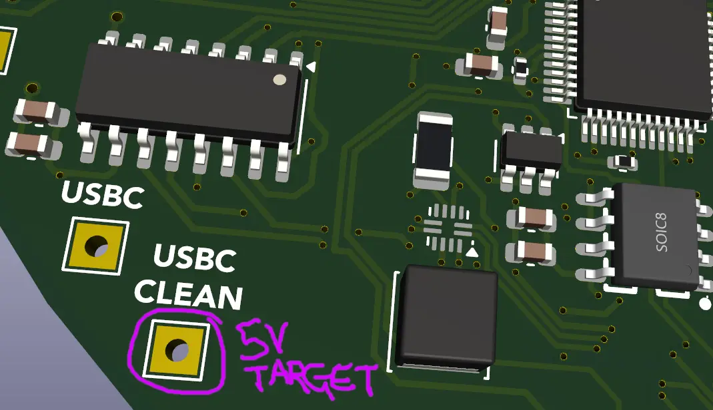

However, before executing that plan it may be beneficial to first use the bench supply with a low current set just to see what happens when voltage is applied.

### Bench supply pre-test

The first step was removing the `MT3608B` boost converter which had anyway blown up. After failing with the soldering iron I succeeded with the hot air gun, while holding the part with tweezers and applying horizontal pressure to dislodge it. This effectively isolates the `VDD` pin of the `TUSB321` so that the 'USBC CLEAN' test point can be used to feed it a specific and precise current from the bench supply.

The next step was to move the alligator clip for supply from the previous 12V configuration used for board bringup to 5V terminals on the PSU and this new target test point on the board.

The next step was to solder on test leads to allow instrumenting the lines of interest in order to monitor the power-up and functioning of the `TUSB321` chip.
 * `CC1`
 * `CC2`
 * `VBUS-DET` (detection pin input, after 909K resistor, at 'USBC' test point)
 * `VBUS` (post ferrite, pre-resistor)

The final step is to write a test program to set the PSU configuration and enable power temporarily.

The expected functionality is something like:
 * USB is connected to an external powered hub
 * Power is introduced to the `VDD` pin from the bench supply
 * Some sort of process occurs on `CC1` and `CC2` representing negotiation for more power
 * Change occurs on the `VBUS` and should be measured
 * The bench supply powers off

The orignal state, with USB disconnected and no power applied, is as follows.


In other words, everything is at zero as expected.

More interestingly, the original state, with USB connected and no bench power applied, is as follows.


Here you can see:
 * `CH1` = `CC1` is ~0V
 * `CH2` = `CC2` is ~0.9V
 * `CH3` = `VBUS-DET` is ~0.5V
 * `CH4` = `VBUS` is ~5.25V

We now need to define a trigger from which to action our oscilloscope capture.

Perhaps a voltage higher than 5.5V occuring on `VBUS` would be good signal, or a signal appearing on `CC1`. Let's try the latter first, since it should occur before any VBUS rise.

I tested the proposed trigger on plugging in the USB cable and obtained this capture.


Here you can see:
 * `CH1` = `CC1` begins at an initial 0.4V or so before rapidly dropping to 0V.
 * `CH2` = `CC2` rises from an initial 0.6V to 0.9V within around 100us.
 * `CH3` = `VBUS-DET` remains stable at 0.5V
 * `CH4` = `VBUS` remains stable at ~5.25V

This may be useful as a point of comparison for subsequent captures.

Let's try powering up the `TUSB321` chipset with the bench supply and seeing what happens.

```
DP832 PSU
 - Status: OFF
 - Version: RIGOL TECHNOLOGIES,DP832,DP8C233203778,00.01.16
 - Self test: TopBoard:PASS,BottomBoard:PASS,Fan:PASS

Turning channels off... OK
Setting up channel #1
 - Voltage: 24.000V
 - Voltage limit: 24.000V
 - Voltage limiting: ON
 - Current: 0.500A
 - Current limit: 0.500A
 - Current limiting: ON
Setting up channel #2
 - Voltage: 12.000V
 - Voltage limit: 12.000V
 - Voltage limiting: ON
 - Current: 0.300A
 - Current limit: 0.300A
 - Current limiting: ON
Setting up channel #3
 - Voltage: 5.000V
 - Voltage limit: 5.000V
 - Voltage limiting: ON
 - Current: 0.100A
 - Current limit: 0.100A
 - Current limiting: ON

Triggering channel 3 (5V) for test period
 - Enable
Saved screenshot_192.168.8.3_2024-11-06T11:43:32.png
 - Disable
```

I repeated the test a few times, but in each case the screenshot showed no power draw, the scope did not trigger.

After that, attempting to power on the 5V channel manually resulted in an error about overvoltage protection.

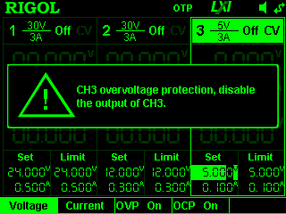

The overvoltage protection was adjusted to 5.5V and then the test was retried.

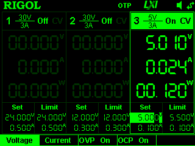

This appears to work.

However, still the scope does not trigger.

Rather than worrying about triggering, I switched it to auto mode to see if anything was visibly changing when the `TUSB321` chip is powered by the bench supply.

It was then apparent that things were changing.

Recall the USB connected, `TUSB321` unpowered state.


 * `CH1` = `CC1` is ~0V
 * `CH2` = `CC2` is ~0.9V
 * `CH3` = `VBUS-DET` is ~0.5V
 * `CH4` = `VBUS` is ~5.25V

Contrast the USB connected, `TUSB321` powered state.


 * `CH1` = `CC1` is ~0V (same)
 * `CH2` = `CC2` is ~0.4V (reduced from ~0.9V)
 * `CH3` = `VBUS-DET` is ~0.5V (same)
 * `CH4` = `VBUS` is ~5.25V (same)

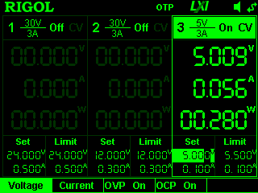

We also note some 56mA of power draw evidenced on the PSU.

So what's going on here? According to the `TUSB321` datasheet, there are various signalling levels used on the `CC1` and `CC2` channels.

 * "LOW" is 0.4V, which is perhaps what we are seeing in the second state
 * "MEDIUM" is 0.28-0.56 x VDD which works out to 1.47-2.94V, most likely in the middle, or around 2.2V
 * "HIGH" is VDD-0.3V which works out to 4.95V

None of these levels appear to describe the rest state we are seeing (0.9V).

Probably it would be best not to try to spend time understanding all of the signalling state transitions and just get the thing working.

Given that the `VBUS` voltage doesn't change in this case, but some negotiation does appear to have occurred, perhaps a higher amperage 5V supply has been negotiated successfully.

Checking the power supply design notes I did state that 5V 1.5A = 7.5W was the negotiation target, so this would appear to be the case.

In terms of next steps:
 * We could connect a DC load to test what the power draw is under each scenario: no `TUSB321` power, and `TUSB321` powered and negotiations complete.
   * The hypothesis would be that ~1.5A can be drawn in the second case only.
 * Since the USB powered device which we plugged in to in this case is a USB2.0 hub, perhaps we will see a different result if we plug in to a USBC "wall wart" AC charger with known high current capability. Unfortunately that's hard to achieve in the current position due to cable length constraints and AC outlet locations on my bench.
   * While I could muck around with existing extension cords, it's a lot of hassle. Instead, I have ordered a small benchtop AC extension lead and sockets to resolve this, it should arrive tomorrow and make this feasible.
 * We could instrument the output pins of the `TUSB321` and look for state changes.

## 2024-11-07 Testing

The game plan today is to instrument the `MT3608B` boost converter stage of the power system and see what happens when very short pulses of controlled power are inserted in order to characterise its performance and determine why it may have blown up on board 2.

Since exposure to any very short pulses is less likely to damage the system, and we have access to an easy insertion point for power in, the main challenge is going to be finding a way to get a read off of the other pins, such as the feedback pin (critical) and the output pin (what the rest of the system takes as input).

In this way we can test the performance of the subsystem against projected behaviour and determine the magnitude of any differences.

In theory when 5V is applied, 12V is output.

For this testing I will revert from using board 2 to using board 1. Board 1 has a backward MCU hard-soldered in, but that's OK because we're uninterested in any later stages. This gives us a clean start with the boost converter in place without risking another board.

Oscilloscope configuration:
 * `CH1` = 'USB CLEAN' test point and also our input voltage supply point. Anticipated range in test: 0-5V.
 * `CH2` = Boost converter output (after the diode). Anticipated range in test: 0-12V.
 * `CH3` = Boost converter feedback (scaled down with resistor divider). Anticipated range in test: 0-1V.
 * `CH4` = '12V' test point, after subsequent regulator. In case everything works (wouldn't that be nice!). Anticipated range in test: 0-12V.

According to the [`MT3608B` datasheet](https://www.olimex.com/Products/Breadboarding/BB-PWR-3608/resources/MT3608.pdf), page 3:
 * `VIN` can take 2-24V. Anticipated range in test: 0-5V.
 * `EN` needs only 1.5V, but we are feeding it 5V, which is allowed and expected. Anticipated range in test: 0-5V.
 * `FB` should range between 0.588-0.612V (ie. 0.6V is the target). Anticipated range in test: 0-1V.
 * `SW` can take up to 4A of current at 50% duty cycle and 5V.

In double-checking the configuration against the datasheet we do not notice anything significant, only missing input-side capacitance which should not be required to test basic circuit configuration and one may assume mainly comes in to play under dynamically supply and load conditions.

Now we are ready to write a test routine for the boost converter subsystem.

Our general strategy should be to start at a short interval of supply, for which we will use the datasheet to ascertain a reasonable value, and a low voltage.

We will then work our way up in terms of time until we see the output stabilise (ie. the integrated feedback process has enough time to enter a stable state).

Once we have a stable output at a low voltage, we will increase the voltage toward the target input voltage of 5V.

In this way we will minimize the potential for damage to the component.

The suggested start parameters are 2.1V (being a safe margin above the 2V nominal input limit) and 5ms. We note that on page 5 of the datasheet poor efficiency and reduced switching frequency are anticipated until around 4V, therefore we should not worry too much about behaviour seen at 2.1V and seek to verify any observations at higher voltages 4V, 4.5V, 5V. The datasheet had no information on timing, which may possibly be because it is circuit-dependant and thus of dubious utility to include.

Before power is applied, the oscilloscope setup is as follows.


After running a setup script, the PSU configuration is as follows.

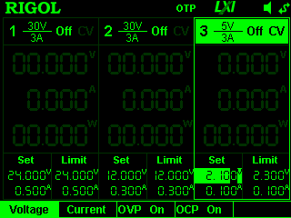

Since there is no easy way to apply a voltage for a very short interval, I have written the script to simply apply power with one command then immediately run another command to disable it.

This should provide a short burst that is safe, at least 2.1V 0.1A should not burn anything!

```
./psu-boosttest
DP832 PSU
 - Status: OFF
 - Version: RIGOL TECHNOLOGIES,DP832,DP8C233203778,00.01.16
 - Self test: TopBoard:PASS,BottomBoard:PASS,Fan:PASS

Turning channels off... OK
Setting up channel #1
 - Voltage: 24.000V
 - Voltage limit: 24.000V
 - Voltage limiting: ON
 - Current: 0.500A
 - Current limit: 0.500A
 - Current limiting: ON
Setting up channel #2
 - Voltage: 12.000V
 - Voltage limit: 12.000V
 - Voltage limiting: ON
 - Current: 0.300A
 - Current limit: 0.300A
 - Current limiting: ON
Setting up channel #3
 - Voltage: 2.100V
 - Voltage limit: 2.300V
 - Voltage limiting: ON
 - Current: 0.100A
 - Current limit: 0.100A
 - Current limiting: ON

Triggering channel 3 (2.1V) for test period
 - Enable
 - Disable
```

This test obtained the following result.


Here we can see the `VIN` ramping up, the `OUT`put ramping up, and the `FB` (feedback) ramping up.

However, we can't see enough detail owing to scale. I will reconfigure the oscilloscope to show higher scale and place all channels at the base.

We can't see any 12V output past the subsequent regulator, which is to be expected as its threshold turn-on voltage is never achieved.

Let's see the same result with more details.


Here we can see the same data, partly obscured by overlay and with some significant abberations on the feedback pin.

The key takeaway is that the maximum voltage attained on the input pin is still short of the target voltage, implying that we haven't provided power long enough.

We should therefore add a small delay in the script and determine whether input reaches the programmed level before proceeding.


We now see the boost converter appear to reach a fully ramped-up state, with stable output attained.

While we're seeing quite some abberations on the feedback pin, this may partly be to do with the lack of a load and the lack of capacitance before the subsequent 12v regulator.

The stable output levels are:

| Input | Feedback | Output |
| ----- | -------- | ------ |
| 2.1V  | 75mV     | 1.95V  |

Let's try again, increasing the maximum current from 0.1A to 0.2A, just to see if there's a change.


We see similar curves with similar final values and a similar period here, that is to say again with about a 20ms ramp-up time. So it seems the additional current has not really changed things. We can turn it down again and proceed to increase voltage. Let's try 2.5V.


OK, so that's interesting. We appear to have reached a particularly high abberation point within the circuit. This is certainly not looking healthy.

When we zoom in here's what we see.


This shows that the output is cycling between a series of decreasing peaks, and the feedback pin (which should be a scaled-down version of the same waveform, albeit at higher scale/detail) echoes this perspective. The input voltage is very stable.

We note that the peak of the feedback pin occurs at nearly 8x50mV = 600mV which is around the point at which it is supposed to stabilize. So this is potentially correct activity.

Let's look at the frequency ranges shown at this voltage in the `MT3608B` boost converter datasheet and compare those to any curves present in the inductor datasheet and in the capture.

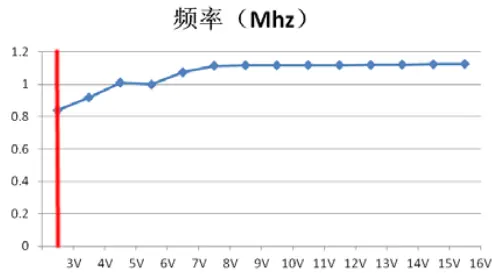

This implies that the boost converter switching frequency we are seeing should be around 800kHz which works out to around one cycle per 1250ns.

In the oscilloscope output we can see the cycle repeats at around 1000ns. This is in the range of expected behaviour.

A key problem seems to be that the output is not stable, this is due to lack of capacitance, and may improve with load.

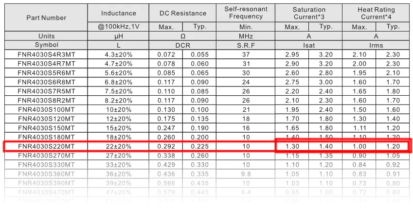

Double-checking the inductor we find that it is not really rated for more than 1.2A which at 5V gives us only around 6W less losses, which is cutting it fine for a 5W output.

Probably we could have selected a better inductor, but this one should - at a minimum - function fine until we exceed 1A load, at which heat should be expected, and safely for short periods up to 1.2A load (if the datasheet may be believed). So in short we're probably slightly underpowered but that may not be a problem given bulk capacitance is present in later stages.

Now let's try the same capture after updating the voltage to 3.5V and observe how the detailed curves change. We would anticipate the potential of an increased switching frequency, according to the frequencies graph we just saw in the boost converter datasheet.


Here we see the same frequency as we had before, which is around 1000ns.

Notably, we only see a small increase in the input voltage and the output power which is not in line with the input voltage increase. This implies the current may be insufficient. Let's increase the current to 0.2A and see what happens.


Wow, that's a substantial difference. We're seeing periods of total output power absence which implies we're browning out the boost regulator in some way. This is definitely bad news.

Let's increase the current again to 0.3A and see what happens.


We are still seeing this issue. Let's increase it again, this time to 0.4A.


We are still seeing this issue. Let's increase it again, this time to 0.5A.


OK, so that's not really doing it for us. Let's try to increase the voltage instead. We'll bring it up from 3.5V to 4.0V and look for change.


Here we can see that the previously flat period with no output has begun to recover. I think we're just sailing too close to the low-end of the functional paramters for this subsystem and this is made worse by a lack of local capacitance on the input side. Let's bring the voltage up to 5V and get in to standard operating territory. This should give us a clear view of what's going on and move us now closer to the intended circuit configuration.


We're still seeing similar results. We can try adding a load now and we'll likely see things become stable.

I had a 12V 0.3A fan lying around, we'll see what that does to things.


Well that's apparently working. The fan began to move before the power cut out, and what we see in the oscilloscope that has changed is the introduction of a period of oscillations in the feedback output which matches the addition of a load. If we add a capacitor rather than just the load itself the anticipation would be a smoothing out of the curves.

However, first of all let's zoom back out to the bigger picture before making any changes.


Here we see the ramp-up period of around 4ms. Let's get a slightly better view.


And better...


Here we can see some interesting properties.

Firstly, we are seeing the output (light blue) touching around 15V.

Secondly, we are seeing the feedback exceed the range which is set to 8x50=600mV. That's expected, since we were anticipating 680mV. Let's scale that down and see how high it gets. We'd expect it to move higher than the reference point during the periods at which the output oscillates beyond 12V.


So here we can see a much more useful view of the overall system startup. 
 * `VIN` scales up smoothly but oscillates with the switching load due to lack of local capacitance.
 * `OUT` reaches around 15V at peak but generally is in the range we would anticipate but oscillates probably due to lack of local capacitance.
 * `FB` oscillates as high as around 4.5V or slightly below `VIN`, which again is probably expected and will disappear if capacitance is added.
 * `12V` is actually powering on, it seems the regulator downstream begins to generate output as power arrives albeit at something less than its input level in this time period. We should zoom out further to see if it actually completes its rise.


Well that's interesting. Looking at the overall picture now, we notice that the regulator flattens its output to around 6V or half of what it should anticipate. This may be due to the effect of the fan as an additional load drawing too much power. Let's unplug that and see what happens.


A very different picture as we anticipated.

We're seeing the downstream 12V regulator output plateau, this is unexpected.

Next steps:
 - Double check the calculations for the resistor divider on the feedback pin. If these are wrong, it can affect the output voltage. However, they appear correct, and we are actually seeing ~15V peaks.
 - Add some capacitance to see how this smooths out the curves.
 - Try increasing the length of on time and seeing what happens, checking for thermal buildup.

On the double-checking front, from the datasheet:
 * "The feedback voltage is 0.6V." (Elsewhere the range is specified as 0.588-0.612V)
 * The formula is given: `VOUT = VREF x (1 + (R1/R2))`
 * Substituting:
   * `12V ~= 0.6V x (1 + (100K/5.1K))`
   * `12V ~= 0.6V x (1 + (19.6078431))`
   * `12V ~= 0.6V x 20.6078431`
   * `12V ~= 12.36470588V`
 * In the most extreme cases within stated manufacturing tolerance (ie. VREF is misplaced between 0.588V or 0.612V) we expect instead 12.12V through 12.61V

So in theory the output should be correct or within a few percent, we should not see a half output. We could add a capacitor to smooth things out, this will need to be ordered as I don't have any leaded ones lying around. Correction, found one! 1000uF.

Let's see what a recapture looks like now.


That's looking a lot cleaner. We can see a substantial reduction in the oscillations.

Let's try increasing the current to 0.9A and see what happens.


The 12V regulator output now rises to around 7V. Let's give it a bit more time and see what happens.


This is interesting. It seems at a later point we now see the boost converter circuit state change. Once this occurs, feedback oscillations decrease, output voltage oscillation decreases and he 12V regulator settles on a 7V output. As we are stil seeing large oscillations in the input volatage, it seems that area is critically missing capacitance. If only we could find another leaded cap... I will go hunt one down. Got one, 100uF 50V.

Let's retry with both the input cap and the output cap and see what happens.


This has removed the state change, and the voltage continues to ramp upwards.

Overall however we still see the following picture:
 * __Very high oscillation in the input voltage__ due presumably to non-local capacitance, insufficient current, and wrong capacitor type. The switched inductor is 'right next to' the boost converter (actually the layout of this part of the board is sub-optimal) but the off-board capacitor is some distance away. This does not help. Checking the datasheet for the boost converter, the recommended capacitor type is ceramic whereas we are using electrolytic which are less suitable for high frequencies. I have ordered some ceramics to test with. This may become stable once downstream caps have charged and the load has normalized.
 * __Input and output voltage still both trending upwards at input termination__. This suggests a longer power-on period may assist with achieving more stable output.

While waiting for new capacitors to arrive, let's give the system a bit more time and see what happens.

### More power!


Here we can see:
 * Input voltage stabilizes around 3.5V after 250ms. This suggests it is insufficiently powerful to drive the boost converter.
 * Boost output voltage stabilizes around 10V after 250ms. Given we have checked our calculations and added capacitance, this suggests a power shortage.
 * The feedback pin continues to oscillate with peaks up to 6.5V
 * The 12V regulator output voltage does stabilize (around 250ms) at 9V.

At this point we will try adding more power by bringing the amperage up to 1.1A.


Here we see much the same picture, although the input voltage stabilizes at 3.5V more quickly, here about 100ms or so.

We could try raising the input voltage slightly to see if it affects the output voltage.
 * Hypothesis: If the input voltage increase yields a higher than 9V output of the 12V regulator, then we are still underpowered. Otherwise, we are not underpowered and the issue may be in the resistor divider being inaccurate.

Let's try 5.3V.


This appears to have triggered the built-in overvoltage protection in the third channel of the bench PSU.

I will reprogram the PSU to have 5V on channel 2 (which has higher output capacity to 30V/3A) and retry the same capture.


This appears to have the same curve, which appears to show the input voltage rising abruptly before decreasing.

Here is the channel 1 view.


As you can see it drops quite abruptly.

Theories:
 * The boost converter changed state, eg. frequency?
   * We can verify or discount this by zooming in to the detailed curves around the time of transition.   
     * Result: The switching indeed appears to have altered in character although not necessarily frequency. Could this be the boost converter unexpectedly entering a stable "hold" state? Could it be that the resistors defining the output voltage point are poorly matched to their nominal values?
 * The boost converter enters a state in which it requires more power than is available?
   * Unlikely, since we are supply a lot of power at this point.
     * Result: Discount this theory.
 * Non-local input or output capacitance finished charging?
   * We can potentially confirm or discount the capacitance as a cause of state change by adding and removing capacitance.
 * The downstream 12V regulator changed state? 
   * We should discount the 12V regulator as the cause since it curves down slowly in resonse to the abrupt change earlier in the circuit, the earliest of course being the input voltage, which is affected by the boost converter switching frequency and current draw.
     * Result: Discount this theory.

### Bad resistance?

Other than waiting for extra and superior capacitance to arrive, it seems the best way to move forward at this point is perhaps to cover the basics by double-checking the resistor values. If the resistors do not appear to be correct, we may have found our issue. Reflowing the area with the heat gun may also help. First let's measure.
 * 97.1k
 * 5.04k

After recalculating against the 0.6V nominal reference, 12.16v. If the reference is at the extreme ends of the datasheet quoted range, then this could be as low as 11.9V and as high as 12.4V.

None of these account for the observed behaviour.

### Irregular regulator?

Another option is that the 12V regulator is outputting 9V because the wrong part was added.

However, the label on the part matches the label on the [JLCPCB component page](https://jlcpcb.com/partdetail/Xblw-L7812CDTR_XBLW/C22357877), and the label in the datasheet for a 12V part, specifically `XBLW L7812 CHN 343B`.

What if I remove the regulator part from the board, and test it with the bench supply? This would finally determine whether in fact the part is 9V internally or 12V.

After investigation, removal seems irritating owing to the close proximity to other components, and the soldered ground plate being a large surface area.

Another option would be lifting a pin, however this is hard to achieve with my present hand tools.

A final option which does seem feasible is to cut the regulator's output pin, bend a portion upward, and instrument that. This would presumably isolate it from the rest of the circuit sufficiently to identify whether or not there is a problem. I have ordered a precision cutting tool for this purpose, which should arrive tomorrow.

In the mean time, I will consider that the 9V being shown is some sort of mix between 12V correct output and 5V elsewhere (so 7V difference meaning 8.5V is the nominal middle) due to the MCU module being incorrectly installed and thus through some combination of circumstance this regulator may be fighting another regulator, or some kind of alternate circumstance having similar outcomes.

### Third time lucky?

Perhaps a fresh board would not have this problem, in other words. Re-instrumenting a third board could be a way forward, since this board #1 has the backward MCU and board #2 had a burned out boost converter. The question that then remains is why did the boost converter burn out? It seems I may have found the issue in terms of current. Nothing is really limiting current on the board, whereas the boost converter only supports ~1.2A (or really 1A comfortably) the other components like the 12V regulator are higher rated and there's quite a bit of capacitance to fill. Perhaps the issue was that the boost converter simply fried due to too much inrush current?

This would explain everything.

However, this does not position things well for a revision without a new board.

Perhaps a plug-in board could be developed which provides an alternative circuit path to the part of the board currently broken.

I will look in to alternative boost converters with higher current potential.

Shortlist:
 * [MT3540-F23](https://jlcpcb.com/partdetail/xi_an_AerosemiTech-MT3540F23/C181783) @ 1.5A (Xi'an Aerosemi Tech) - same manufacturer as current chip
 * [L7812CV-DG](https://jlcpcb.com/partdetail/Stmicroelectronics-L7812CVDG/C2914) @ 1.5A (STMicro)
 * [MC34063ECN](https://jlcpcb.com/partdetail/Stmicroelectronics-MC34063ECN/C5180) @ 1.5A (STMicro)

... argh! So it turns out the component selection was good, and it's actully a 4A part. However, it's a 'China clone' part that's based on an original part with ~1-1.2A limits.

The China ones are much better, and available from multiple manufacturers for ~nothing. So the part selection was actually ideal.

Unsure what the issue is/was about it blowing up then.

I've managed to find a tool to cut the leg on the downstream regulator and re-instrument directly off the pin, so let's check out a retry.

### Reintroducing Mr. Regulator (Xi'an Special Edition)

A retry with the same settings yielded this capture.


Looking a lot more regular. Let's zoom out and see where we're at.


This looks like now we are only getting around 5V output from the regulator.

I am now worried that we've fried the resistor through over-zealous soldering (the probes came loose).

To test this theory I will run the multimeter over both sides to determine resistance.

Yes, it appears to have dropped from ~100K to ~35K.

This explains the drop in voltage, from `VOUT = VREF × (1 + (R1/R2))`.

```
VREF = 0.6V (reference voltage)
R1 = 35k (damaged upper resistor)
R2 = 5.04k (lower resistor, previously measured) Let's calculate: VOUT = 0.6V × (1 + (35k/5.04k))
= 0.6V × (1 + 6.9444444)
= 0.6V × 7.9444444
= 4.76666667V
```

Therefore, with the damaged upper resistor now measuring 35k, the expected output voltage of the boost converter would be approximately 4.77V. 

This is exactly what we are seeing. We note also that the previous 9V may have also been due to resistor damage from soldering performed after measuring the resistor.

## New Mister Resistor

Found another 100K resistor and installed in place. It measures 96.4K which should be fine.

Let's try again.


Well, here we can see very little, it's all over the place. Let's try a second capture, after moving some probes around to ensure good grounding.


Very similar to what we had before the resistor replacement, except all the curves are much higher. It seems that the output voltage continues to rise the whole way through the capture until power is cut, reaching something like 15V average but 30V peaks.

Let's see if we scale that down and recapture just how high it goes.


Wow. Again off the charts, reaching something like 50V or more.

Let's see what happens if we temporarily remove the 1000uF capacitor.


OK that's definitely bad.

I think we need to wait for the capacitors to arrive and try some functioning caps.

I put the cap back in and got back to this sort of thing, similar to two images ago.


The key takeaway is that, once the power is cut and all is said and done, the 12V regulator actually outputs 12V.

The hope is that, after we add some more capacitance, we will see this without unplugging, and that will be a stable output suitable for the rest of the circuit.

In the mean time we will try running a little longer to see what happens.


I flipped the acquire mode to 'high res' which seems to have removed the sketchyness and shows more of a reasonable output.

Here you can see:
 * The `VIN` voltage comes up in about 200ms on the supply side (yellow)
 * While this is happening, the boost output (light blue) ramps steadily upward toward 20V or more
 * While this is going on the 24V regulator is cutting its output back to something tiny, probably sensing dangerous levels of supply.
 * Finally, the power is cut. Immediately, boost output begins to drain as the 1000uF 25V capacitor empties, but the regulator is now happy and switches to a 12V output which remains stable.

It seems, perhaps, that the state of the circuit between the boost converter and the regulator is causing issues for the regulator. 

We can hope that the new capacitance fixes the problem, noting the old 1000uF is ~25 years old and only rated for 25V which is already being exceeded.


This was the 'peak' acquire mode, zoomed out to maximum level. Less clear, but it shows some high voltages on the output side well above 35V.

After that we see stability, which continues until the boost stage output drops below 12V, at which point the later-stage 12V regulator begins a steady decline.


This is the same capture in 'normal' acquire mode.


Here is a zoomed in version, with layers selected so as to increase legibility.


Here is the same capture in peak mode.

### MT3608B Design Review

 * With regards to the mode switch we have been seeing, it seems the datasheet has a clue: "The MT3608B has internal soft start to limit the amount of input current at startup and to also limit the amount of overshoot on the output." This suggests we're seeing the end of the soft start ramp-up.
 * Layout is specified strictly and we have an absolute chop-shop slop job, so this needs rejigging.
   * Key issues are large loops, unduly long traces, and thin traces.
 * Inductor is specified as 4.7uH-22uH and we selected 22uH. Just relying on general assumption, it may be beneficial to move toward the middle of the range (10uH). [This option](https://jlcpcb.com/partdetail/Sunlord-WPN4020H100MT/C98364) looks good, or an [overkill high current option](https://jlcpcb.com/partdetail/Sunlord-MWSA0603S100MT/C132141). Checking relevant theory, based on the circuit parameters we should have selected something in the 5-10uH range anyway, 6.8uH or 10uH would be better. 22uH is too large which leads to feedback loop issues and slow transient response which is what we were perhaps seeing.
 * Inductor should be low DCR, according to [this similar (same clone) part Chinese datasheet](https://www.lcsc.com/datasheet/lcsc_datasheet_2105242005_NATLINEAR-LN2220PAR_C2833712.pdf).
 * Recommended 22uF caps missing on input and output pins
 * Schottky diode is 75V rated, and must have current rating over RMS, so looks OK from that perspective.
 ```
ID(RMS) = SQRT(IOUT x IPEAK)
ID(RMS) = SQRT(12V x 67V)
ID(RMS) = SQRT(804V)
ID(RMS) = 28.35V
```
 * Schottky diode should be selected for low forward voltage drop, to achieve higher load efficiency.

### 2024-11-08 Debugging

I am going to start the day by reading up on boost converter design equations, documenting the novel material in the power supply notes, and then revisiting the current situation with a new board. Only electrolytic capacitors arrived last night, I have no ceramics, and the fundamental problem of a larger inductor than is preferred is going to be difficult to solve without a new board given that the inductors are so small and come in such a range of disparate form factors.

#### New board plan

One option is to produce an intermediate board that upgrades the current boards with a reimplmentation of the power supply stages. This would have to pull in the `VBUS` current to power the `TUSB321` chipset. Presumably we can rely on the `VBUS` current never being over 5V because we will not negotiate such. Therefore, we should aim to have a resistor just large enough to provide power to the `TUSB321` directly from bus power, with some kind of protection diode, but perhaps have this circuit disabled once the local 5V comes online so that supply is continuous and transitions to onboard 5V as the preferred source. It would implement interfaces to the `VDD` and `VBUSDET` pins, as well as to a reimplementation of the `MT3608B` block, then output to the input of the 12V regulator. So it would need connections to raw `VBUS`, `TUSB321:VDD`, `5V`, `GND`, and the 12V regulator input. On the board itself, some modifications would be required, including the removal of at last one of the feedback resistors and the `MT3608B` chip.
 * `VBUS`: Raw USB bus voltage
   * Used for: Early stage and later stage power to boot the `TUSB321`, new input to re-implemented `MT3608B` block for main power draw.
   * Source from: Ferrite bead terminal or resistor terminal (both dangerous as overheating may damage the components)
 * `TUSB321:VDD`: Power input to `TUSB321`
   * Used for: Powering on the chip to negotiate a higher amperage on `VBUS`.
   * Source from: Test point 'USBC CLEAN', after removing existing `MT3608B` and inductor which are the only other things on the net.
 * `5V`: Regulated 5V supply
   * Used for: Power input to `TUSB321` after boot completes
   * Source from: Test point '5V'.
 * `GND`: Ground
   * Used for: Everything
   * Source from: Test point 'GND'.
 * `L7812:VIN`: Regulator input.
   * Used for: Boost stage power passthru from bus.
   * Source from: L7812 VIN pin directly (trace width too thin on test point).

Here's what I came up with in terms of those five connection points.

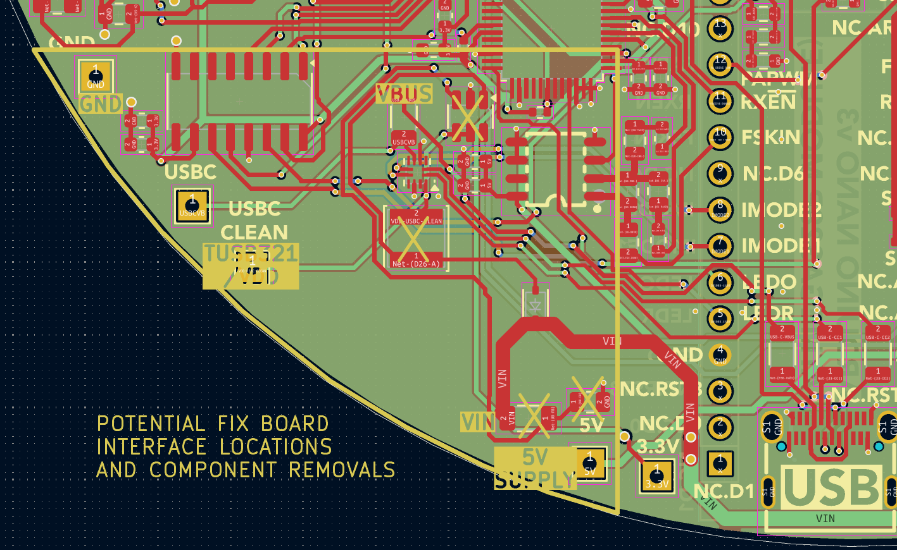

This could be quite a small 2 layer board, the only issue is I will need to import the geometry which KiCad is not great for.

Its components will be: 100uF + 100nF cap for TUSB321 VDD, diodes and resistors for smooth power transition sourcing from `VBUS` to `5V`, `MT3608B` and associated inductor (6.8uF or 10uF this time), diode (same as last time), resistors (same as last time) and input and output capacitors (22uF each), 330nF cap before `L7812:VIN`, and 100nF cap after `L7812:OUT` output before passing to mainboard 12V regulator.

Although it seems from various comments that TI does not encourage people to power `VDD` from the `VBUS` source although other people have stated this goal and tried. [One attempt](https://e2e.ti.com/support/interface-group/interface/f/interface-forum/873752/tusb321-configuration-issues-when-using-tusb321-as-ufp) (inconclusive result) tries to use two bypass capacitors of 10uF and 0.1uF at the port with no filtering or limiting. We already have a ferrite, at least. Other sources suggest the combination of transients during connect/disconnect events and potentially higher bus voltages such as from misbehaving peers mean that this is a bad idea.

Overall I think that small board will be a good cheap fix, at least it should work.

The power transition stuff might be buggy, perhaps it would be good to model that first with a bench PSU changeover.

#### Bench model

The power switching situation to model would be a 4.5V-5.5V VBUS supply needing a schottky diode, some zener protection and a slight voltage reduction (say to 4.55V regulated, say through a 5V regulator like L6705CV plus a subsequent voltage divider of 10K/100K to reduce voltage) before feeding to an output. After this occurs, a second supply channel is switched on at 5V (simulating the regulated output) and should take over. We should see the bench supply current level switch over entirely to the new supply channel. If this works, we can progress with confidence.

The relationship between the two sources should be as follows:
 * A schottky diode from each source ensures unidirectional flow
 * When the higher voltage source appears, it will take precedence

I have ordered some schottky diodes for testing, they will arrive tomorrow.

I already have the other components: 5V regulator, associated 0.33uF/0.1uF in/out ceramic caps, 100K/10K resistors and 7.5V zener diodes.

With the following PSU configuration, ie. 6V...


We observe the following output, ie. 4.45V, as expected.


However, with the following PSU configuration, ie. 5V...


We observe the following output, ie. 3.4V, which is too low!

This means the output before the voltage divider was about 3.74V. Let's instrument that and confirm.


Yes, 3.72V.

There must be substantial losses in the regulator at low draw.

Apparently an 'LDO' regulator will not have this level of losses.

Unfortunately, such regulators are not available locally at short notice.

Therefore, I will have to trust the datasheet in selecting one in the final circuit and hope for adequate performance.

In the mean time, we could remove the divider network to yield the higher current.

Whether the current exceeds our required 4.5V threshold for turning on the `TUSB321` via its `VDD` pin or not, we still can test an automatic changeover of source channel when the zener diodes arrive.

#### Stepping back

It would be worthwhile to check later stage functionality on a fresh board before committing to a fix. Point being, if there are other issues, we probably want to discover them first and decide whether it makes sense to just do a new revision of the main board instead of mucking about with fixes. Today then I will start to mark out those portions of the schematic which have been tested and work through programming the MCU. 

Areas needing attention today:
 * MCU/audio chipset interface
 * Clock generator
 * Power amplifier
 * 3.3V outputs
 * Forward power, reverse power and SWR

Best approach:
 * Get a totally fresh board supplied with 12V bench power
 * Plug in a fresh MCU module (use mounts this time not direct soldering)
 * Begin process to alter firmware from previous reference firmware to current schematic

## Complete issues list

 * Cable passthru too difficult, hole should be enlarged
 * `TUSB321` PD chip incorrect topology
 * `TUSB321` PD chip missing 100uF and 100nF caps at VDD
 * `MT3608B` self-destructed for unknown reasons
 * `MT3608B` inductor too large at 22uH, reduce to 6.8uH or 10uH.
 * `MT3608B` inductor should be low DCR.
 * `MT3608B` missing 22uF cap at VIN input (place directly across terminals)
 * `MT3608B` missing 22uF output cap at OUT
 * `MT3608B` block layout is crap: large loops, unduly long traces, thin traces.
